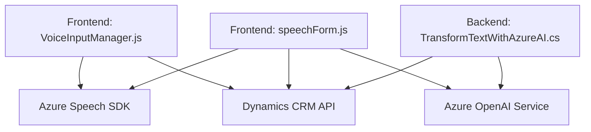

### **Breve Resumen Técnico**

El repositorio muestra una solución software basada en la integración de Dynamics 365 con servicios en la nube de Azure, enfocados en sistemas de reconocimiento de voz, síntesis de texto (text-to-speech) y transformación de texto mediante IA de Azure OpenAI. Consiste en una combinación de módulos frontend en JavaScript para la interacción con formularios y funciones basadas en plugins escritos en C# para integrarse en la infraestructura de Dynamics 365.

---

### **Descripción de Arquitectura**

El diseño global sigue un modelo de **arquitectura orientada a servicios**, aprovechando la capacidad de servicios externos como Azure Speech SDK y Azure OpenAI. La solución combina tres componentes principales:

1. **Frontend/Cliente**:
   - Módulos JavaScript (`Frontend/JS/*`) ejecutados en el entorno navegador. Estos interactúan con formularios de Dynamics 365 utilizando eventos y funciones específicas.
   - Modularización que separa funcionalidades específicas, como lectura de formularios, entrada de voz y análisis textual.

2. **Backend (Plugins)**:
   - Basado en la arquitectura de **plugins de Dynamics 365**, donde funcionalidades específicas están encapsuladas en clases y se ejecutan en el contexto de eventos del CRM.
   - Consume servicios externos (Azure AI y OpenAI) mediante invocaciones HTTP.

---

### **Tecnologías Usadas**

1. **Frontend**:
   - **Azure Speech SDK**:
     - Para conversión de texto a voz (text-to-speech) y reconocimiento de voz (speech-to-text).
   - **Vanilla JS**:
     - Manipulación dinámica del DOM (directamente usando la API de JavaScript del navegador).

2. **Backend**:
   - **Microsoft Dynamics CRM SDK**:
     - Framework para desarrollos basados en plugins y extensiones dentro de Dynamics 365.
   - **Plugins customizados en C#**:
     - Integración con Dynamics CRM mediante la interfaz `IPlugin`.
   - **Azure OpenAI**: 
     - Consumo de servicios de IA basados en generadores como GPT para transformar y analizar texto.
   - **Json Libraries**:
     - Newtonsoft.Json y System.Text.Json para manejar datos JSON.

3. **Patrones**:
   - **Integración dinámica**: Azure Speech SDK se carga en tiempo de ejecución cuando es requerido por las funciones frontend.
   - **Software Modular**: Las funcionalidades están separadas por módulos/ficheros según su propósito.
   - **Plugin Architecture**: Arquitectura basada en la implementación de la interfaz `IPlugin` para realizar integraciones con Microsoft Dynamics CRM.
   - **Promises/Callbacks**: En los módulos JS se emplean promesas y callbacks para controlar procesos asincrónicos.

---

### **Diagrama Mermaid**

---

### **Conclusión Final**

La solución representa una integración avanzada entre un frontend desarrollado en JavaScript y un backend basado en Dynamics CRM plugins escritos en C#. Se sigue una **arquitectura orientada a servicios**, utilizando componentes externos como Azure Speech SDK y OpenAI para lograr capacidades avanzadas de transformación del lenguaje y procesamiento de voz.

#### Pros:
- Modulares y reutilizables: Las funciones en el frontend y los métodos en los plugins están individualizados para mejorar el mantenimiento y reusabilidad.
- Escalabilidad: Gracias al uso de servicios en la nube (Azure Speech SDK y OpenAI), el sistema puede manejar una gran cantidad de solicitudes sin exigir hardware local.
- Adaptabilidad: La carga dinámica de Azure Speech SDK asegura que los recursos solo sean utilizados cuando es necesario.

#### Contras:
- Dependencias externas: Altamente dependiente de Azure, lo que puede ser costoso y acoplado a la infraestructura de Microsoft.
- Gestión de errores limitada: No se observa una estrategia robusta para manejar errores específicos (fallos de red o invalidación en Azure).

En general, el diseño muestra una solución bien estructurada y moderna que podría optimizarse con mejoras en la resiliencia del sistema y el manejo de excepciones.