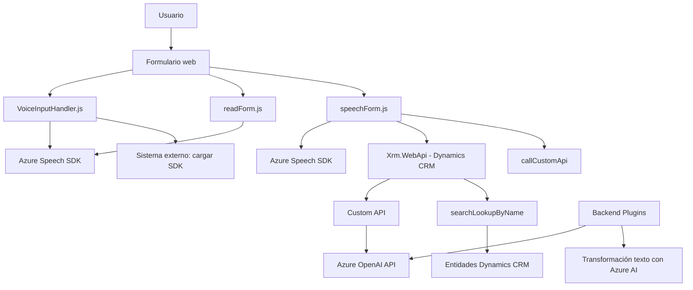

### Breve resumen técnico
El repositorio engloba una solución centrada en la interacción entre formularios web y servicios de voz e inteligencia artificial, utilizando integraciones con **Azure Speech SDK** y **Azure OpenAI API**. Está orientado a mejorar la accesibilidad, procesar comandos hablados, y transformar datos mediante IA. Está compuesto por varios archivos que implementan lógica modular, eventos asincrónicos y comunicación con APIs externas.

---

### Descripción de arquitectura
La arquitectura sigue un enfoque de **n capas** con lógica modular y una integración directa con servicios de terceros. Los componentes incluyen:

1. Capa de presentación (**Frontend**): Archivos en `FRONTEND/JS` para procesamiento de formularios y manejo de voz.
2. Capa de negocio (Plugins): Código backend en `Plugins/*` que implementa plugins para Dynamics CRM, encargados de transformar datos mediante IA y de interactuar con APIs como Azure OpenAI.
3. Capa de integración externa: Usando SDK/REST APIs para la interacción con servicios como Azure Speech (voz) y Azure OpenAI (GPT).

Adicionalmente, sigue patrones como **MVC (Model-View-Controller)** en frontend y **Plugin-Based Architecture** en el backend de Dynamics CRM.

---

### Tecnologías usadas
**Frontend:**
1. **JavaScript**
2. **Azure Speech SDK** (integración dinámica)
3. **Event-driven architecture**: Uso intensivo de callbacks y promesas para la gestión asincrónica.

**Backend:**
1. **C#**: Lenguaje de implementación principal de plugins.
2. **Dynamics CRM SDK**: Para interacción con entidades y flujos de trabajo.
3. **Azure OpenAI API**: Servicios GPT usados para transformar texto con reglas específicas.
4. **Newtonsoft.Json**: Manejo de datos JSON en plugins.

---

### Diagrama **Mermaid**

---

### Conclusión final
El repositorio implementa una solución basada en **n capas** que utiliza tanto un frontend (para entrada y salida de voz interactiva) como un backend (plugins de Dynamics CRM). Las dependencias principales son **Azure Speech SDK** y **Azure OpenAI API**, que gestionan voz y transformación de texto respectivamente. La interacción es modular y emplea patrones como **Event-Driven**, haciendo énfasis en accesibilidad, personalización y procesamiento avanzado de datos.

Esta solución es ideal para aplicaciones empresariales que necesitan integrar comandos hablados con sistemas CRM avanzados y servicios Azure, facilitando la automatización y mejora de la experiencia de usuario.