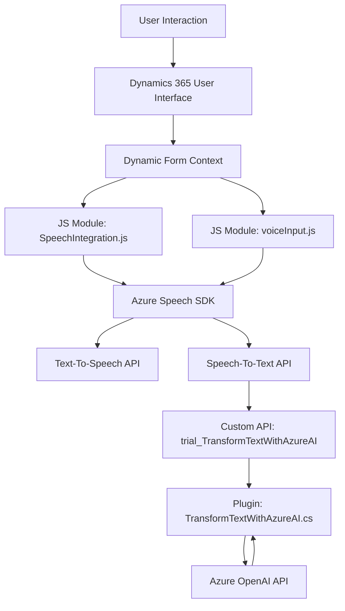

### Resumen Técnico
El repositorio alberga componentes que colaboran para proporcionar funcionalidades de integración de voz y texto en sistemas Dynamics CRM/365. La solución utiliza el Azure Speech SDK para la síntesis y reconocimiento de voz, y una API de Azure OpenAI para transformar texto en JSON estructurado. Adicionalmente, se desarrolló un plugin para Dynamics CRM que gestiona la interacción entre el sistema CRM y servicios externos.

---

### Descripción de Arquitectura
La arquitectura parece ser **n-capas híbrida**, acoplada con componentes SaaS externos (Azure Speech SDK y Azure OpenAI). Las capas principales son:
1. **Frontend**: Código JavaScript para la interacción entre el usuario y los formularios de Dynamics 365 (captura y síntesis de voz).
2. **Backend**: API personalizada o plugin de Dynamics 365 que realiza una conexión con Azure OpenAI para procesamiento avanzado de texto.
El diseño refleja modularidad y separación de responsabilidades, pero depende de servicios externos para funcionalidades clave.

---

### Tecnologías y patrones usados
1. **Frontend**:
   - **Tecnologías**: JavaScript ES6+, Dynamics 365 Form Context API (`executionContext`, `formContext`).
   - **Servicios Externos**: Azure Speech SDK (Text-to-Speech y Speech-to-Text API).
   - **Patrones**: Modular (funciones específicas), Factory Pattern, y patrón de integración con servicios externos.

2. **Backend**:
   - **Tecnologías**: C# (.NET Framework), Microsoft Dynamics SDK.
   - **Servicios Externos**: Azure OpenAI API interactuando mediante solicitudes HTTP (usando `System.Net.Http`).
   - **Patrones**: Plugin pattern (interfaz `IPlugin`), Facade pattern simplificado, y desacoplamiento funcional entre CRM y Azure OpenAI.

---

### Dependencias o Componentes Externos
1. **Azure Speech SDK**: Genera sintesis de voz y permite el reconocimiento de comandos desde audio.
2. **Azure OpenAI**: Realiza transformación y procesamiento avanzado de texto a través de modelos de lenguaje.
3. **Microsoft Dynamics SDK**: Gestión del modelo de datos y eventos en formularios.
4. **Newtonsoft.Json**: Manipulación y conversión de estructuras JSON.
5. **Sistema .NET Libraries**: Clases como `HttpClient`, `RegularExpressions` y `Json` esenciales para el funcionamiento del plugin.

---

### Diagrama Mermaid

---

### Conclusión Final
La solución implementada ofrece capacidades avanzadas de interacción basada en voz para formularios de Dynamics 365 mediante la integración de servicios Azure. Utiliza una arquitectura n-capas híbrida que combina un frontend modular, APIs personalizadas y un plugin backend. El uso de Azure Speech SDK y Azure OpenAI añade funciones de síntesis y procesamiento de lenguaje natural, por lo que permite gestionar formularios de manera más intuitiva. Sin embargo, es crucial considerar la seguridad y encapsulación de las claves de API en el código para evitar riesgos.