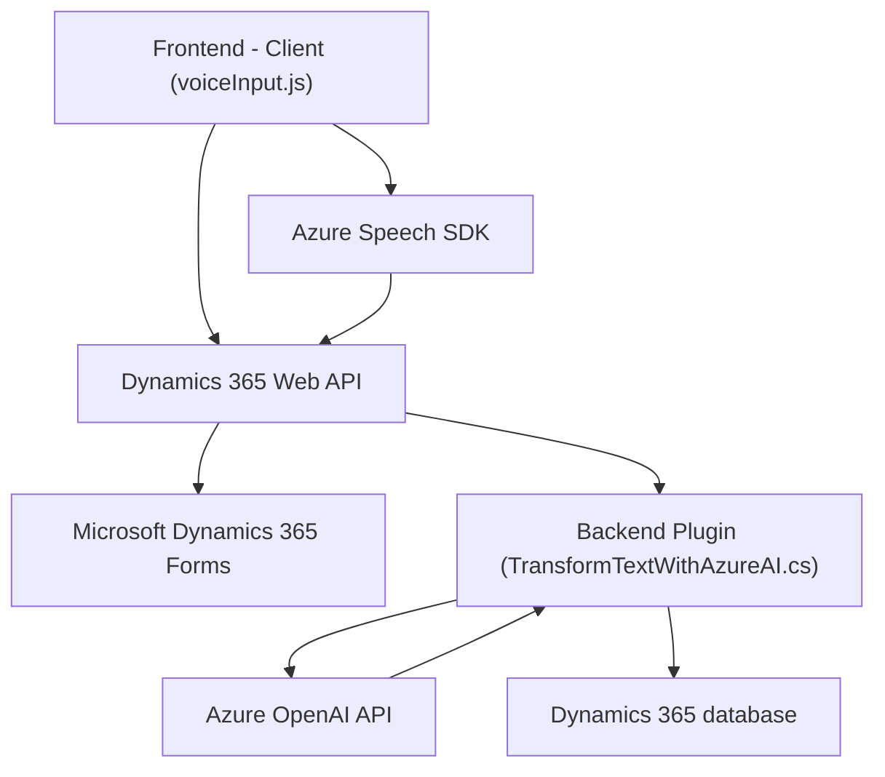

### Breve Resumen Técnico
Este repositorio parece estar orientado al desarrollo de una solución que combina **captura de datos por voz, procesamiento de lenguaje natural y registro en formularios dinámicos** de un CRM basado en **Microsoft Dynamics 365**, utilizando tecnologías como el **Azure Speech SDK** y **Azure OpenAI API**. La arquitectura facilita una integración con Dynamics para administrar campos de formularios mientras usa servicios avanzados de *cloud AI* para realizar transcripción y transformación de datos.

---

### Descripción de Arquitectura  
La solución tiene una arquitectura **n capas**, con cada nivel implementando funcionalidad específica:
- **Frontend (Presentation Layer):** Representado por los archivos repletos de funciones como `voiceInput.js` y `readForm.js`. Estos manejan la interacción del usuario y procesan las entradas de voz para integrarse con el backend y otros servicios.
- **Middleware (Integration Layer):** En este caso, el middleware coordina el procesamiento de voz y las solicitudes hechas a APIs externas (Azure APIs y Dynamics Web API).
- **Backend (Business Layer):** Implementado principalmente en el plugin de Dynamics CRM escrito en C#. Este conecta eventos del CRM con el Azure OpenAI API para transformar datos automáticamente antes de actualizarlos en el sistema.

Esto constituye un enfoque donde cada parte cumple un rol bien definido, pero sigue trabajando conjuntamente para ofrecer una funcionalidad integral. La arquitectura podría evolucionar hacia un **modelo hexagonal** si se separan las integraciones externas como *puertos* y *adaptadores*.

---

### Tecnologías, Frameworks y Patrones usados
1. **Tecnologías:**
   - **Frontend:**
      - **Javascript**: Implementación de la captura y síntesis de voz, manipulación de formularios y comunicación con APIs.
      - **Dynamics 365 Web API**: Permite la manipulación de datos del CRM desde el código cliente.
   - **Backend:**
      - **Azure Speech SDK**: Transcripción de voz y síntesis avanzada.
      - **Azure OpenAI API**: Transformación de texto basada en inteligencia artificial.
      - **Microsoft Dynamics CRM SDK**: Extensión de eventos del CRM para procesar datos en tiempo real.
   - **Comunicación REST (HTTP)**: APIs externas (Azure y Dynamics).

2. **Frameworks usados:**
   - **.NET Framework**, utilizado en el plugin.
   - **Microsoft XRM SDK**, para extender la funcionalidad de Dynamics 365 CRM.

3. **Patrones Arquitectónicos y de Código:**
   - **Factory Pattern:** Creación de configuraciones en el Azure Speech SDK.
   - **Adapter Pattern:** Traducción de datos entre voz, JSON y campos de formularios.
   - **Event-driven Architecture:** Interacción con eventos de Dynamics CRM.
   - **Encapsulación de servicios externos:** Métodos centralizan la lógica de interacción con servicios como Azure OpenAI API.

---

### Dependencias o Componentes Externos Presentes
1. **Azure Speech SDK:** Captura y transcribe voz.
2. **Azure OpenAI API:** Transformación avanzada de texto con IA.
3. **Dynamics 365 Web API:** Para comunicación directa con el CRM.
4. **JSON Handling:** Usando `Newtonsoft.Json` para manejar datos estructurados.
5. **HTTP Client:** Realización de llamadas REST hacia servicios externos.

---

### Diagrama Mermaid

---

### Conclusión Final
La solución presentada es una integración avanzada para usar transcripción de voz y transformación de texto basada en inteligencia artificial dentro de un contexto CRM dinámico como Dynamics 365. La arquitectura n capas permite separar responsabilidades y facilitar el mantenimiento y escalabilidad del sistema. Aunque robusta, la implementación podría beneficiarse de mejoras como mayor modularización y estandarización de errores. El uso de servicios externos como Azure Speech SDK y OpenAI API hace que la solución sea particularmente adecuada para entornos empresariales con dependencias en *cloud-driven ecosystems*.