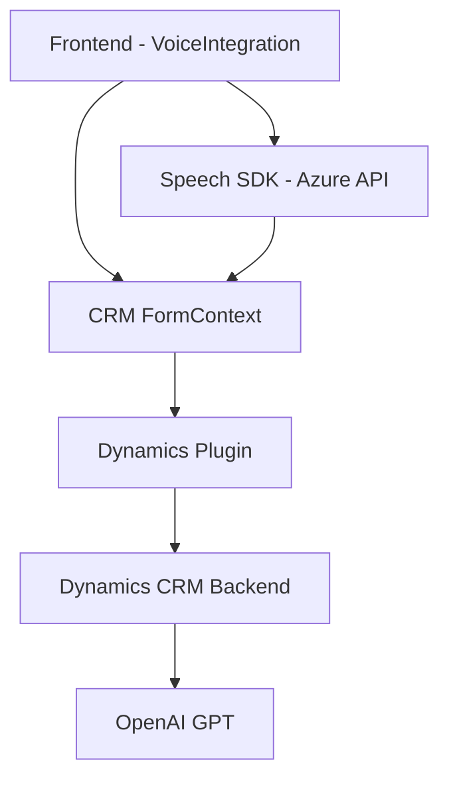

### Breve resumen técnico

El repositorio parece enfocarse en funcionalidades para manejar formularios dinámicos (probablemente como parte de una solución Microsoft Dynamics 365). Contiene tres tipos de componentes:

1. **Frontend JS** para interactuar con formularios del usuario y procesar datos textuales con reconocimiento y síntesis de voz utilizando el Azure Speech SDK.
2. **API Backend en forma de plugin de Dynamics CRM** que integra el servicio Azure OpenAI a través de identificadores para realizar transformaciones de texto en formato JSON.
3. Una solución en conjunto que implementa **funcionalidades dinámicas** mediante IA, integradas con servicios externos, dentro del ecosistema de Dynamics CRM.

---

### Descripción de arquitectura

La solución se organiza como un sistema híbrido. En el frontend, las funcionalidades están implementadas en un patrón estructural modular, con una arquitectura orientada a **event-driven** y carga dinámica de dependencias (Azure Speech SDK). En el backend, se implementa un **plugin basado en la interfaz `IPlugin` para Microsoft Dynamics CRM**, cuyo propósito es coordinar datos del sistema y realizar integraciones con servicios externos (Azure OpenAI).

Conceptos de arquitectura involucrados:
- **Arquitectura basada en microservicios:** El sistema utiliza servicios especializados de Azure (Speech SDK, OpenAI) y se comunica con estos a través de API REST.
- **Patrón hexagonal (frontera con servicio externo):** El backend actúa en la capa de integración de Dynamics CRM y comunica directamente el texto procesado por AI mediante servicios externos.
- **Modularidad y desacoplamiento:** El código JS y el backend están orientados a tratar datos específicos evitando interdependencias innecesarias.

---

### Tecnologías usadas

1. **Frontend:**
   - **Javascript:** Para manejar eventos del DOM, manipular datos del formulario, y procesar reconocimiento/síntesis de voz con Azure Speech SDK.
   - **Azure Speech SDK:** Para funcionalidades de voz (reconocimiento y síntesis).
   - **Microsoft Dynamics CRM APIs (`Xrm.WebApi`):** Para ejecutar comandos y manipular datos del formulario desde CRM.

2. **Backend (Plugin):**
   - **C#.NET (Plugin Dynamics 365):**
     - `Microsoft.Xrm.Sdk`: Para acceder a servicios y parámetros de ejecución del entorno de Dynamics CRM.
     - `System.Net.Http`: Para realizar integraciones REST con el servicio de Azure OpenAI.
     - **Azure OpenAI API:** Para estructurar datos textuales con capacidades GPT.
   - Serialización JSON:
     - **Newtonsoft.Json**
     - **System.Text.Json**

3. **Patrones:**
   - **Carga dinámica de dependencias en el cliente:** Implementada en frontend para cargar Azure Speech SDK.
   - **Integración REST con servicios externos:** En el plugin backend para procesar texto con Azure OpenAI.

---

### Diagrama Mermaid válido para GitHub

---

### Conclusión final

Esta solución integra dos áreas de desarrollo: frontend dinámico basado en distintas tecnologías de Microsoft y JavaScript, y un backend en C# para la ejecución de un plugin que procesa texto con Azure OpenAI. A pesar de una estructura modular en cada área, el diseño general muestra un sistema híbrido que operaría en una arquitectura basada en **n capas**, pero con componentes que interactúan con servicios externos, acercando la solución a principios de **integración con microservicios**. Es especialmente apta para sistemas empresariales como Microsoft Dynamics CRM, donde la personalización de formularios y funcionalidades avanzadas por IA son fundamentales.