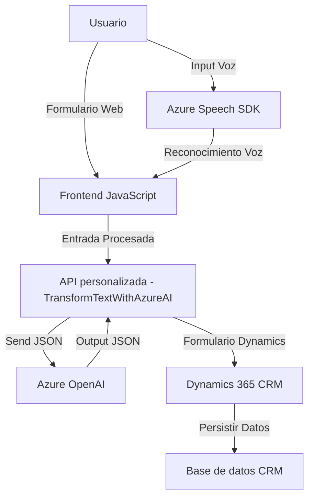

# Análisis detallado del repositorio

## Breve resumen técnico
El repositorio describe una solución que combina la integración de servicios de reconocimiento y síntesis mediante el **Azure Speech SDK**, con funcionalidades de procesamiento de datos en formularios web y una integración con **Dynamics 365** mediante plugins para transformación de datos, apoyado por el servicio **Azure OpenAI**. Parece ser parte de un sistema destinado a mejorar la interacción del usuario con formularios, facilitando tanto la entrada de datos mediante voz como la salida en forma de síntesis de texto hablado.

---

## Descripción de la arquitectura

La solución está compuesta por dos partes fundamentales:

1. **Frontend**:
   - JavaScript archivos como `voiceInputHandler.js` y`speechForm.js` ofrecen las siguientes funcionalidades:
     - Entrada de voz procesada con **Azure Speech SDK** y mapeo de datos con formularios (entrada basada en voz y aplicación al formulario).
     - Salida de voz (síntesis de texto a voz) para leer valores visibles del formulario interactivo.
     - Integración con APIs externas para procesamiento avanzado de texto (como un servicio que usa **Azure OpenAI**).

   - La estructura modular de los archivos refuerza una arquitectura basada en componentes funcionales y reutilizables, además de utilizar técnicas de asíncronía y mapeo de datos para maximizar la eficiencia en la manipulación de formularios.

2. **Plugins de Dynamics 365**:
   - Estas componentes (por ejemplo, `TransformTextWithAzureAI.cs`) están diseñados como extensiones para Dynamics 365 usando la arquitectura **plugin-based**. Implementan la interfaz `IPlugin`, permitiendo:

     - Interceptar eventos de negocio en Dynamics 365 y procesar datos mediante el servicio Azure OpenAI.
     - Enviar y recibir datos JSON estructurados, transformándolos según un conjunto reglamentado de normas.
     - Comunicar a Dynamics CRM los cambios en los atributos del formulario mediante ensamblajes .NET.

---

## Tecnologías usadas
1. **Frontend**:
   - **Azure Speech SDK**: Para síntesis y reconocimiento de voz en el navegador, cargado dinámicamente.
   - **JavaScript/ES6+**: Principal lenguaje usado.
   - **Async/Await y Promesas**: Manejo de operaciones asíncronas.
   - **APIs Dinámicas** (Azure AI y Speech SDK endpoints).

2. **Backend y Plugins**:
   - **Microsoft.Xrm.Sdk**: Librerías principales para configurar y ejecutar plugins en Dynamics 365.
   - **Azure OpenAI**: Utilizado para convertir texto en JSON estructurado.
   - **C#**: Lenguaje de programación para los plugins en .NET.
   - **System.Net.Http**: Para realizar solicitudes HTTP externas.
   - **Newtonsoft.Json** y **System.Text.Json**: Para manejo avanzado de datos en formato JSON.

---

## Tipo de solución
Primordialmente, el repositorio está diseñado como una solución híbrida para las siguientes funcionalidades:
1. Una **interfaz de usuario enriquecida** que permite la entrada y salida de datos mediante voz, destinada a mejorar la experiencia de interacción en sistemas basados en formularios.
2. Integración con **Dynamics 365 CRM** mediante plugins que operan como mediadores entre la plataforma CRM y servicios de inteligencia artificial basados en Azure.

La solución puede clasificarse como un **herramienta híbrida para sistemas de CRM**, que conecta una **parte frontend interactiva** y un plugin backend.

---

## Arquitectura
La arquitectura parece ser multicapa (n-capas), con separación clara de responsabilidades:
1. **Capa de interfaz (Frontend)**:
   - Encargada de interactuar con el usuario y procesar voz mediante módulos JavaScript.
   - Modularidad dividida por archivos según funcionalidad.

2. **Capa de integración con servicios externos**:
   - Los archivos JavaScript integran el **Azure Speech SDK** cargado dinámicamente para procesamiento de voz.
   - Comunicación con APIs externas (Azure OpenAI y otros).

3. **Capa de plugins en backend**:
   - Implementación de plugins en C# dentro de Dynamics CRM, permitiendo una interacción directa entre la plataforma y servicios como Azure.

4. **Arquitectura basada en microservicios externos**:
   - Depende de servicios en Azure como Speech SDK y OpenAI, delegando la complejidad del procesamiento a estas soluciones de cloud computing.

---

## Dependencias y componentes externos
1. **Azure Speech SDK**:
   - Para síntesis y reconocimiento de voz en el navegador se carga dinámicamente desde el endpoint público proporcionado por Microsoft.
2. **Azure OpenAI API**:
   - Plugin backend realiza una solicitud a esta API para transformar texto en objetos JSON.
3. **Dynamics 365 (Xrm.WebApi)**:
   - Utilizado para interactuar con datos almacenados en la plataforma CRM, aplicar transformaciones, y registrar los cambios correspondientes.

Otros frameworks o librerías incluyen:
- **Newtonsoft.Json** y **System.Text.Json**: Convertir JSON a objetos y serializar objetos en cadenas JSON.
- **Microsoft.Xrm.Sdk**: Base para programación en plugins de Dynamics 365.
- **System.Net.Http**: Realizar solicitudes HTTP externas.

---

## Diagrama Mermaid

---

## Conclusión final
La solución presentada en este repositorio es más una **herramienta híbrida de interacción avanzada** que combina la entrada y salida de voz con el uso de plugins de CRM, las redes neuronales de **Azure OpenAI**, y un sistema backend de transformación. Está diseñado para integrarse en un sistema empresarial existente (muy probablemente Dynamics 365), agregando valor mediante la capacidad de usar voz humana como medio de interacción con datos. La arquitectura es modular, siguiendo un enfoque **n-capas**, y su dependencia central está basada en servicios externos de Azure.