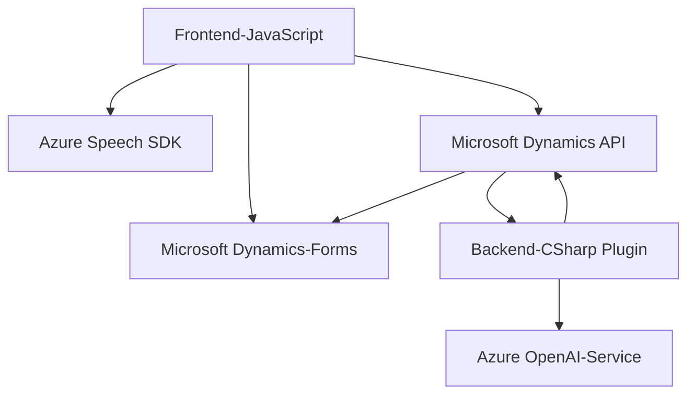

### Breve resumen técnico:

El repositorio proporcionado detalla tres archivos responsables de interactuar con formularios en Dynamics 365, procesar datos con reconocimiento de voz (Azure Speech SDK), realizar síntesis de voz, e integrar con Azure OpenAI Service para transformar texto según reglas específicas. Estas soluciones están desarrolladas para funcionar en un ecosistema orientado a servicios y dependen de APIs externas para su core funcional.

---

### Descripción de arquitectura:

La solución representa una arquitectura **híbrida orientada a servicios** con modularidad en componentes distribuidos. Aunque hay un archivo backend (`TransformTextWithAzureAI.cs`) implementado como un plugin en Dynamics 365, los archivos en el directorio `FRONTEND/JS` operan como scripts cliente que dependen de APIs externas (Azure Speech y Dynamics API) para completar sus objetivos. El diseño favorece la separación de responsabilidades:

1. **Front-end**:
   - Implementa reconocimiento de voz para capturar y sintetizar datos de formularios.
   - Proporciona la lógica de procesamiento dinámico de formularios y mapeo de datos.
   
2. **Back-end**:
   - Extiende Dynamics 365 mediante un plugin que crea interacciones con Azure OpenAI Service para transformar texto.

3. **Integración con servicios externos**:
   - SDK de Azure Speech para reconocimiento y síntesis de voz.
   - Azure OpenAI para procesamiento avanzado de lenguaje natural e inteligencia artificial.

---

### Tecnologías usadas:

1. **Lenguajes:**
   - `JavaScript` (Scripts del frontend).
   - `C#` (.NET Framework para el plugin).
   
2. **APIs/Librerías:**
   - **Azure Speech SDK**: Reconocimiento/síntesis de voz en el frontend.
   - **Azure OpenAI Service**: Procesamiento profundo de lenguaje natural en el backend.
   - `Microsoft Dynamics SDK`:
     - `Xrm.WebApi.online.execute`: Para llamadas API a Dynamics 365.
     - `Microsoft.Xrm.Sdk`: Lógica del plugin.
   - `Newtonsoft.Json` y `System.Text.Json`: Manejo de JSON en el backend.
   - `HttpClient`: Para consultas REST al servicio OpenAI.

3. **Patrones de diseño:**
   - **Cliente-Servidor**: El cliente realiza llamadas a servicios externos y consume información procesada.
   - **Modularidad**: La solución divide la responsabilidad en métodos y clases independientes. 
   - **Service Integration**: Arquitectura basada en APIs para la interacción entre sistemas.
   - **Plug-in Architecture**: Integración de extensiones con Dynamics 365.

---

### Diagrama Mermaid:

---

### Conclusión final:

Esta solución está diseñada para extender la funcionalidad de Microsoft Dynamics usando servicios avanzados como Azure Speech SDK y Azure OpenAI. La arquitectura es modular y orientada a servicios, lo que permite integrar componentes independientes para mejorar procesos empresariales como la interacción con voz y la inteligencia artificial para procesamiento de datos. Por su diseño, esta solución favorece la escalabilidad y la adaptabilidad al entorno de Dynamics 365.

