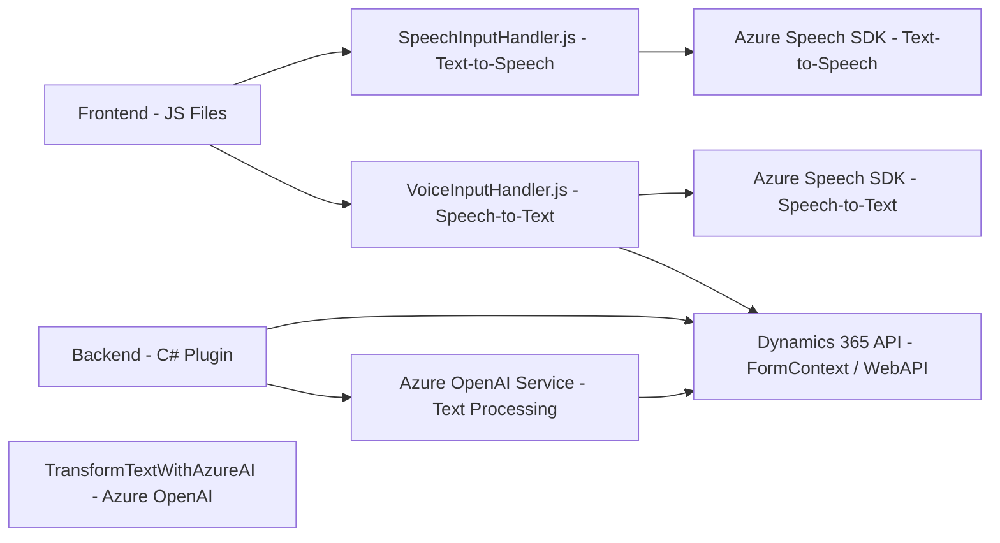

### Breve Resumen Técnico

El repositorio incluye múltiples archivos relacionados con la integración de servicios de Microsoft Azure, específicamente el **Azure Speech SDK** y **Azure OpenAI**, al sistema Dynamics 365. La funcionalidad abarca desde la transformación de texto con inteligencia artificial, la entrada de voz (speech input) desde el micrófono del usuario, hasta la síntesis de texto a voz (text-to-speech). En capacidad técnica, combina capas de interactividad de frontend (JavaScript) con backend y extensibilidad para CRM mediante plug-ins .NET.

---

### Descripción de Arquitectura

La solución parece estar diseñada como una **arquitectura de n capas**, utilizando una combinación de funcionalidades de frontend para gestionar eventos y comunicar con APIs externas (Azure Speech y Dynamics 365). El backend, representado en el archivo de código C#, soporta extensiones de Dynamics 365 mediante plug-ins personalizados para llamadas hacia Azure OpenAI. Existe un patrón de integración de servicios externos (Speech SDK y OpenAI) que posiciona la solución como una integración híbrida (cliente-servidor-nube).

---

### Tecnologías Usadas

1. **Frontend:**
   - Lenguaje: JavaScript.
   - Frameworks/Bibliotecas:
     - Azure Speech SDK (cargado dinámicamente desde URL externa).
   - Dependencias SDK: Dynamics 365 (`formContext`, `Xrm`, y operaciones de WebAPI).

2. **Backend:**
   - Lenguaje: C#.
   - Framework: Plug-in architecture de Dynamics CRM.
   - Librerías:
     - `Microsoft.Xrm.Sdk` para interacciones con Dynamics CRM.
     - `Newtonsoft.Json.Linq`, `System.Text.Json` para manejo de JSON.
     - `System.Net.Http` para solicitudes HTTP hacia las APIs de Azure.

3. **APIs externas:**
   - **Azure Speech SDK**: Para conversión de texto a voz y reconocimiento por micrófono.
   - **Azure OpenAI Service**: Para transformar texto con procesamiento avanzado por AI.

4. **Patrones observados:**
   - **Carga dinámica de recursos**: El SDK de Azure Speech se importa solo cuando es necesario.
   - **Partición por funcionalidad**: Funciones separadas en frontend para entrada/salida de voz, y en backend para transformación de texto.
   - **Middleware/Abstract Wrapper**: `GetOpenAIResponse` implementa una capa envoltura para interacción con Azure OpenAI API.

---

### Diagrama Mermaid Válido para GitHub

---

### Conclusión Final

La solución integra clientes de JavaScript para interactuar con formularios de Dynamics 365, backend basado en plug-ins C#, y capacidades avanzadas de AI mediante los servicios de Azure Speech y OpenAI. Esta arquitectura de **n capas** separa responsabilidades claramente: el frontend se enfoca en la interacción con el usuario y los datos visibles en formularios, mientras el backend amplifica la funcionalidad mediante extensiones de Dynamics 365 y procesamiento en la nube. Es una arquitectura escalable y modular que permite añadir nuevas funcionalidades relacionadas con voz e inteligencia artificial.