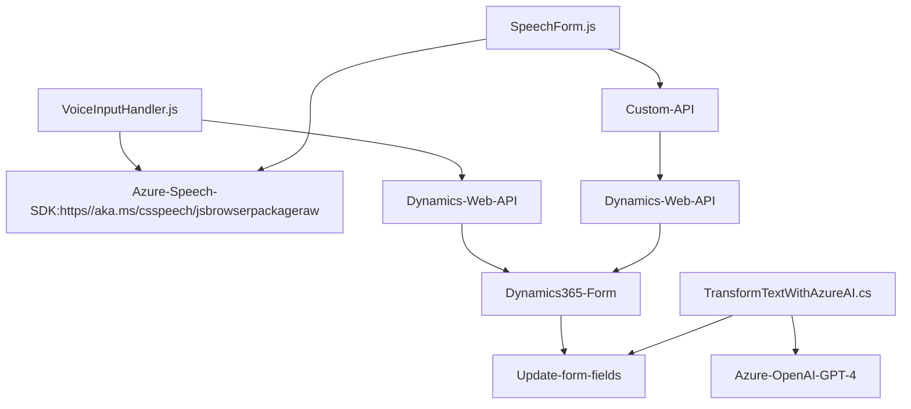

### Breve Resumen Técnico:

El repositorio contiene principalmente tres módulos principales con distintas responsabilidades:
1. **`VoiceInputHandler.js` / `SpeechForm.js`** (Frontend/JS): Manejan entrada de voz y síntesis usando **Azure Speech SDK** e integran su procesamiento con Dynamics 365 forms.
2. **`TransformTextWithAzureAI.cs`** (Plugin/CRM): Implementa un plugin de Dynamics 365 que transforma texto ingresado por el usuario utilizando **Azure OpenAI** en formato JSON estructurado.

La solución general se enfoca en extender las capacidades de **Dynamics 365** al integrar procesamiento inteligente de voz y texto con servicios externos de **Azure Speech SDK** y **Azure OpenAI API**, destacando la modularidad y la integración con servicios externos.

---

### Descripción de Arquitectura:

La arquitectura de esta solución es una combinación de **n capas** con elementos de **arquitectura hexagonal**:
1. **Capas de frontend**: Los scripts JavaScript (`VoiceInputHandler.js`, `SpeechForm.js`) proporcionan la interfaz y lógica de la entrada por voz para interactuar con formularios en Dynamics 365.
2. **Capa de integración**: Los scripts usan servicios externos como Azure Speech SDK y una Custom API (probablemente alojada en Azure o similar) para procesamiento avanzado.
3. **Capa de backend**: El archivo de plugin para Dynamics 365 `TransformTextWithAzureAI.cs` actúa bajo el paradigma **Plugin CRM** y delega la mayor parte del cómputo pesado hacia **Azure OpenAI API**, conformando un microservicio especializado y acoplado débilmente con el contexto CRM.

El uso de SDKs externos y servicios de terceros junto con una división clara entre módulos y roles respeta principios relacionados con patrones de diseño como: **Fachada y coordinación de servicios (en frontend)**, **externals-driven architecture** y **single responsibility principle**.

---

### Tecnologías, Frameworks y Patrones Usados:

**Tecnologías:**
1. **Frontend**:
   - **JavaScript**: Desarrollo de lógica.
   - **Azure Speech SDK**: Reconocimiento y síntesis de voz. Servicios cargados dinámicamente desde `https://aka.ms/csspeech/jsbrowserpackageraw`.
   - **Dynamics Web API**: Comunicación con entidad CRM para actualizar formularios en Dynamics 365.
   - Implementación de métodos asíncronos usando Promises.

2. **Backend**:
   - **C# y .NET Framework**: Plugin preparado para Dynamics 365 SDK mediante implementación de `IPlugin`.
   - **Azure OpenAI API (GPT-4)**: Procesamiento de texto entrante desde formularios.
   - **Newtonsoft.Json y System.Text.Json**: Manipulación avanzada de objetos JSON dentro del flujo del plugin.
   - **HttpClient**: Solicitudes HTTP para integración con Azure API.

**Patrones:**
1. **Frontend:**
   - **Cargador dinámico de dependencias**: Carga dinámica del SDK de Azure.
   - **Fachada**: Reúne funcionalidades de reconocimiento y síntesis de voz en funciones reutilizables para permitir un servicio consistente.
   - **Separation of concerns**: Lógica modular dividida en funciones específicas con entradas/salidas claras.

2. **Backend:**
   - **Plugin pattern CRM**: Para encapsular la lógica de negocio extendida en Dynamics CRM.
   - **API delegation**: Delegación de operaciones complejas a microservicios externos (Azure OpenAI).
   - **Exitencias y entradas claramente definidas** en formato JSON, cumpliendo con una arquitectura de datos estructurada.

---

### Dependencias o Componentes Externos:

**Frontend**:
- **Azure Speech SDK**: Servicio externo para síntesis y reconocimiento de voz.
- **API a integrar con Dynamics Web API**: Para intercambio de datos en aplicaciones relacionadas con formularios.

**Backend**:
- **Azure OpenAI GPT-4 API**: Servicio externo utilizando inteligencia artificial para generar JSON estructurado y transformaciones del texto.
- **Microsoft Dynamics CRM**: Base para ejecución del plugin.
- **Microsoft.Xrm.Sdk**: SDK para acceso integración con entidades CRM en Dynamics 365.
- **Newtonsoft.Json y System.Text.Json**: Manejo estructurado de datos JSON.

---

### Diagram Mermaid:

---

### Conclusión Final:

- Esta solución implementa extensiones para Dynamics 365 mediante entrada por voz y procesamiento avanzado del texto.
- Sigue una arquitectura basada en **n-capas** con elementos de **arquitectura hexagonal**, aprovechando servicios externos como Azure Speech SDK para el frontend y Azure OpenAI API para el plugin CRM.
- Funcionalidades como el cargador dinámico de SDKs y la comunicación con microservicios externos destacan sus características modernas y flexibles.
- Es una solución robusta adecuada para integrar speech-to-text y AI-powered text processing en la base de Dynamics 365.
