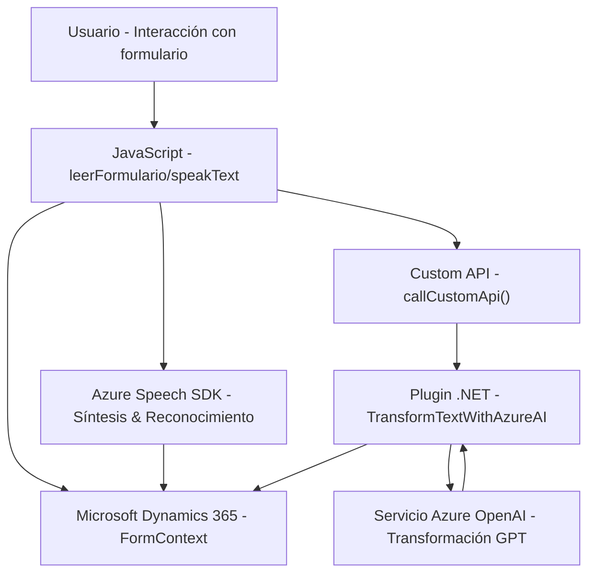

# Análisis Técnico

## Breve Resumen Técnico
El repositorio parece ser una solución orientada al trabajo con formularios en Microsoft Dynamics 365, integrando capacidades de voz mediante Azure Speech SDK y procesamiento de texto con Azure OpenAI. La solución está compuesta por tres grandes componentes:
1. **Frontend en JavaScript**: Interacción con formularios mediante voz (lectura y reconocimiento).
2. **Plugins en C#**: Extensiones de Dynamics CRM que interactúan con Azure OpenAI para el procesamiento y transformación de texto.
3. **Dependencias externas**: Azure Speech SDK y Azure OpenAI son los principales servicios integrados.

---

## Descripción de la arquitectura
La solución utiliza una arquitectura híbrida basada en:
- **Modularización**: Las funcionalidades están divididas en módulos independientes, como lectura de formularios, reconocimiento de voz, y transformación de texto.
- **Integración de servicios**: Hace uso de patrones de arquitectura orientada a servicios (SOA) al integrar servicios como Azure Speech SDK y Azure OpenAI con Dynamics 365.
- **Extensiones para Dynamics CRM**: Los plugins, desarrollados en C#, se ajustan al framework de Dynamics usando `IPlugin`, que es típico de las extensiones en la plataforma.
- **N capas**: La solución muestra una forma de arquitectura de tres capas:
  - **Capa de presentación**: Archivos JS para interacción del usuario con el formulario mediante voz y visualización.
  - **Capa de servicios**: Middleware de procesamiento (integración con Azure APIs).
  - **Capa de datos**: Gestión de datos y mapeo en Microsoft Dynamics CRM.
  
---

## Tecnologías Usadas
1. **Frontend**:
   - **JavaScript** para las funciones de cliente.
   - **Azure Speech SDK** para síntesis y reconocimiento de voz.
   - **Microsoft Dynamics 365 Web API** para integración con formularios y campos del CRM.

2. **Backend**:
   - **C#** para los plugins (`TransformTextWithAzureAI.cs`) utilizados en Dynamics CRM.
   - **Microsoft.Xrm.Sdk** para conectar y interactuar con Dynamics.
   - **Azure OpenAI** para la transformación y comprensión del texto.
   - **Newtonsoft.Json.Linq** para la manipulación de JSON.

---

## Diagrama Mermaid

---

## Conclusión Final
La solución tiene una **arquitectura orientada a integración de servicios externos** y un diseño modular con diferentes capas funcionales. Es ideal para facilitar la interacción mediante voz con formularios dinámicos y extensibles en el contexto corporativo de Microsoft Dynamics 365. Las tecnologías utilizadas, como Azure Speech SDK y Azure OpenAI, hacen uso de los principios modernos de desacoplamiento y API-first, lo que la convierte en una solución flexible y escalable para entornos empresariales optimizados para inteligencia artificial.