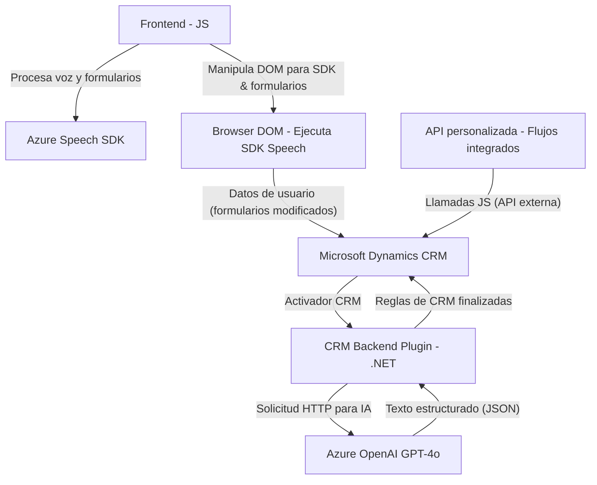

### Breve resumen técnico
Este repositorio representa una solución basada en la integración de formularios, voz y procesamiento avanzado de texto mediante inteligencia artificial. Está compuesto por archivos JavaScript para el frontend (procesamiento de voz y extracción de datos del formulario) y un plugin .NET/C# para la transformación de texto usando Azure OpenAI. La solución se enfoca en la interfaz de usuario (frontend), el manejo dinámico de formularios y la inteligencia artificial integrada con Microsoft Dynamics CRM.

---

### Descripción de arquitectura
La arquitectura combina componentes de diversas capas:
- **Frontend de capa ligera**:
  - Implementado en JavaScript, se comunica directamente con Azure Speech SDK para la síntesis y transcripción de voz. Tiene una estructura modular y reutilizable con funciones separadas para distintas responsabilidades (procesamiento de voz, manipulación de datos de formularios).
- **Backend plugin (.NET)**:
  - Diseñado para ejecutarse como un plugin dentro del ecosistema de Dynamics CRM, transformando el texto mediante Azure OpenAI para manipular datos estructurados.
- **Dependencias externas dinámicas**:
  - Azure Speech SDK, API personalizada y Azure OpenAI son recursos externos críticos que amplían las funciones de la solución.

Arquitectura inferida:
- **N capas híbridas**:
  - Consta de frontend, CRM plugin (backend) y servicios externos en la nube.
- **Integración con APIs externas**:
  - Uso de patrones de microservicio para interactuar con OpenAI mediante HTTP, pero no se organiza como una arquitectura estricta de microservicios.

---

### Tecnologías usadas
1. **Frontend**:
   - Lenguaje: JavaScript.
   - Framework: Ninguno aparente (código directo).
   - SDK: Azure Speech SDK.
   - DOM y API del navegador.
2. **Backend/plugin**:
   - Lenguaje: C#.
   - Framework: Microsoft Dynamics CRM Plugin Interface.
   - SDK: Microsoft.Xrm.Sdk.
   - Modelado de JSON: `System.Text.Json` y `Newtonsoft.Json.Linq`.
3. **Servicios externos**:
   - Azure Speech API (JS).
   - Azure OpenAI GPT-4o.
   - API personalizada basada en Dynamics CRM.
   - HTTP para conexión con APIs externas.

---

### Diagrama Mermaid

---

### Conclusión final
Esta solución tiene una arquitectura híbrida de n capas que combina un frontend basado en JavaScript con un backend basado en Microsoft Dynamics CRM (.NET). Es modular, reutilizable y preparada para integraciones dinámicas. Los componentes externos necesarios (Azure Speech SDK y Azure OpenAI) refuerzan su capacidad para manejar procesos de texto y voz. Aunque no es estrictamente un sistema de microservicios, tiene una composición que aprovecha servicios externos orientados a eventos y procesamiento.