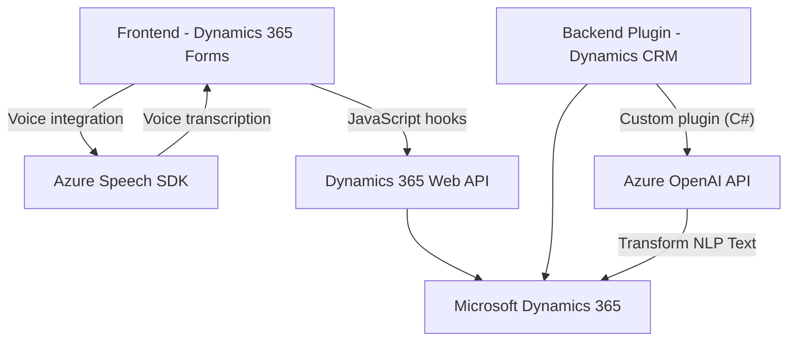

### Breve resumen técnico

El repositorio describe una solución con múltiples componentes focalizados en la integración de **Azure Speech SDK** y **Azure OpenAI API** con **Microsoft Dynamics 365 CRM**. Los módulos permiten la entrada y salida de voz, transcripción automática, y el procesamiento de lenguaje natural (NLP) para interactuar dinámicamente con los formularios CRM. Además, incluye un plugin en C# para manipular texto utilizando un modelo IA.

---

### Descripción de arquitectura

- **Tipo de solución:** Este repositorio es una combinación de **API**, **frontend auxiliar** para Dynamics 365, y un **plugin** de backend. El objetivo general es mejorar la interacción de usuarios con formularios CRM, permitiendo entrada de voz, generación de respuesta de voz, transcripción automática y transformaciones de texto mediante IA.

- **Arquitectura física:** 
  - La capa frontend está acoplada a Dynamics 365 mediante JavaScript (gran dependencia de `executionContext`, `formContext`, y funciones relacionadas).
  - La integración de Clouds (Azure Speech y Azure OpenAI API) define un **serverless microservice** para procesamiento.

- **Patrones observados:**
  - **Modularidad funcional:** Cada archivo se diseña con funciones claramente organizadas por propósito.
  - **Plugin Framework:** Uso del patrón de plugins de Dynamics CRM para extensibilidad.
  - **External SDK Integration:** Dependencia al SDK de Azure Speech y OpenAI usando integraciones REST API.
  - **Callback Asíncrono:** Escalabilidad mediante gestión dinámica de SDK y transcripción en el frontend.

- **Tipo de arquitectura:** Multicapa, con elementos distribuidos:
  - **Frontend:** JavaScript se ejecuta dentro del contexto del cliente (Dynamics 365 forms).
  - **Backend plugins:** El procesamiento avanzado se basa en la lógica de C#, integrada mediante plugins de Dynamics CRM.
  - **Servicios en la nube externa** (por ejemplo, Speech SDK y OpenAI).

---

### Tecnologías y dependencias usadas

1. **Frontend:**
   - **JavaScript (vanilla)**: Para manipulación DOM y SDK externo.
   - **Azure Speech SDK**: Sintetización y reconocimiento de voz.
   - **Dynamics 365 Web API (Xrm.WebApi.online)**: Acceso a datos internos relacionados con los formularios CRM.

2. **Backend:**
   - **C#**: Implementación de plugins en Dynamics CRM.
   - **Azure OpenAI API**: Conexión vía API REST, transformaciones de texto.
   - **Framework Dynamics 365**: Interacción con entidades CRM mediante servicios como `IOrganizationService`.

3. **Cloud services:**
   - **Azure Speech SDK**: Reconocimiento y síntesis de voz.
   - **Azure OpenAI API**: Procesamiento y transformación de texto basado en IA.

---

### Merlin Diagrama **Mermaid** válido para GitHub

---

### Conclusión final

La solución muestra una **integración efectiva de servicios en la nube** con un sistema CRM corporativo como Dynamics 365. Es una **arquitectura modular multicapa**, ideal para casos donde se mejoran experiencias de usuario mediante IA y capacidades de voz. Sin embargo, podría beneficiarse de mejoras como:
1. **Centralización de configuración** para credenciales en Azure.
2. **Manejo de errores robusto** frente a fallos en los SDK o los formularios Dynamics.
3. **Un mayor desacoplamiento** entre lógica específica (Dynamics) y los SDKs externos, para escalabilidad futura.