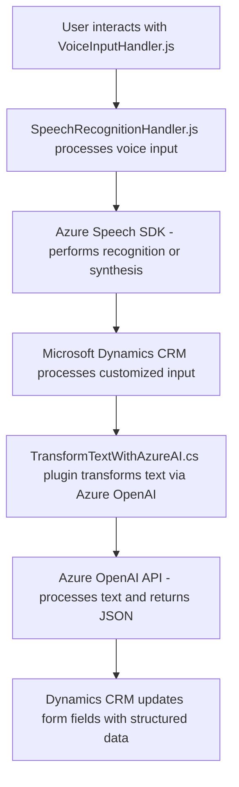

### Breve Resumen Técnico
El repositorio analiza la integración de Azure Speech SDK y Azure OpenAI con formularios dinámicos en Microsoft Dynamics CRM. Está compuesto por tres archivos específicos que cumplen distintos roles en este ecosistema:
1. **`VoiceInputHandler.js` y `SpeechRecognitionHandler.js` (Frontend)**: Manejan la interacción con el usuario en términos de entrada de voz y reconocimiento, transformando datos en tiempo real y enviando información al backend.
2. **`TransformTextWithAzureAI.cs`**: Plugin backend que usa AI (via Azure OpenAI) para transformar texto y alimentar los formularios en Dynamics CRM.

### Descripción de la Arquitectura
1. **Tipo de Solución**: Una aplicación híbrida que implementa funcionalidades basadas en inteligencia artificial (Azure Speech SDK y Azure OpenAI) para enriquecer el flujo de trabajo en un entorno CRM.
2. **Arquitectura Usada**:
   - **Frontend**: Modular y basado en funciones, donde cada archivo aborda aspectos específicos de interacción con la voz o los formularios.
   - **Backend**: Basado en plugins, diseñado para ejecutar procesos específicos dentro del ecosistema Dynamics CRM.
   - **N-Capas/Ambiente**: La arquitectura general sigue una aproximación de múltiples capas:
     - **Capa de presentación**: Javascript en el frontend.
     - **Capa de negocio**: Plugin de backend (`TransformTextWithAzureAI.cs`).
     - **Capa de datos**: Interacción y persistencia en Dynamics CRM.
3. **Patrones Usados**:
   - Modularidad: Separación de responsabilidades por archivo y función.
   - API Gateway: Conexión de APIs de Azure Speech y Dynamics CRM.
   - Plugin architecture para extensibilidad en Dynamics CRM.

### Tecnologías Usadas
1. **Frontend**:
   - Javascript
   - Azure Speech SDK
   - HTML DOM Manipulation
   - Microsoft Dynamics CRM SDK (`Xrm.WebApi`).
2. **Backend**:
   - C# (.NET Framework para Dynamics CRM).
   - Azure OpenAI (GPT-4 o equivalente).
   - JSON Parsing Libraries (`Newtonsoft.Json`, `System.Text.Json`).
   - HTTP Client for API Requests.
3. **Frameworks y herramientas externas utilizadas**:
   - Azure SDKs (Speech y OpenAI).
   - Dynamics CRM SDK.

### Dependencias o Componentes Externos
1. **Azure Speech SDK** para reconocimiento y síntesis de voz.
2. **Azure OpenAI** como servicio de transformación textual.
3. **Microsoft Dynamics CRM** como capa de datos y lógica empresarial.
4. **External APIs & Libraries** como `Newtonsoft.Json` y manejo de datos JSON.

---

### Diagrama Mermaid compatible con GitHub

### Conclusión Final
El sistema combina inteligencia artificial (Azure Cognitive Services y OpenAI) con la automatización de procesos empresariales (Dynamics CRM). Su arquitectura modular y su diseño basado en capas permiten que las funciones sean reutilizables y extensibles. La integración directa con potentes SDK y APIs proporciona una solución robusta y sofisticada para casos de uso como la entrada de datos por voz y la transformación de texto en datos estructurados para CRM.