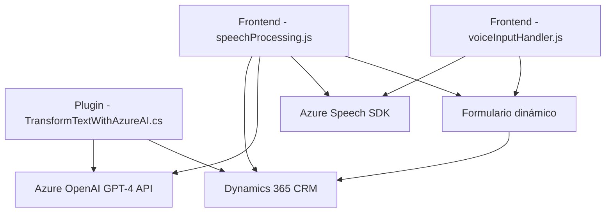

### Resumen Técnico del Repositorio

El repositorio abarca funcionalidad asociada con **procesamiento de voz**, **formulario dinámico**, e **integración con AI** en un entorno de Microsoft Dynamics 365. Utiliza Azure Speech SDK para reconocimiento y síntesis de voz, además de una integración con Azure OpenAI GPT para procesamiento de texto. Complementa estas capacidades con un plugin implementado en C# que extiende las funcionalidades de Dynamics CRM.

---

### Descripción de Arquitectura

La solución se puede categorizar como una aplicación **multicapa**:

1. **Presentación (Frontend en JavaScript)**: Contiene archivos como `voiceInputHandler.js` y `speechProcessing.js`, encargados de capturar datos de formularios y manipularlos mediante servicios externos (Azure Speech SDK, APIs personalizadas).
2. **Backend/Extensiones (Plugin en C#)**: `TransformTextWithAzureAI.cs` se define como un plugin de Dynamics 365 que procesa texto vía Azure OpenAI GPT-4, proporcionando AI para transformar datos.
3. **Servicios Externos**:
   - **Azure Speech SDK**: Para reconocimiento/síntesis de voz desde formularios.
   - **Azure OpenAI GPT-4**: Para procesamiento y transformación avanzada de texto.

La arquitectura global puede clasificarse como **Híbrida Multicapa SOA**, ya que combina:
- **Multicapa**: Frontend para captura de datos y backend para procesamiento con lógica CRM.
- **Orientada a Servicios**: Interacción con servicios externos (Azure Speech SDK, Azure OpenAI GPT).
- **Event-Driven**: Uso de patrones basados en eventos.

---

### Tecnologías y Patrones Usados

#### Tecnologías y frameworks:
1. **Frontend (JavaScript)**:
   - Azure Speech SDK (para operaciones de síntesis/reconocimiento de voz).
   - Dynamics 365 API (`Xrm.WebApi`) para interacción con datos del formulario.
   
2. **Backend (C#)**:
   - Microsoft Dynamics CRM **IPlugin interface** para extensiones a nivel de servidor.
   - Azure OpenAI GPT para transformación de texto.

3. **Servicios y librerías externos**:
   - Azure OpenAI (para procesamiento AI).
   - Dynamics Web API (para manipulación de datos y llamadas REST).
   - Microsoft SDK (`SpeechSDK`) cargado dinámicamente para reconocimiento de voz.

#### Patrones:
1. **Modularidad**: Código dividido entre frontend y backend en funciones/métodos especializados.
2. **Carga dinámica**: Integración de SDKs externos (Azure Speech SDK) solo cuando es necesario.
3. **Event-driven**: Uso de callbacks y eventos para manejar interacción de voz.
4. **Integración APIs externas**: Uso de SOA para interactuar con Azure Speech y OpenAI.

---

### Diagrama con Mermaid

---

### Conclusión Final

Esta solución está diseñada para trabajar en un ecosistema **Dynamics 365**, mejorando la interacción del usuario con formularios dinámicos mediante comandos de voz y agregando capacidades de inteligencia artificial. Su arquitectura combina varias capas:
- **Frontend** para interactuar con los usuarios.
- **Backend** (Plugin) que utiliza lógica avanzada.
- **Servicios externos** como Azure Speech SDK y OpenAI GPT.

En general, es una solución sólida, centrada en eventos y SOA, con una fuerte dependencia de APIs y SDKs externos que permiten aumentar las capacidades estándar de Dynamics 365.