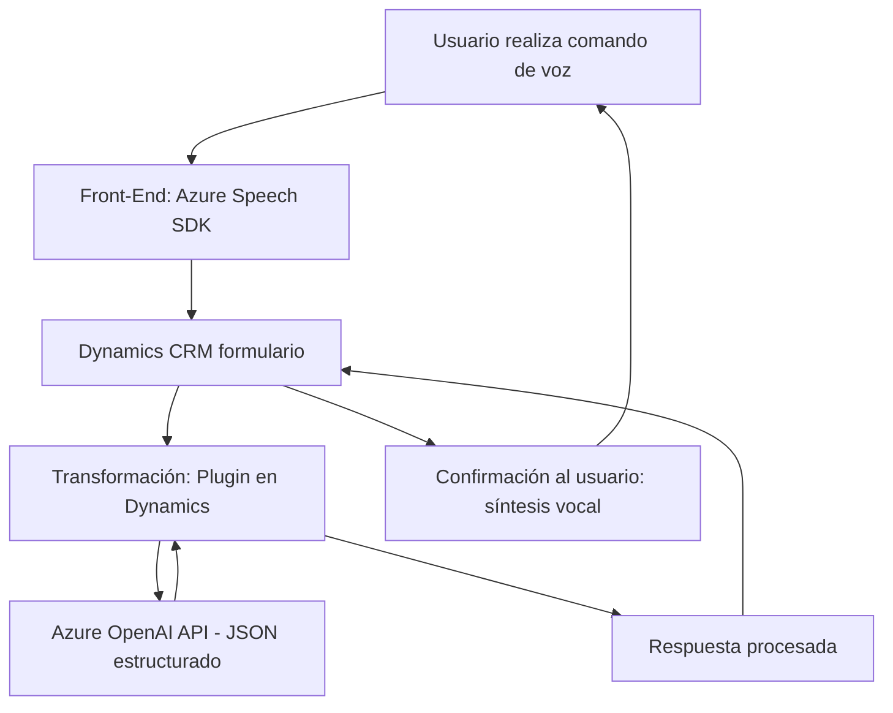

### Breve resumen técnico
El repositorio muestra una solución que implementa funcionalidades para interacción entre un sistema CRM basado en Dynamics 365 y los servicios de Azure (Azure Speech SDK y Azure OpenAI). Incluye una interfaz de entrada de voz y síntesis de voz en el frontend, junto con un plugin backend que transforma texto usando Azure AI.

---

### Descripción de arquitectura
La solución evidencia una arquitectura basada en **n-capas**:
1. **Frontend**: Procesa datos del usuario mediante Azure Speech SDK, interactuando con formularios dinámicos en el sistema CRM.
2. **Backend (Plugins)**: Extiende las funcionalidades de Dynamics CRM mediante integración directa con la API de Azure OpenAI para la transformación del texto.
3. **Servicios Externos**: Azure Speech y Azure OpenAI actúan como microservicios encargados de procesamiento especializado.

El diseño utiliza patrones como:
- **Facade**: En el frontend, los métodos encapsulan detalles complejos sobre cómo interactuar con Azure Speech SDK y manejar datos de formularios.
- **Observer Callback**: Para cargar el SDK dinámicamente, optimizando la carga inicial.
- **Plugin-based Architecture**: En el backend, extendiendo la funcionalidad del CRM mediante la interfaz de plug-ins.
- **Service-oriented architecture (SOA)**: División clara de responsabilidades con dependencias externas de servicios Azure.

---

### Tecnologías usadas
1. **Frontend**:
   - Lenguaje: JavaScript.
   - Frameworks/Bibliotecas: Azure Speech SDK.
   - Otros: APIs y contexto de Dynamics CRM.

2. **Backend**:
   - Lenguaje: C#.
   - Frameworks/Bibliotecas: 
     - Microsoft Dynamics SDK (Microsoft.Xrm.Sdk).
     - Newtonsoft.Json para manejo JSON.
     - System.Net.Http y System.Text.Json para interacción con APIs.
     - Azure OpenAI API.

---

### Diagrama Mermaid válido para GitHub

---

### Conclusión final
La solución está diseñada como una **integración entre Dynamics CRM y servicios Azure**, implementando una arquitectura **n-capas** con servicios externos complementarios. En el frontend, se destaca la interacción con Azure Speech SDK para entrada y salida de voz (modular y eficiente). En el backend, se implementan plugins para extender Dynamics con lógica personalizada, empleando Azure OpenAI API para manejo avanzado de datos. Es un diseño bien estructurado, que sigue buenas prácticas de modularidad y uso de APIs específicas para minimizar la carga local y aprovechar la escalabilidad de las soluciones en la nube.