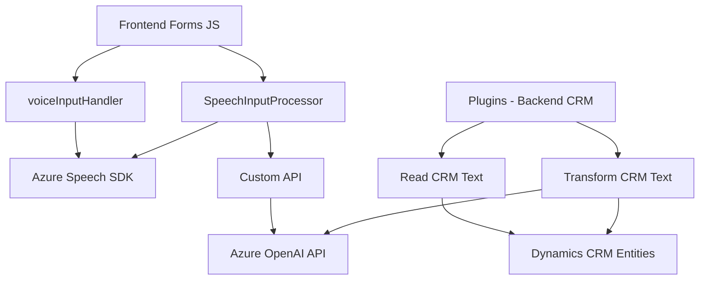

### Breve Resumen Técnico
El repositorio contiene una solución orientada a procesar datos de formularios en Dynamics 365 mediante interacción por voz y texto, integrándose con servicios externos como **Azure Speech SDK** y **Azure OpenAI API**. El propósito principal es aumentar accesibilidad y dinamismo en CRM mediante lectura de campo en voz alta, entrada por voz, y transformación avanzada de datos utilizando IA externa.

---

### Descripción de Arquitectura
1. **Tipo de solución**: Sistema compuesto por múltiples componentes:
   - **Frontend**: Módulos en JavaScript que procesan entrada y salida de voz (ej. `voiceInputHandler.js`, `SpeechInputProcessor.js`).
   - **Backend Plugins**: Funcionalidad para transformación avanzada de texto (ej. `TransformTextWithAzureAI.cs`).
2. **Patrón arquitectónico**: Modularidad explícita en frontend (manipulación dinámica del DOM y Azure SDK) combinado con arquitectura plugin en backend (Dynamics CRM).  
   - La interacción entre componentes sugiere un modelo **orientado a servicios**, con utilizados API externas (Speech y OpenAI).
3. **Tipo de arquitectura**:
   - **Híbrida**: Frontend modular con lógica separada por función (entrada/salida de voz).
   - **Plugin-based backend**: Código modular y desacoplado para Dynamics CRM.
4. **Patrones adicionales usados**:
   - **Adapter Pattern**: Transformación de datos de formularios en textos legibles (`getReadableValue`, adaptaciones a CRM mediante mapeos).
   - **Observer/Callback Pattern**: Cargado asíncrono de SDKs y manejadores de eventos.
   - **Factory Pattern**: Creación dinámica de servicios (Azure Speech SDK, organización de Dynamics).

---

### Tecnologías Usadas
1. **Frontend**:
   - **JavaScript** con integración de Azure Speech SDK.
   - Manipulación del DOM (**HTML API** y control de `formContext`).
2. **Backend**:
   - **C#** como lenguaje principal.
   - **Dynamics CRM Framework** para plugins (`IServiceProvider`, `Xrm.Sdk`).
   - **Azure OpenAI API** para procesamiento avanzado.
3. **Dependencias Externas**:
   - **Azure SDK**: Speech (gestión de entrada/salida de voz) y OpenAI (procesamiento textual).
   - **Newtonsoft.Json** y **System.Net.Http** para gestionar respuestas HTTP y JSON en plugins.

---

### Diagrama Mermaid Válido para GitHub

---

### Conclusión Final
La solución presentada combina tecnologías modernas como **Azure Speech SDK** y **OpenAI API** con la extensibilidad de Dynamics CRM, optimizando interacción en formularios por voz y procesamiento externo avanzado. Su arquitectura modular y desacoplada facilita la escalabilidad y extensibilidad, y resulta ideal para sistemas de accesibilidad o automatización CRM. Las implementaciones pueden beneficiarse de mayor robustez en seguridad (gestión de claves API) y mejora en patrones de desacoplamiento entre frontend y backend.