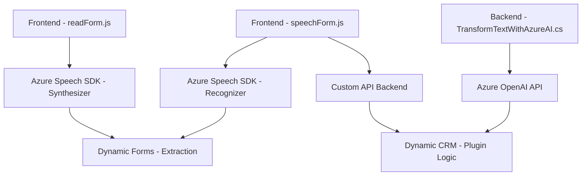

### Breve resumen técnico
El repositorio contiene una solución orientada a integrar capacidades de inteligencia artificial y servicios avanzados de voz mediante la API de **Azure Speech SDK** y **Azure OpenAI API**. La solución está dividida en tres secciones clave: frontend dinámico que interactúa con formularios (sintetiza y transcribe voz), backend (plugins) que procesan texto con la API de OpenAI, y componentes para comunicación asincrónica entre Azure y Dynamics CRM.

---

### Descripción de arquitectura
La solución combina múltiples elementos arquitectónicos:
- **Frontend (JavaScript):**
  - Implementa una lógica basada en la interacción con formularios dinámicos, usando SDKs externos como **Azure Speech SDK** para síntesis y reconocimiento de voz, apoyándose en un enfoque modular y dinámico.
  - Usa principios de desacoplamiento mediante el cargador dinámico de dependencias y procesamiento asíncrono.
  
- **Backend (C# Plugin - Dynamics CRM):**
  - Integra lógica de procesamiento mediante **Azure OpenAI API**, usando plugins de Dynamics CRM. Encapsula las reglas de negocio y aprovecha la arquitectura de microservicios (API externa de OpenAI) para delegar tareas de inteligencia artificial.

**Tipo de arquitectura:**
- Se observa una **arquitectura de microservicios** para la interacción con Azure API, mientras que el backend de Dynamics sigue una estructura basada en plugins.
- El frontend implementa una **estructura modular** (separación clara de responsabilidades como extracción de datos, procesamiento de voz, y mapeo dinámico).

---

### Tecnologías usadas
1. **Frontend:**
   - **JavaScript**
   - **Azure Speech SDK**
   - **Dynamic Forms** (Dynamics 365)

2. **Backend:**
   - **C#**
   - **Azure OpenAI API**
   - **Dynamics CRM SDK** (API para plugins y Xrm WebApi)

3. **Arquitectura general:**
   - **HTTP API Calls:** Para comunicación entre frontend y servicios externos.
   - **Asynchronous Programming:** Uso extensivo de `async/await`.
   - **JSON Processing:** Transformación y normalización de objetos JSON.

---

### Dependencias o componentes externos que podrían estar presentes
1. **Azure Speech SDK:** Para sintetizar texto en voz desde el frontend y transcribir voz a texto.
2. **Azure OpenAI API:** Servicios de inteligencia artificial para realizar transformaciones avanzadas de texto.
3. **Dynamic Forms:** Formulario dinámico de Microsoft Dynamics 365, para manipulación de datos y controles desde JavaScript.
4. **Dynamics SDK (Microsoft.Xrm.Sdk):** Para integrar plugins y manejar la lógica de negocio en el backend de Dynamics CRM.

---

### Diagrama Mermaid válido para GitHub Markdown

El diagrama refleja una interacción básica entre las principales componentes del sistema.

---

### Conclusión final
La solución combina elementos de diferentes capas tecnológicas (frontend dinámico, backend basado en plugins) y aprovecha APIs externas de Azure para potenciar funcionalidades avanzadas como procesamiento de voz e inteligencia artificial. La arquitectura es una mezcla de **microservicios** y **modularidad**, con fuerte uso de conceptos asíncronos.

Las ventajas son la modularidad y escalabilidad con servicios externos como **Azure Speech** y **Azure OpenAI**, pero incluye dependencia en servicios específicos de Microsoft Dynamics y Azure, lo cual puede presentar desafíos de configuración o costos en entornos críticos.