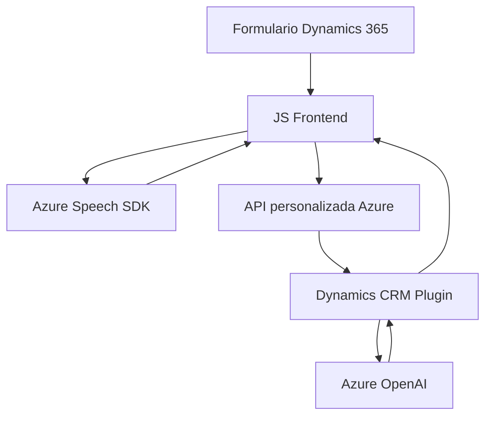

### Breve resumen técnico

El repositorio parece ser una solución completa que integra funcionalidad avanzada dentro de una plataforma CRM, específicamente Microsoft Dynamics 365. Se enfoca en la interacción entre usuarios y formularios mediante entrada y salida de voz utilizando tecnologías como Azure Speech SDK y APIs personalizadas. Además, utiliza un plugin basado en Azure OpenAI para procesar y transformar texto de manera estructurada.

---

### Descripción de arquitectura

La arquitectura sigue un enfoque **n-capas**, separando la lógica de interacción con formularios, procesamiento de datos, y llamada a servicios externos (Azure Speech SDK y Azure OpenAI). Cada componente individual maneja una parte de la solución:
- **Frontend JavaScript**: Trabaja encapsulado en Dynamics 365, manejando la lógica del cliente, integración con SDKs y APIs.
- **Plugin C#**: Extiende la funcionalidad del servidor CRM para realizar transformaciones avanzadas con servicios de Azure.

La solución utiliza un modelo híbrido:
- **Modularidad** en el frontend para encapsular funcionalidades específicas del procesamiento de voz.
- **Plugin-based** en el backend, como una extensión directa del ciclo de vida CRM.

---

### Tecnologías usadas
1. **Frontend**:
   - **Azure Speech SDK**: Para conversión de texto a voz y reconocimiento del habla.
   - **JavaScript**: Para lógica del cliente, manipulación del DOM y interacción con APIs de Dynamics 365.

2. **Backend**:
   - **Microsoft Dynamics CRM SDK (C#)**: Gestión de plugins y operaciones relacionadas con CRM.
   - **Azure OpenAI**: Procesamiento avanzado de texto.
   - **Newtonsoft.Json y System.Text.Json**: Manejo de datos en formato JSON.
   - **System.Net.Http**: Envío de solicitudes HTTP al servicio de Azure.

---

### Diagrama Mermaid válido para GitHub

---

### Conclusión final

- **Tipo de solución**: La solución combina un **frontend** basado en JS y un **backend** basado en plugins (C#) integrados en Dynamics 365, extendiendo la funcionalidad CRM mediante Azure Speech SDK y OpenAI.
- **Diseño arquitectónico**: Implementa una estructura **n-capas hídrida**, con integración de servicios externos, procesamiento de entrada/salida de voz y transformación de texto en varios niveles de la aplicación.
- **Flexibilidad y escalabilidad**: Permite extender funcionalidades con servicios en la nube como Azure y facilita la personalización de reglas de negocio mediante plugins CRM. La modularidad en el frontend asegura que futuras extensiones sean manejables.
