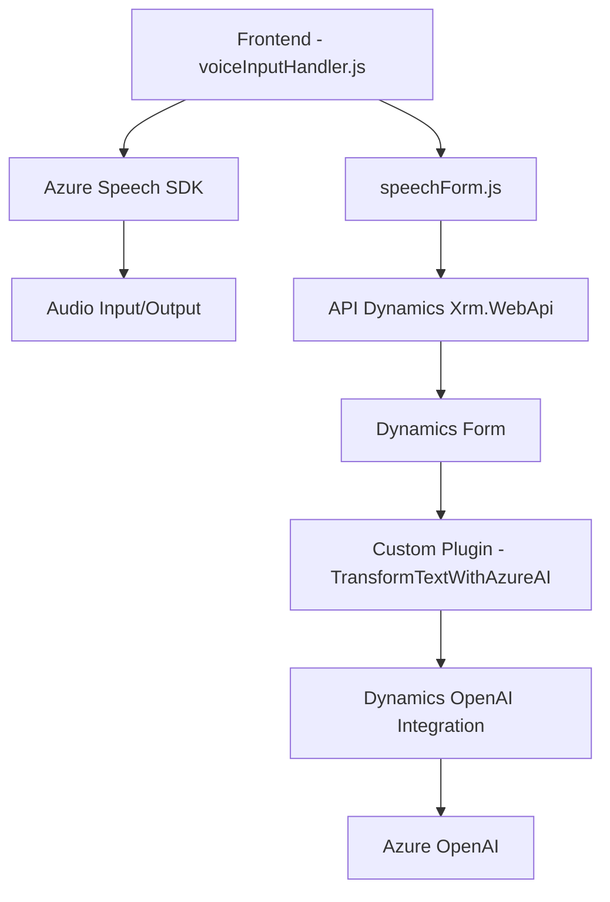

### Breve resumen técnico
El repositorio contiene una solución híbrida diseñada para interactuar con formularios dinámicos en Dynamics 365, proporcionando funcionalidades centradas en voz y procesamiento de texto mediante servicios de Azure. Hay tres componentes principales:
1. **Frontend/JS**: Scripts de JavaScript para manipular formularios y usar Azure Speech SDK.
2. **Backend Plugin**: Código C# que usa Dynamics CRM y Azure OpenAI para transformar texto.
3. **Servicios Externos**: Integración con el Azure Speech SDK y Azure OpenAI para reconocimiento de voz y generación de JSON estructurado.

---

### Descripción de arquitectura
La solución tiene una arquitectura **n-capas**:
1. **Frontend/Presentación**:
   - Scripts de JavaScript como `voiceInputHandler.js` y `speechForm.js` que manejan las interacciones de usuario basadas en formularios y voz.
   - Implementación de patrones como modularidad y separación de responsabilidades.

2. **Lógica del Negocio**:
   - El componente de Dynamics Plugin (`TransformTextWithAzureAI.cs`) encapsula la lógica avanzada de transformación de texto mediante OpenAI.
   - Este plugin aplica reglas específicas para estructurar datos.

3. **Servicios Externos e Integración**:
   - Uso extensivo de Azure SDKs (Speech y OpenAI), lo cual configura la arquitectura con claras dependencias externas orientadas a microservicios en la nube.

---

### Tecnologías usadas
1. **Frontend (JavaScript)**:
   - **Azure Speech SDK**: Para síntesis y reconocimiento de voz.
   - API dinámica de Dynamics (`Xrm.WebApi`) para manipular formularios.

2. **Backend (C#)**:
   - **Microsoft Dynamics SDK**: Para interacción directa con instancias de CRM.
   - **Azure OpenAI API**: Para procesamiento semántico y estructuración.
   - **Newtonsoft.Json**: Librería estándar para manipulación avanzada de JSON.

3. **Patrones**:
   - **Carga dinámica**: SDK Azure Speech se carga solo cuando se necesita.
   - **Separación en capas**: Estructura limpia entre presentación / negocio / datos.
   - **Microservicios externos**: Llamadas a servicios en Azure.
   - **Programación basada en eventos**: Activación de funcionalidades según interacción del usuario.

---

### Dependencias o componentes externos
1. **Azure Speech SDK**: Para síntesis de voz y reconocimiento.
2. **Azure OpenAI API**: Para transformar texto siguiendo reglas personalizadas.
3. **Microsoft Dynamics CRM APIs (Xrm.WebApi)**: Gestión de formularios y datos dinámicos.
4. **Librerías internas**:
   - `Newtonsoft.Json` y `System.Text.Json`: Manipulación JSON.
5. **Servicios internos**:
   - API personalizada (`trial_TransformTextWithAzureAI`).

---

### Diagrama Mermaid válido para GitHub Markdown

---

### Conclusión final
La arquitectura definida se basa en una estructura n-capas con fuerte integración a servicios en la nube de Azure, lo que permite enriquecer formularios dinámicos en Dynamics 365 con capacidades de interacción mediante voz y procesamiento de texto avanzado. Los patrones utilizados, como modularización y separación de responsabilidades, garantizan escalabilidad y mantenibilidad. Aunque la solución depende fuertemente de servicios externos, la estrategia de integración permite una experiencia rica para los usuarios mediante tecnologías IA como Azure OpenAI y Azure Speech SDK.