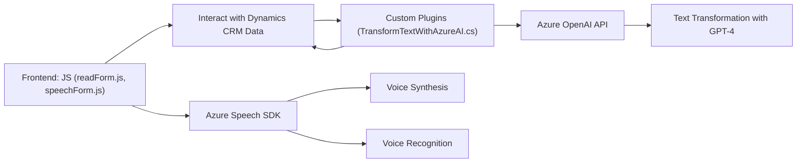

**Resumen técnico:**

El repositorio representa una solución empresarial que habilita funciones de entrada de voz, síntesis de texto y procesamiento avanzado de datos usando inteligencia artificial. Está diseñado para integrarse con Microsoft Dynamics CRM y servicios en la nube como Azure Speech SDK y Azure OpenAI.

---

**Descripción de arquitectura:**

La arquitectura general es una implementación **cliente-servidor** con soporte para servicios externos. Los archivos están organizados funcionalmente:
1. **Frontend:** Scripts en JavaScript para captar datos de formulario y habilitar entrada/salida por voz.
2. **Plugins:** Archivos .NET que implementan lógica de negocio avanzada y comunicación con Azure OpenAI.

Se sigue un patrón de arquitectura basado en **capas**:
- Capa de presentación (frontend): Gestiona la interacción con el usuario.
- Capa de negocio (plugins): Procesa datos, aplica reglas y comunica con servicios externos.
- Capa de integración: Interactúa con APIs como Azure Speech SDK y Azure OpenAI.

---

**Tecnologías usadas:**

1. **Frontend:**
   - JavaScript.
   - Integración con Azure Speech SDK para síntesis y reconocimiento de voz.
   - Dinámica de formularios en Microsoft Dynamics 365.
   - Promesas y funciones asíncronas (`async/await`).

2. **Plugins:**
   - **.NET Framework**, específicamente C#.
   - Microsoft Dynamics SDK para la implementación de extensiones.
   - Azure OpenAI API, con modelos de lenguaje como GPT-4.

3. **Patrones:**
   - Event-driven en el frontend para carga y ejecución de actividades del SDK de Speech.
   - Service Layer en los plugins para interactuar con servicios externos como APIs.
   - Modularización de funciones de frontend para mayor reutilización.

---

**Dependencias externas:**

1. **Microsoft Azure Speech SDK:** Para síntesis de texto a voz y reconocimiento de entrada por voz mediante transcripciones.
2. **Microsoft Dynamics Web API:** Utilizado para gestionar datos en formularios y acceder a entidades de Dynamics 365.
3. **Azure OpenAI API:** Interactúa con modelos GPT-4 o similares para transformar texto y emplear IA.
4. **.NET framework APIs:** Para manipulación textual, solicitudes HTTP y serialización JSON.

---

**Diagrama Mermaid:**

---

**Conclusión final:**

La solución está diseñada para operar en un entorno empresarial como Microsoft Dynamics CRM, con soporte de servicios en la nube de Azure Speech SDK y OpenAI. La arquitectura refuerza **separación de responsabilidades** entre frontend y plugins (`n capas`) y utiliza servicios como una extensión para añadir capacidades avanzadas como entrada/salida por voz y procesamiento de IA. Para fortalecer la seguridad, valores sensibles como claves y endpoints deberían gestionarse con herramientas de secretos.

El código está bien estructurado modularmente, pero podría beneficiarse de una mayor abstracción en ciertos módulos de frontend. Por ejemplo, encapsular toda la lógica de síntesis y reconocimiento de voz en una clase reutilizable.