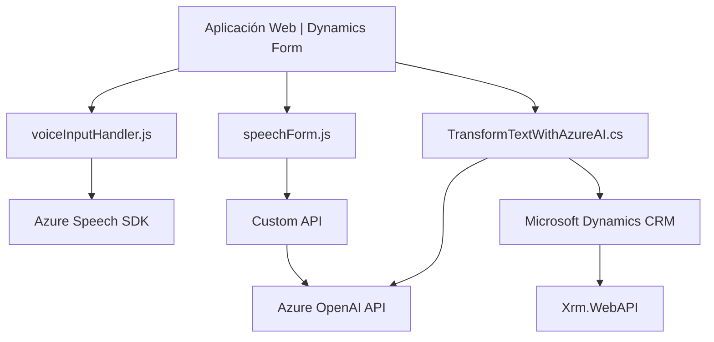

### Breve resumen técnico
El repositorio contiene tres archivos que evidencian una solución combinada con funcionalidades de accesibilidad por voz, procesamiento de transcripción de datos y transformación integrada con IA en el contexto de Microsoft Dynamics CRM. La solución utiliza el **Azure Speech SDK** y el **Azure OpenAI API** como dependencias principales para implementar funcionalidades como entrada/salida de voz y procesamiento de texto avanzado.

---

### Descripción de arquitectura
- **Tipo de solución:** Una integración avanzada para Microsoft Dynamics CRM que combina accesibilidad, transcripción de datos por voz, y análisis de texto mediante API externas. Es una mezcla de frontend, backend basado en plugins, y el uso de servicios cloud.
- **Arquitectura:** La solución muestra características claras de una arquitectura de **n capas**:
  - **Frontend:** En los archivos JavaScript, responsable de la interacción con el usuario, manejo del SDK de Azure Speech y manipulación visual de datos del formulario.
  - **Backend:** En el plugin C# (TransformTextWithAzureAI.cs), que actúa como un componente en Dynamics CRM y realiza operaciones con una API externa (Azure OpenAI).
  - **Integración con servicios externos:** Usa el Azure Speech SDK en el frontend para la transcripción/lectura de voz, y el Azure OpenAI API en el backend para procesamiento de texto avanzado.

---

### Tecnologías usadas
1. **Frontend:**
   - **JavaScript**: Implementado en funciones como lectura de formulario y control de entrada de voz.
   - **Azure Speech SDK**: SDK externo para captura de voz y generación de texto audible.
   - **Dynamics CRM WebAPI (`Xrm.WebApi`)**: Utilizada para manipular datos de los formularios dentro del entorno Dynamics.

2. **Backend:**
   - **C#**: Utilizado para el desarrollo del plugin de Dynamics CRM.
   - **Microsoft.Xrm.Sdk**: Para la integración con el ecosistema de Dynamics CRM.
   - **Azure OpenAI API**: Usada para transformar texto mediante IA aplicada.

3. **Frameworks y patrones:**
   - **Plugins Architecture (Dynamics CRM):** El backend implementa `IPlugin`, lo que permite responder a eventos dentro de Dynamics CRM.
   - **Service-Oriented Architecture (SOA):** Integración de APIs externas manualmente mediante HTTP requests, centralizando servicios de Azure en la solución general.

---

### Dependencias y componentes externos
1. **Azure Speech SDK:** Necesario para las funciones de captura y síntesis de voz. Se carga dinámicamente desde un servidor público de Microsoft.
2. **Azure OpenAI API:** Necesaria para el procesamiento y transformación avanzada de texto.
3. **Dynamics CRM WebAPI (Xrm.WebApi):** Para búsquedas y operaciones sobre datos del sistema CRM.
4. **HTTP Requests:** En el plugin C#, utilizan la integración directa con servicios remotos vía `System.Net.Http`.
5. **JSON Manipulación:** Uso de `Newtonsoft.Json.Linq` y `System.Text.Json` para manejar datos de intercambio entre el plugin y la API externa.

---

### Diagrama **Mermaid** compatible con GitHub Markdown

---

### Conclusión final
La solución está construida dentro de un marco basado en Microsoft Dynamics CRM y emplea una arquitectura **n capas** que separa el frontend (interacción visual y por voz) y el backend (procesamiento en plugins e integración con APIs externas). Las tecnologías clave incluyen **Azure Speech SDK** para entrada y salida de voz en el frontend, **Dynamics CRM WebAPI** para manipular los formularios y atributos, y **Azure OpenAI API** para el procesamiento de texto natural con IA. El diseño del sistema es modular, utiliza patrones de integración de servicios (micro integraciones) y estándares modernos en un entorno basado en Microsoft.