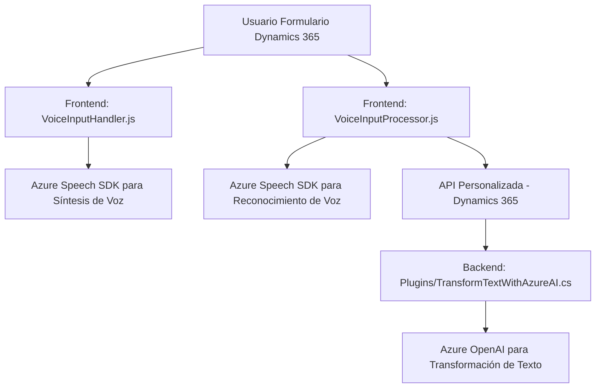

### Breve resumen técnico:
Este repositorio está diseñado para implementar funcionalidades relacionadas con la integración de voz y procesamiento de inteligencia artificial en formularios de Dynamics 365 utilizando tecnologías de Microsoft Azure, específicamente Azure Speech SDK y Azure OpenAI. Incorpora scripts frontend para la captura, conversión y síntesis de voz, así como un backend basado en la arquitectura de plugins para ejecutar transformaciones avanzadas con servicios externos.

### Descripción de arquitectura:
- **Tipo de solución:** La solución es una combinación de frontend y backend enfocada en la integración de voz y procesamiento de lenguaje natural en un CRM (Dynamics 365).
- **Arquitectura utilizada:**
  - Principalmente una arquitectura de **n capas**: donde las capas incluyen la interacción con el cliente (frontend scripts), lógica de negocio (Dynamics CRM plugins), y servicios externos (Azure APIs).
  - Utilización de patrones como **event-driven architecture** para el procesamiento de voz en el frontend y el patrón Plugin en Dynamics CRM para extender sus funcionalidades, con fachada hacia los servicios externalizados de Azure OpenAI y Speech SDK.

### Tecnologías usadas:
1. **Frontend (JavaScript):**
   - **Azure Speech SDK:** Utilizado para conversión de texto a voz y procesamiento de entrada por voz.
   - **Dynamics 365 formContext API:** Para interactuar con formularios y atributos del CRM.
   - Modularización y programación funcional para descomponer tareas específicas: extracción de datos visibles, síntesis de voz y aplicación de valores a formularios.

2. **Backend (.NET C#):**
   - **Microsoft Dynamics CRM Plugin Framework:** Extensión directa hacia el CRM.
   - **Azure OpenAI API:** Comunicaciones HTTP con un endpoint de GPT para procesamiento de texto.
   - **Newtonsoft.Json / System.Text.Json:** Manipulación de JSON en el backend.
   - **HTTP Client:** Para enviar solicitudes al servicio Azure OpenAI.

### Dependencias externas identificadas:
1. **Dependencias externas de frontend:**
   - **Azure Speech SDK** (`window.SpeechSDK`): Proporciona la capacidad de síntesis de voz y reconocimiento de voz.
   - **HTML/JavaScript Form Context (Dynamics 365)**: API de interacción con formularios existentes.

2. **Dependencias externas del backend:**
   - **Azure OpenAI SDK/API**: Para realizar transformaciones de texto a partir de un modelo GPT.
   - **Microsoft Dynamics CRM SDK (.NET)**: Para manipulación de datos en el modelo del CRM.
   - **Sistema de solicitud HTTP**: Comunicación segura con endpoints externos.

---

### Diagrama Mermaid **(GitHub Markdown compatible):**

---

### Conclusión final:
La solución combina frontend y backend para ofrecer procesamiento de voz y texto en formularios interactivos de Dynamics 365. Es modular y flexible, con integración directa con servicios en la nube como Azure Speech SDK y OpenAI. Aunque la arquitectura utiliza capas y elementos de event-driven design, la implementación general refleja un enfoque centralizado en el contexto del CRM (n capas). La dependencia fuerte hacia Azure servicios y Dynamics 365 limita su portable. Sin embargo, su diseño modular facilita la ampliación de funcionalidades en futuras iteraciones.

Recomendaciones para mejorar:
1. **Seguridad:** Gestionar claves API de manera segura mediante un sistema de secretos o configuración.
2. **Configuración:** Parametrizar valores estáticos como modelo, temperatura y configuración para la API.
3. **Escalabilidad:** Evaluar posibilidad de adaptar el diseño hacia microservicios independientes si los datos/formularios crecen exponencialmente.