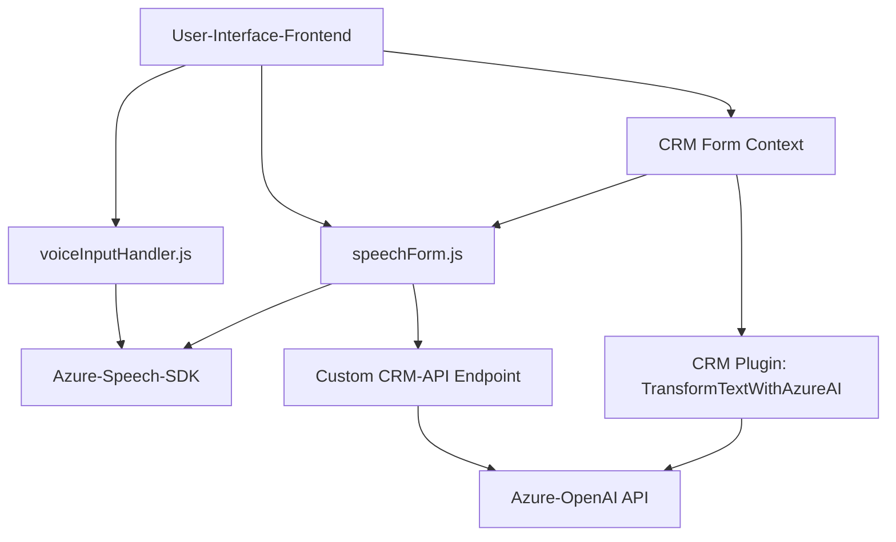

### Breve resumen técnico
El repositorio en cuestión trata una solución que integra funcionalidades avanzadas de voz y procesamiento de texto utilizando el SDK de Azure Speech y Azure OpenAI, orientado principalmente a integrar capacidades de accesibilidad y automatización dentro de formularios de **Microsoft Dynamics 365 CRM**. Combina un **frontend basado en JavaScript**, un **plugin back-end de C#** y servicios complementarios de Azure para crear una experiencia de interacción enriquecida.

---

### Descripción de arquitectura
La solución sigue una arquitectura **n-capas** que incluye:

1. **Capa de presentación (Frontend):** Implementada en JavaScript, dedicada a manejar la interfaz de usuario y la interacción directa dentro de los formularios de Dynamics 365, ofreciendo reconocimiento y síntesis de voz.
2. **Capa de lógica de negocio (Plugins/Dynamics 365):** Escrita en C#, encapsula las reglas de negocio y establece conexión con servicios externos como **Azure OpenAI** para procesamiento inteligente del texto.
3. **Capa de integración con servicios externos:** Comunica el sistema con **Azure Speech SDK** y **Azure OpenAI API**, que actúan como servicios de backend para la conversión de voz y el procesamiento de texto.

El diseño utiliza varios patrones:
- **Cliente-Servidor:** Comunicación clara entre componentes cliente (frontend) y servidor (Dynamics + Azure).
- **Composición modular:** Divide la funcionalidad en métodos especializados y modulares en ambos componentes (JS y C#).
- **Integración con servicios externos:** Usa APIs y SDKs de Azure para añadir funcionalidades específicas como síntesis y reconocimiento de voz, además de procesamiento avanzado de texto.
- **Adaptador:** Traduce datos del formato del formulario o del SDK hacia entidades consumibles por Dynamics 365.

---

### Tecnologías usadas
1. **Frontend (JavaScript):**
   - Azure Speech SDK: Reconocimiento y síntesis de voz.
   - Microsoft Dynamics CRM Context API: Para la interacción con formularios y datos dentro de Dynamics.
   - Promesas y funciones asíncronas para interacción fluida con APIs externas.

2. **Backend (C# Plugin):**
   - Microsoft Dynamics CRM SDK: Interfaces para ejecutar plugins.
   - .NET Core: Framework base para el plugin.
   - Azure OpenAI API: Realización de transformaciones de texto mediante modelos GPT-4 personalizados.

---

### Dependencias o componentes externos
1. **Azure Speech SDK:** Para la funcionalidad de procesamiento de voz (reconocimiento y síntesis).
2. **Azure OpenAI:** Procesamiento avanzado de texto bajo reglas predefinidas.
3. **Microsoft Dynamics CRM SDK/API:** Contexto y manipulación de datos de formularios en Dynamics 365.
4. **HTTP Libraries (C#):** Para consumir APIs REST externas (Azure OpenAI).
5. **JSON Manipulation Libraries:** Manejo de estructuras JSON en .NET Core.

---

### Diagrama **Mermaid** válido para **GitHub Markdown**

---

### Conclusión final
Esta solución combina **funcionalidades avanzadas de voz e inteligencia artificial** para ofrecer una experiencia mejorada en la interacción con formularios, enfocándose en mejorar la accesibilidad y automatización de procesos dentro de Dynamics 365 CRM. La arquitectura está diseñada siguiendo un modelo modular de **n-capas**, incluyendo lógica de presentación, negocio e integración con servicios externos. Además, emplea directamente tecnologías de Azure para reconocimiento de voz y procesamiento inteligente con OpenAI, lo que la hace altamente adaptable y potente para aplicaciones basadas en datos contextuales y formularios dinámicos.