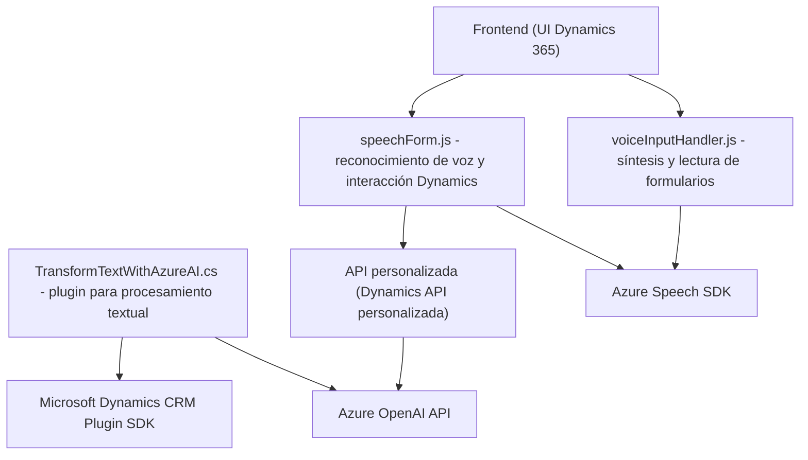

**Breve resumen técnico:**  
El repositorio contiene tres archivos: `voiceInputHandler.js` y `speechForm.js` en el frontend (JavaScript para Dynamics 365), y `TransformTextWithAzureAI.cs` (un plugin en C# para procesamiento avanzado de texto mediante Azure OpenAI). La solución integra servicios de reconocimiento y síntesis de voz (Azure Speech SDK) y transformación avanzada de datos (Azure OpenAI), enfocándose en facilitar la interacción y procesamiento automatizado de formularios en Dynamics CRM.

---

### 1. Descripción de arquitectura:  
La solución utiliza una arquitectura híbrida basada en n capas con componentes separados entre la capa cliente (frontend en Dynamics 365, usando JavaScript) y la lógica de negocio (plugins y APIs en Dynamics CRM). Además, hay una fuerte integración con servicios externos (e.g., Azure Speech SDK y Azure OpenAI API) para reconocimiento de voz, conversión de texto a voz, y procesamiento inteligente de texto hacia objetos estructurados.

La arquitectura está basada en **patrones comunes**, como:
1. **Delegación:** Los módulos JavaScript delegan tareas específicas a servicios externos (como carga de SDK o síntesis/reconocimiento de voz).
2. **Integración de servicios:** La capa del plugin (.NET) delega tareas relacionadas con transformación de texto a la API de Azure OpenAI.
3. **Modularidad:** El frontend organiza la lógica en funciones reutilizables y específicas.

---

### 2. Tecnologías usadas:
- **Frontend:**
  - JavaScript ES6+.
  - Azure Speech SDK (síntesis de voz y reconocimiento de voz).
  - Dynamics 365 APIs (`executionContext` y `Xrm.WebApi`).
- **Backend:**
  - C# (.NET Framework/Core).
  - Dynamics CRM Plugin SDK (`IPlugin`, `OrganizationService`, etc.).
  - Azure OpenAI API (servicio de transformación de texto).
- **Dependencias externas:**
  - `Newtonsoft.Json` (manipulación JSON en C#).
  - `System.Text.Json`.
  - `System.Net.Http`.
  - Azure Speech SDK y Azure OpenAI.

---

### 3. Diagrama **Mermaid** (100 % compatible con GitHub Markdown):

---

### 4. Conclusión final:  
Esta solución está diseñada para extender la funcionalidad de Microsoft Dynamics 365 utilizando servicios avanzados de Azure, como el **Speech SDK** y **OpenAI**. El diseño es modular, centrado en la interfaz del usuario (frontend) para interactuar con formularios y procesar datos, mientras delega tareas avanzadas como síntesis/reconocimiento de voz y transformación inteligente de texto hacia servicios externos.

Aunque la arquitectura destaca por su integración con servicios potentes, la solución tiene un **acoplamiento fuerte hacia Azure** y las API específicas, lo que puede complicar la portabilidad o adaptación en caso de cambios en los servicios. Una mejora futura podría ser parametrizar configuraciones sensibles para integraciones externas, aumentando la flexibilidad y seguridad del sistema.