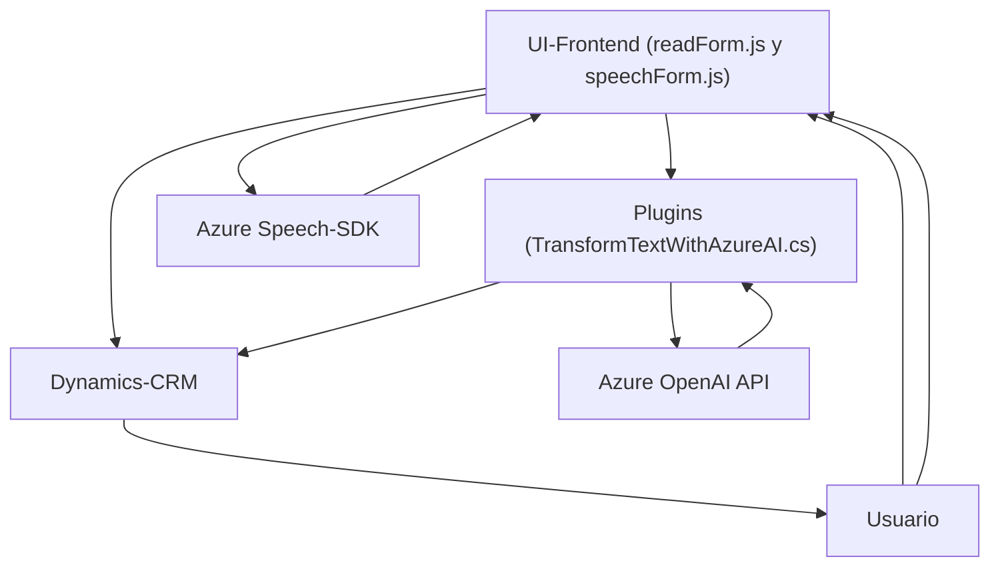

# Análisis técnico del repositorio

## Breve resumen técnico
El repositorio contiene varios archivos distribuidos por funciones específicas. Destacan los siguientes puntos clave:
1. **Tipo de solución**: La estructura muestra una solución multidimensional que integra un **frontend**, APIs externas (Azure Speech SDK), registros en dinámicos **formularios web** manejados desde el cliente, y un **plugin** de servidor para procesamiento de datos utilizando un servicio de IA (Azure OpenAI).
2. **Funciones principales**:
   - Reconocimiento de voz para transcripción y síntesis.
   - Mapeo de entrada/salida de formularios contextuales (Dynamics CRM).
   - Creación de un plugin en Dynamics 365 que interactúa con el API Azure OpenAI para procesar texto y devolver JSON.

---

## Descripción de la arquitectura
La solución utiliza una arquitectura **modular** basada en varias capas:
- Capa de **presentación**: Para manejar las interfaces del usuario, situada en la carpeta `FRONTEND/JS`, incluye lógica de transcripción de voz y manipulación de formularios web.
- Capa de **lógica de negocio**: Representada por el archivo `Plugins/TransformTextWithAzureAI.cs`, que actúa como intermediario inteligente para transformación y validación de datos usando API externas.
- Capa **exclusivamente orientada** a integraciones: Comunicación con servicios externos como Azure Speech SDK y Azure OpenAI.
- **Patrones de diseño utilizados**:
  - Carga dinámica de dependencias.
  - Event-driven (activación por eventos como entrada de voz).
  - Modularización por contexto.
  - Designación de plugins para extender un CRM como Dynamics.

El diseño general sigue un enfoque **multicapa** que divide las responsabilidades entre cliente, servicios y servidor.

---

## Tecnologías usadas
1. **Frontend (FRONTEND/JS)**:
   - **JavaScript**: Relacionado con lógica de cliente para formularios, interacción DOM y eventos.
   - **API externa: Azure Speech SDK**: Servicios de reconocimiento y síntesis de voz proporcionados por Azure.
   - **Dynamics CRM/WepApi**: Para manipulación de datos contextuales basados en formularios.

2. **Back-end (Plugins)**:
   - **Microsoft Dynamics CRM Plugin Framework**: Gestión de extensiones dentro de Dynamics CRM utilizando la interfaz `IPlugin`.
   - **HTTP Client**: Para realizar llamadas HTTP hacia la API de Azure OpenAI.
   - **Azure OpenAI API**: Servicio inteligente de IA que realiza la transformación de texto.
   - **Newtonsoft.Json.Linq / System.Text.Json**: Simplificación de la manipulación de objetos JSON en la lógica del plugin.

---

## Diagrama **Mermaid**

---

## Conclusión final
Este repositorio muestra una solución que integra **tecnologías modernas de frontend, APIs cognitivas (Azure Speech y OpenAI)** para reconocimiento y procesamiento de voz con **Dynamics CRM**. El diseño arquitectónico sigue un enfoque **multicapa**, con separación entre presentación, integración de servicios y lógica de negocio. Los patrones utilizados optimizan modularidad y reutilización, adecuándose bien a necesidades de interacción con datos contextuales y servicios externos. Adecuado para aplicaciones empresariales emergentes que requieren **automatización inteligente** y capacidades AI.