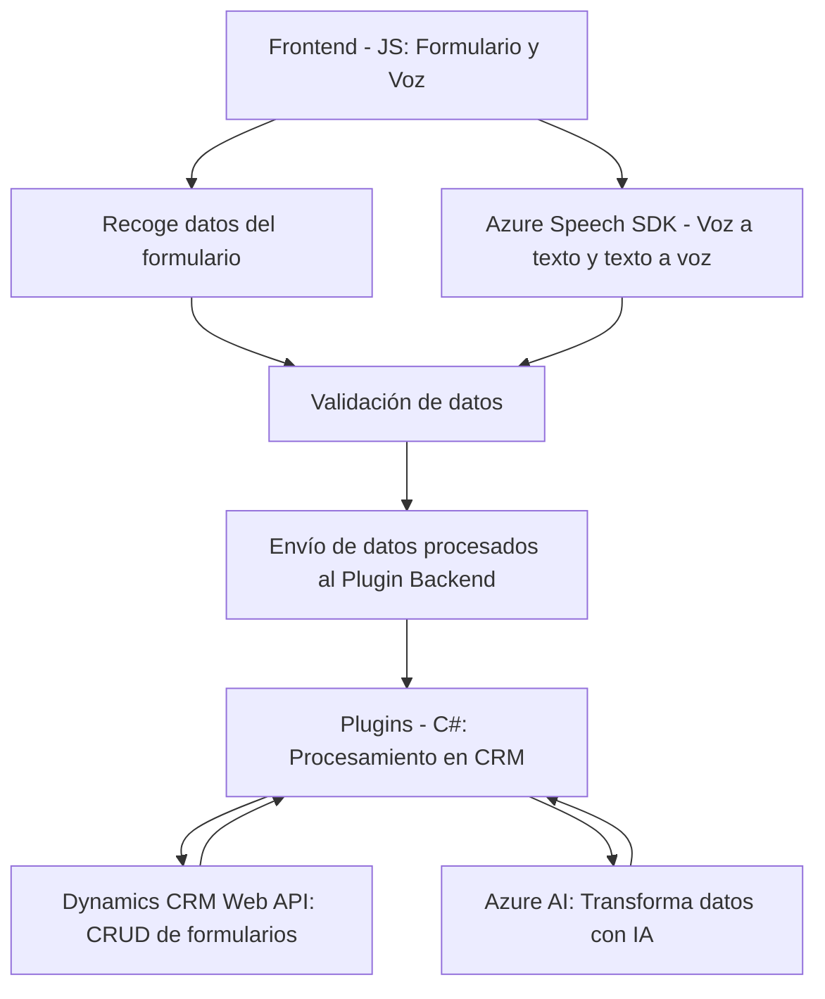

### Análisis Técnico y Arquitectural

#### Breve Resumen Técnico:
El repositorio presenta archivos que implementan funcionalidades de interacción entre un sistema basado en formularios (probablemente Dynamics CRM) y servicios avanzados como el Azure Speech SDK y Azure OpenAI API. Se centra en la automatización mediante reconocimiento de voz, síntesis de voz, transformación de texto con IA y procesamiento de datos del formulario.

---

#### Descripción de Arquitectura:
1. **Arquitectura Identificada:**  
   La solución utiliza una arquitectura **n capas**, donde cada componente está diseñado para encargarse de una responsabilidad específica: 
   - `Frontend`: Procesamiento de datos, interacción directamente en la UI (formularios).
   - `Servicios Externos`: Conexión con SDKs hospedados en Azure para síntesis de voz y manipulación de datos mediante IA.
   - `Backend (Plugins)`: Extensión lógica para CRM con Dynamics mediante plugins que ejecutan cálculos y transformaciones profundas.

2. **Modularidad:**  
   Los archivos están organizados funcionalmente, asegurándose de que cada componente elige una responsabilidad específica: reconocimiento de voz, procesamiento de texto en formularios, transformación avanzada con Azure OpenAI, etc.

3. **Patrones de Diseño Identificados:**  
   - **Modularización Funcional:** Cada archivo descompone lógicamente las tareas en funciones independientes.
   - **Integración de Servicios:** Interacción con servicios externos como Azure Speech SDK y Azure OpenAI API.
   - **Encapsulación:** Wrappers específicos para SDKs y APIs.
   - **Plugin Pattern:** En el archivo `TransformTextWithAzureAI.cs`, se utiliza la arquitectura basada en plugins de Dynamics CRM para extender la funcionalidad del sistema.

---

#### Tecnologías y Frameworks Usados:
1. **Frontend:**  
   - JavaScript: Manipulación de formularios, interacción con APIs, y lógica dinámica en el navegador.  
   - Azure Speech SDK: Reconocimiento y síntesis de voz.  

2. **Backend:**  
   - C# (.NET Framework): Extensión y lógica mediante plugins para Microsoft Dynamics CRM.  
   - Azure OpenAI API: Procesamiento y transformación avanzada de texto basado en IA.  

3. **Dependencias Externas:**  
   - Dynamics CRM Web API para CRUD con formularios del sistema.  
   - SDKs de Azure (Speech, AI) integrados mediante endpoints específicos.  
   - Librerías como Newtonsoft para manejar JSON estructurado.  

---

#### Diagrama Mermaid **100% compatible con GitHub Markdown:**

---

### Conclusión Final:
La solución representa una integración robusta entre servicios de inteligencia artificial, síntesis de voz y sistemas CRM como Microsoft Dynamics. Se utiliza una arquitectura de capas modular, que permite la escalabilidad y facilita la separación de responsabilidades. El enfoque en SDKs y APIs garantiza una implementación flexible y extensible que puede evolucionar fácilmente conforme a nuevas tecnologías y necesidades empresariales.