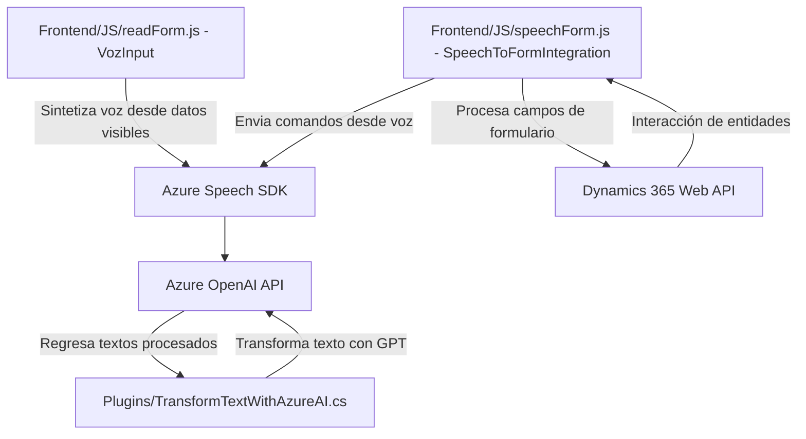

### Breve resumen técnico:
El repositorio presenta ejemplos de integración entre servicios de Azure, como Speech SDK y OpenAI API, con Dynamics 365. Su propósito general es mejorar la interacción y accesibilidad de formularios mediante síntesis de voz, reconocimiento de voz y procesamiento de texto con IA para facilitar la automatización y experiencia de usuario.

---

### Descripción de la arquitectura:
La arquitectura de la solución sigue un modelo híbrido:
- **Cliente (Frontend)**: JavaScript desarrollado para la interacción directa con los formularios de Dynamics 365 y servicios de Azure (Speech SDK). Esto se puede considerar una capa de presentación y lógica del lado del cliente.
- **Servidor (Backend)**: Plugins en C# para Dynamics 365 que actúan como controladores orientados a la ejecución de lógica específica (e.g., transformación de texto o procesamiento de datos vía Azure OpenAI API).
- **Arquitectura n-capas** con una clara separación de responsabilidades:
  1. **Presentación/Frontend**: Operaciones del cliente (interfaz del formulario en el navegador).
  2. **Negocio/Lógica**: Plugins de Dynamics 365 y APIs externas que procesan datos.
  3. **Datos**: Interacción dinámica con el sistema de entidades de Dynamics 365 y sistemas externos (Azure Cognitive Services).
- Aunque algunos aspectos se alinean con un enfoque de **arquitectura hexagonal**, los plugins y formularios aún mantienen una dependencia directa de tecnologías específicas.

---

### Tecnologías usadas:
1. **Frontend (JavaScript):**
   - **Azure Cognitive Services Speech SDK**: Para reconocimiento y síntesis de voz en JavaScript.
   - **Dynamics 365 Web API**: Para actualizar y manipular campos de formularios mediante integración directa.

2. **Backend (C#):**
   - **Azure OpenAI API**: Para transformación y generación de texto mediante GPT en procesamientos avanzados de IA.
   - **Newtonsoft.Json** y **System.Text.Json**: Para manipulación de JSON en C#.
   - **System.Net.Http**: Para realizar llamadas HTTP hacia Azure APIs.
   - **Microsoft.Xrm.Sdk**: Para la integración con Dynamics 365.

---

### Patrones identificados:
- **Event-driven architecture**: Uso extensivo de eventos y métodos asincrónicos (e.g., `recognizeOnceAsync`, Speech SDK callbacks).
- **Dependency injection/service locator**: Uso de `IServiceProvider` en el plugin de Dynamics.
- **Abstracción**: Modularización del código en funciones y métodos específicos con propósitos claros.
- **Adapter pattern**: Adaptación del texto transcrito de voz y su traducción en valores de campos de Dynamics 365.

---

### Diagrama Mermaid:

---

### Conclusión final:
La solución está pensada como una integración avanzada entre un sistema de CRM, servicios de voz y procesamiento de texto mediante IA. Su esquema se ajusta principalmente a una **arquitectura n-capas** pero con líneas que podrían ser mejor adaptadas a un diseño más independiente (hexagonal) al desacoplar los plugins de Dynamics y encapsular mejor las llamadas a servicios externos dentro de adaptadores. Sin embargo, el enfoque actual es funcional y objetivo, adecuado para mejorar experiencias en formularios interactivos mediante voz y procesamiento de texto.