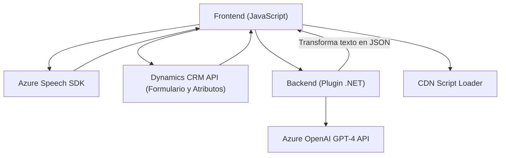

### Breve resumen técnico
La solución presentada se basa en la integración de diversos componentes que habilitan interacción entre voz, texto y formularios en un entorno CRM empresarial (Microsoft Dynamics 365). Utiliza Azure Speech SDK para reconocimiento y síntesis de voz, combinándolo con un plugin en backend que transforma texto utilizando Azure OpenAI.

---

### Descripción de arquitectura
Los fragmentos de código y repositorio indican una arquitectura híbrida **cliente-servidor**, con dos áreas de responsabilidad claras:
1. **Frontend JavaScript**: Interactúa con formularios en cliente web, procesando reconocimiento/síntesis de voz y conectando con APIs externas.
2. **Backend (Plugins)**: Realiza transformaciones avanzadas de datos utilizando Azure OpenAI y se comunica con los servicios de Dynamics CRM.

El diseño favorece modularidad y separación de responsabilidades. Aunque no es estrictamente una arquitectura hexagonal, presenta componentes desacoplados (Dynamics CRM, Azure Speech SDK, Azure OpenAI) que actúan como dependencias externas gestionadas mediante patrones API.

---

### Tecnologías usadas
1. **Frontend**:
   - JavaScript con funciones asíncronas (Promises/Callbacks).
   - Azure Speech SDK: Reconocimiento y síntesis de voz.
   - Dynamics CRM API: Acceso a datos del formulario.
   - ECMAScript modularidad.
   
2. **Backend**:
   - C# .NET.
   - Azure OpenAI Service (GPT-4): Procesamiento avanzado de texto.
   - Dynamics CRM Plugin estándar implementado via `IPlugin`.
   - Newtonsoft.Json: Manipulación JSON.

3. **Dependencias clave**:
   - Microsoft Azure: Speech SDK y OpenAI Service.
   - Dynamics 365 Web API.
   - CDN script loader.

---

### Diagrama **Mermaid**

---

### Conclusión final
La solución es un ejemplo robusto de integración de servicios en un sistema empresarial, enfocándose en mejoras de UX mediante voz y procesamiento cognitivo. Se distingue por las siguientes características:
1. **Modularidad**: Funciones de frontend y backend claramente definidas y desacopladas.
2. **Dependencias externas**: Uso estratégico de Azure Speech SDK y OpenAI, además de la API de Dynamics CRM.
3. **Patrones**:
   - Cliente-Servidor para estructura general.
   - Modularidad en frontend.
   - API Integration para servicios externos.
4. **Recomendaciones**: Algunas sensibles como claves API, deben moverse a configuraciones seguras para evitar riesgos de seguridad.