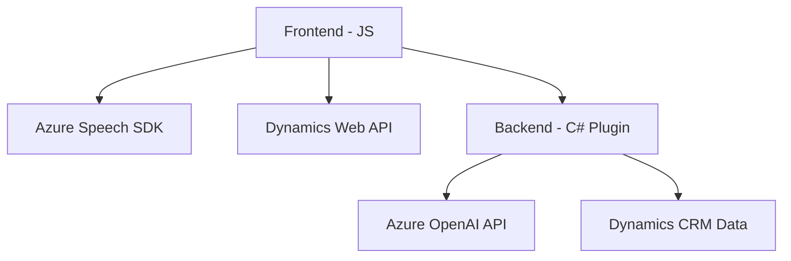

### Breve Resumen Técnico
El repositorio utiliza una combinación de frontend JavaScript y un backend basado en un plugin para **Microsoft Dynamics CRM**. La solución integra servicios de **Azure Speech SDK** para reconocimiento y síntesis de voz, así como la **Azure OpenAI API** para procesamiento y transformación de texto. El objetivo principal es habilitar funcionalidades avanzadas dentro de formularios de Dynamics 365 empleando integración de voz y generación de contenido estructurado.

---

### Descripción de Arquitectura
La solución usa una arquitectura **n-capas**, donde:
1. La **capa de presentación** (Frontend) está implementada en **JavaScript** para interactuar con formularios dinámicos y servicios de voz en la plataforma Dynamics 365.
2. La **capa de negocio** incluye la lógica principal del plugin en **C#** que interactúa con Dynamics CRM y la API de Azure OpenAI para transformar texto de entrada.
3. La **capa de datos** utiliza la Web API de Dynamics CRM para acceder y manipular los datos almacenados en la plataforma.

El uso de un **plugin** en Dynamics 365 indica un enfoque orientado a eventos, ya que está diseñado para ejecutarse en respuesta a acciones específicas de los usuarios.

---

### Tecnologías Usadas
1. **Frontend (JavaScript):**
   - **Azure Speech SDK** (Reconocimiento y síntesis de voz).
   - **Dynamics 365 Form Context** para manipulación directa de formularios.
   - **Promises y callbacks** para operaciones asíncronas.
   
2. **Backend (C#, Dynamics Plugin):**
   - **Microsoft Dynamics CRM SDK** para integración con la plataforma CRM.
   - **Azure OpenAI API**:
     - `System.Net.Http`, `System.Text.Json` y `Newtonsoft.Json.Linq` para llamadas API y procesamiento de respuestas JSON.
   - **Regex y procesamiento textual** para validación y transformación de texto.

3. **Patrones:**
   - **SDK Wrapper:** En Javascript y .NET para encapsular interacciones con Azure Speech y OpenAI APIs.
   - **Plugin Pattern:** En el plugin de Dynamics, para ejecutar código bajo eventos automatizados.
   - **Callback and Promise Pattern:** Para control de asincronismo en el frontend.
   - **Dependency Injection Pattern:** Utilizando `IServiceProvider` en el plugin para gestionar servicios necesarios como contexto de ejecución.

---

### Diagrama Mermaid

---

### Conclusión Final
La solución utiliza una arquitectura **n-capas** que combina la modularidad del frontend en JavaScript para la interacción en tiempo real con usuarios y la robustez del backend (plugin) escrito en C# para procesamiento avanzado de textos con inteligencia artificial. Gracias al uso de servicios de **Azure Speech SDK**, **OpenAI API** y **Dynamics CRM APIs**, esta solución está bien diseñada para aplicaciones empresariales como sistemas CRM que necesiten integrar voz, reconocimiento de datos y procesamiento en tiempo real.

Las dependencias clave están alineadas con los servicios externos (Azure APIs y CRM APIs) y no presenta estructuras complejas, lo que facilita su mantenimiento y permite una integración sencilla con otros sistemas. Es escalable y podría ser extendida en el futuro para admitir lógica de flujo de trabajo más avanzada.