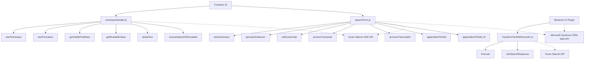

### Breve resumen técnico:
El conjunto de archivos del repositorio describe una solución integrada con **Microsoft Dynamics CRM** que utiliza el **Azure Speech SDK** y la **API de Azure OpenAI**. Está orientada a la interacción entre formularios y comandos de voz, junto con procesamiento inteligente del texto mediante IA. Se observan dos capas principales: una capa **frontend** en JavaScript y una capa **backend** basada en un plugin de Dynamics CRM codificado en C#. La funcionalidad aborda reconocimiento y síntesis de voz, manejo de formularios del CRM, y transformación de texto en JSON estructurado usando servicios de IA.

---

### Descripción de arquitectura:
- **Tipo de solución**:
  Es una solución híbrida, que incluye un **frontend** que interactúa con servicios externos (Azure Speech SDK) y utiliza lógica basada en **CRM dynamics**, además de un **plugin backend** que realiza tareas de integración con texto avanzado usando la API de IA de OpenAI.
  
- **Arquitectura**:
  - **Frontend (JS)**: Presenta una arquitectura funcional y modular, haciendo uso de patrones como "callback-driven" y separación de responsabilidades por función.
  - **Backend (C#)**: Implementa **arquitectura basada en plugins** de Dynamics CRM, que permite extender la funcionalidad base del sistema.
  - En conjunto, la solución sigue un estilo **n-capas**:
    - **Capa de presentación (frontend)**: Control del formulario CRM y la interacción con comandos de voz.
    - **Capa de aplicación (backend)**: Plugins que procesan datos y se integran con OpenAI.
    - **Capa de servicios externos**: Azure Speech SDK para reconocimiento/síntesis y OpenAI para análisis del texto.

---

### Tecnologías usadas:
1. **Frontend**:
   - **JavaScript**: Lógica en el navegador para manejar comandos de voz y manipulación de datos.
   - **Azure Speech SDK**: Biblioteca para reconocimiento y síntesis de voz.
   - **Microsoft Dynamics CRM Web API**: Para manipulación de datos CRM desde el frontend.

2. **Backend**:
   - **C#**: Codificación del plugin usando la interfaz `IPlugin`.
   - **Microsoft Dynamics CRM SDK**: Lógica de integración en el contexto del CRM.
   - **Azure OpenAI API**: Servicios de procesamiento avanzado que transforman textos mediante IA.

3. **Dependencias generales**:
   - **Newtonsoft.Json**: Manejo de objetos JSON en los plugins.
   - **System.Net.Http**: Para conexiones HTTP con la API de OpenAI.

---

### Diagrama Mermaid válido para GitHub:

---

### Conclusión final:
Esta solución integra eficientemente varias tecnologías y servicios para enriquecer la capacidad de procesamiento y reconocimiento de voz en formularios CRM. Se observa una arquitectura de **n-capas**, donde el frontend maneja el reconocimiento de voz y la gestión de datos dinámicos, y el backend proporciona lógica avanzada mediante plugins que interactúan con la funcionalidad del CRM y la transformación de texto con OpenAI. Aunque modular, esta solución altamente depende de servicios externos y APIs específicas, por lo que debería ser monitoreada y ajustada ante cambios en las dependencias de Dynamics CRM o Azure.

La estructura y funciones son pensadas para garantizar adaptabilidad con múltiples integraciones y servicios en tiempo real, siendo adecuada para escenarios empresariales donde reconocimiento de voz y transformación de datos son centrales.