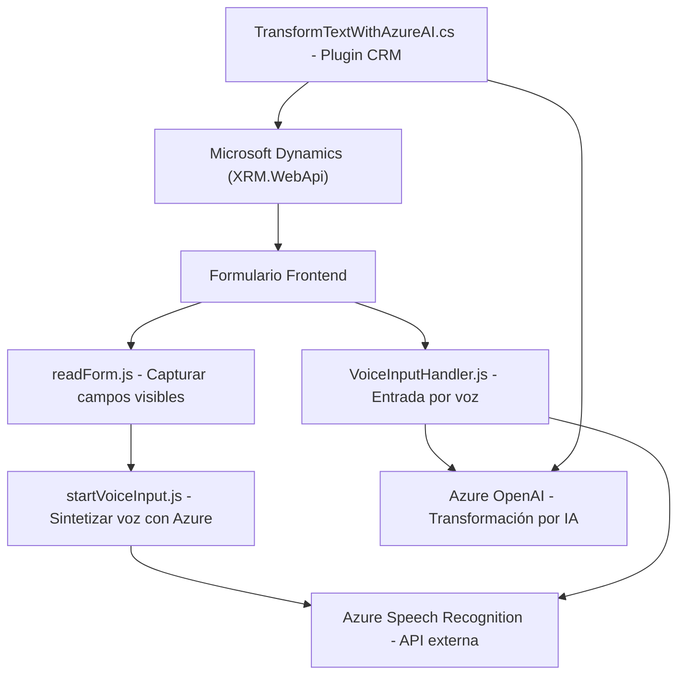

### Breve Resumen Técnico:
El repositorio contiene tres componentes principales, cada uno orientado a la integración de aplicaciones de formularios con el servicio Azure Speech SDK y Azure AI (OpenAI). La solución está destinada a enriquecer un entorno CRM, probablemente Microsoft Dynamics, con funcionalidades avanzadas de procesamiento de datos basados en texto y voz.

---

### Descripción de la Arquitectura:
La arquitectura general sigue un diseño de **n capas**:
1. **Frontend**:
    - Implementada en JavaScript con funciones modulares para capturar, procesar y sintetizar datos relacionados con un formulario CRM.
2. **Backend/Plugins**:
    - C# Plugin (basado en Microsoft Dynamics CRM) que realiza transformaciones en texto utilizando Azure AI OpenAI y lo reintegra en el contexto de la plataforma CRM.
3. **Servicios Externos**:
    - Permitidos por integraciones externas utilizando APIs como Azure Speech SDK para reconocimiento de voz y síntesis de voz. También hace uso de la Azure OpenAI API para transformaciones de texto avanzadas.

El modelo de n capas está claramente representado:
1. **Presentación** (Frontend generado dinámicamente desde formularios).
2. **Interacción y lógica de negocio** (VoiceInputHandler.js y plugin C# para transformación de texto).
3. **Servicios externos** como Azure Speech SDK, OpenAI API, y dependencias del framework Dynamics CRM.

---

### Tecnologías Usadas:
1. **Frontend**:  
   - JavaScript ES6.  
   - Azure Speech SDK para entrada y síntesis de voz.  
   - Dependencia de Microsoft Dynamics para formularios (Xrm.WebApi y `navigator.getUserMedia`).

2. **Backend**:  
   - C# para el desarrollo del plugin asociado a Dynamics CRM (`Microsoft.Xrm.Sdk`).  
   - Azure OpenAI para procesamiento de texto.  
   - Uso de dependencias .NET, especialmente `System.Net.Http` para solicitudes API.

3. **Servicios Externos**:  
   - Azure Speech (voz-sintetización y reconocimiento).  
   - Azure OpenAI (procesamiento de texto avanzado).  

---

### Diagrama **Mermaid**:

---

### Conclusión Final:
La solución presenta una arquitectura orientada a formularios dinámicos en un entorno CRM (Microsoft Dynamics). Utiliza un enfoque modulable basado en tecnologías modernas como Azure Speech SDK y Azure AI para el reconocimiento y síntesis de voz, además de procesamiento de texto utilizando inteligencia artificial.

Aunque la segregación de responsabilidades y modularización es adecuada, se observan áreas de mejora, como:
1. Gestión dinámica de claves API: Las claves se configuran de forma estática en el código, lo cual no es seguro y es una mala práctica.
2. Validación más robusta para la entrada del usuario y manejo de excepciones ante fallos del servicio externo.
3. Implementación de patrones para desacoplar aún más la interdependencia entre el código de frontend y los servicios externos, como el uso de interfaces definidas para facilitar pruebas unitarias y de integración.

Finalmente, el diseño muestra una integración eficiente de tecnologías modernas con aplicaciones CRM, proporcionando una solución habilitada para voz e IA que puede ser escalada y mejorada.