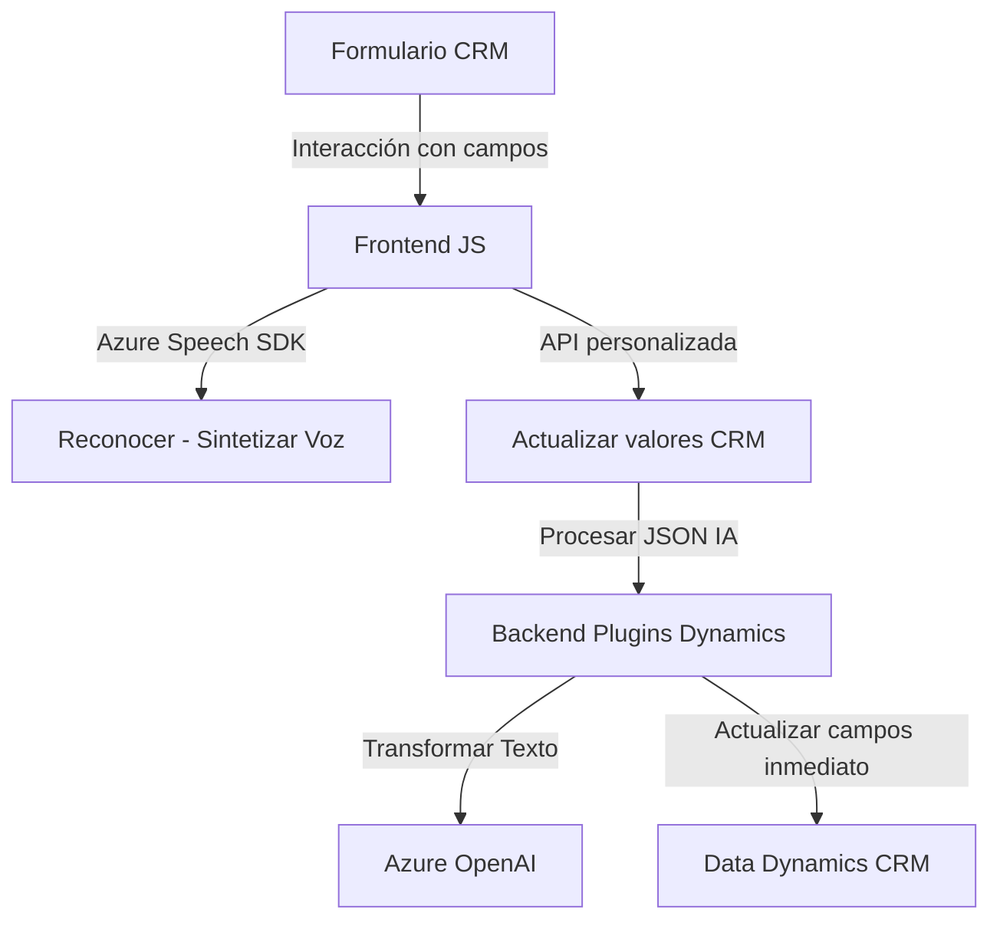

### Breve Resumen Técnico:
El repositorio contiene módulos que interactúan con Azure Speech SDK y Azure OpenAI para funcionalidades de entrada y procesamiento de voz y de transformación avanzada de texto dentro del contexto de formularios CRM de Microsoft Dynamics. Utiliza componentes como plugins en C# para Dynamics y scripts JavaScript para cliente web.

---

### Descripción de Arquitectura:
La solución tiene elementos de integración con servicios externos (Azure Speech SDK y Azure OpenAI) y opera bajo un modelo de arquitectura **n-capas**:
1. **Presentación**: Scripts frontend que interactúan con formularios de Dynamics CRM mediante `executionContext` y `formContext`.
2. **Aplicación/lógica de negocio**: Implementación de plugins en C# para transformación de texto y actualización de datos en el modelo de Dynamics CRM.
3. **Servicios externos**: Integración API con Azure Speech SDK para síntesis y reconocimiento de voz, y Azure OpenAI para transformación de texto.
4. **Datos**: Manipulación directa de datos del modelo CRM (usando `IOrganizationService` y APIs de Dynamics).

Adicionalmente, los componentes son altamente modularizados, y observamos diseño basado en eventos y carga dinámica de SDK en el cliente.

---

### Tecnologías Usadas:
1. **Frontend**: 
   - JavaScript/TypeScript.
   - Azure Speech SDK para reconocimiento y síntesis de voz.
2. **Backend**:
   - C# para plugins en Dynamics CRM.
   - Azure OpenAI API para procesamiento de texto.
   - HttpClient como cliente HTTP para solicitudes al servicio Azure.
3. **Frameworks y Librerías**:
   - Microsoft Dynamics CRM SDK (`IPlugin`, `IOrganizationService`).
   - Newtonsoft.Json y System.Text.Json para manejo de JSON.
   - Event-driven programming en JavaScript.
4. **Servicios Externos**:
   - Azure Speech SDK.
   - Azure OpenAI API.

---

### Diagrama Mermaid:

---

### Conclusión Final:
Este repositorio implementa una solución basada en **n-capas**, combinando frontend para interacción con formularios CRM y plugins backend en Dynamics para procesamiento avanzado de datos. La integración con servicios en la nube (Azure Speech y OpenAI) permite mejorar la experiencia de usuario y enriquecer las capacidades del ecosistema CRM. Sus múltiples niveles de modularización aseguran extensibilidad, aunque algunas prácticas como manejo de credenciales requieren mejoras para asegurar la seguridad.