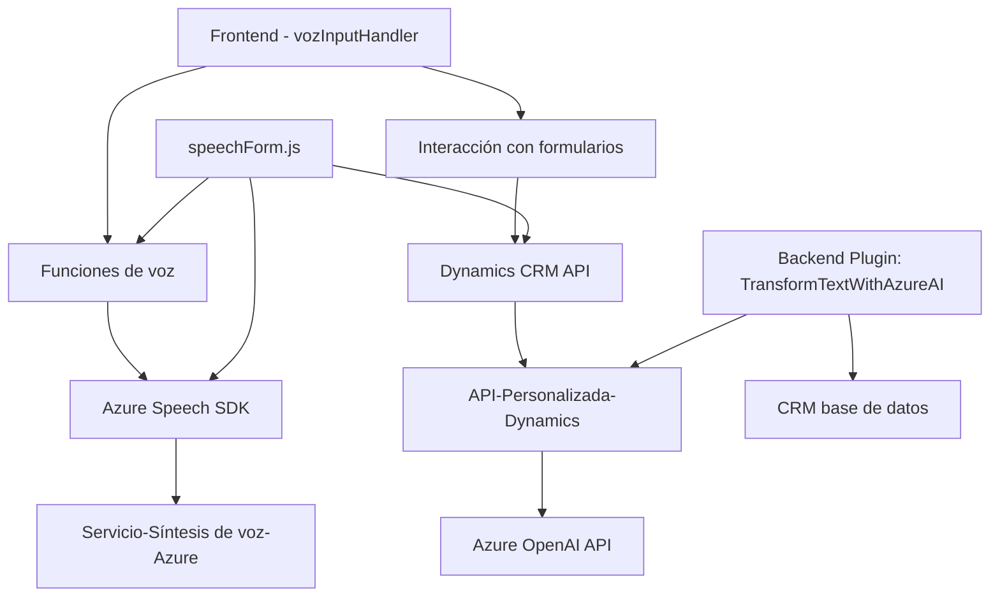

### Breve resumen técnico
Este repositorio es una solución híbrida que implementa interacción voz-texto con un sistema CRM mediante la integración de servicios de Azure Speech SDK y OpenAI. Está compuesta por una interfaz frontend que funciona en navegadores y un backend basado en plugins para Microsoft Dynamics CRM.

---

### Descripción de arquitectura

La arquitectura parece ser **n-capas** con una separación modular en tres capas principales:
1. **Capa de frontend:** Implementa funciones de interacción de entrada y salida de voz y manipulación de formularios.
2. **Capa de servicios externos:** Utiliza servicios de Azure Speech SDK para reconocimiento de voz y síntesis, y Azure OpenAI para transformación avanzada de texto.
3. **Capa backend:** Un plugin desarrollado en .NET Framework para Dynamics CRM que interactúa con Azure OpenAI.

La solución utiliza una mezcla de patrones de diseño:
- **Segregación de Concerns:** Cada archivo está enfocado en un conjunto de tareas específicas.
- **Integración con servicios externos:** Los servicios de Azure Speech SDK y OpenAI son consumidos mediante peticiones HTTP y bibliotecas oficiales.
- **Callback Pattern:** Frente a eventos como carga dinámica de SDK en el cliente o ejecución asíncrona.
- **Event-Driven Plugin Architecture:** El CRM utiliza eventos de ejecución para activar los plugins.

---

### Tecnologías usadas
1. **Frontend:**
   - JavaScript en el navegador.
   - Azure Speech SDK: Para reconocimiento y síntesis de voz.
   - APIs de Dynamics CRM: Para interacción con formularios y datos dinámicos.

2. **Backend:**
   - Lenguaje: C#.
   - Framework: .NET Framework.
   - Microsoft Dynamics CRM API: Para plugins y operaciones relacionadas con entidades en el sistema.
   - Azure OpenAI API: Para transformación avanzada de datos.
   - System.Net.Http y Json libraries (Newtonsoft.Json): Para comunicación con APIs externas.
   
3. **Integraciones:**
   - Servicios en la nube (Azure Speech SDK y OpenAI).
   - Dynamics CRM Web API.

---

### Diagrama Mermaid

---

### Conclusión final

La solución está diseñada para ser usada dentro de un entorno de CRM dinámico (Microsoft Dynamics) y añadir capacidades de voz por medio de Azure Speech SDK, mientras utiliza Azure OpenAI para realizar transformaciones avanzadas de texto. La arquitectura modular basada en capas permite una integración potente con los servicios en la nube sin acoplamiento innecesario entre componentes. Es una plataforma robusta idónea para casos de uso como automatización de procesos empresariales mediante voz y texto, con sólidos fundamentos en patrones de diseño y tecnologías modernas.