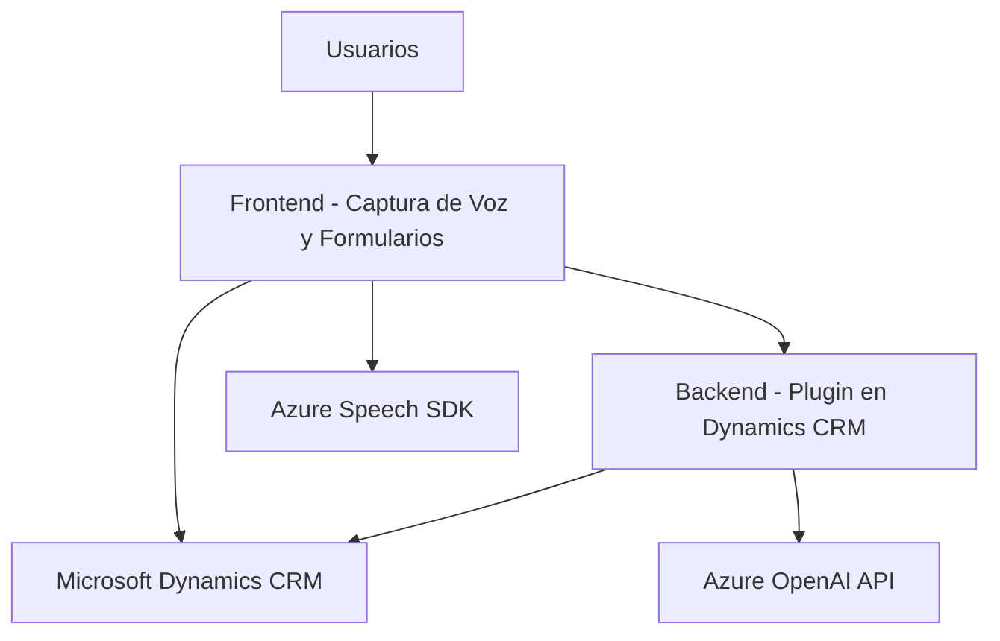

### Breve Resumen Técnico

El repositorio parece estar diseñado para una solución que integra entrada de voz, manipulación dinámica de formularios y transformación de texto mediante servicios avanzados de Azure Speech SDK y Azure OpenAI API. Los componentes principales pueden organizarse en dos frentes:

1. **Frontend (JavaScript)**: Archivos relacionados con manipulación de formularios, captura de voz y síntesis de texto a voz.
2. **Backend (C#, Dynamics Plugin)**: Archivos para transformar texto con reglas predefinidas y manejar comunicación entre Dynamics CRM y Azure OpenAI.

---

### Descripción de Arquitectura

La arquitectura combina un **modelo de capas con integración de servicios externos**. Sus componentes principales son:

1. **Frontend**:
   - Funciona como una capa de presentación, interactuando directamente con usuarios utilizando el reconocimiento de voz (Azure Speech SDK) y manipulando datos de formularios.
   - Modular y orientado a funciones con responsabilidades claras (captura de datos, síntesis de voz, integración con API).

2. **Backend**:
   - Extiende Microsoft Dynamics CRM mediante un plugin que se conecta al servicio de Azure OpenAI para transformación avanzada de texto.
   - Implementa una arquitectura basada en eventos del sistema (a través de la interfaz `IPlugin`).

Ambos frentes dependen de servicios externos de Azure. Esto sugiere una arquitectura **"híbrida de n-capas con integración de servicios externos"**.

---

### Tecnologías y Frameworks Usados

1. **Frontend (JavaScript)**:
   - *Azure Speech SDK*: Para reconocimiento de voz y texto.
   - *Javascript Modular*: Separación de responsabilidades por funciones específicas.

2. **Backend (C#)**:
   - *Microsoft Dynamics SDK*: Para creación de plugins que interactúan con Dynamics CRM.
   - *Azure OpenAI API*: Para transformación avanzada de texto.
   - *HTTP REST Client Libraries*: Para el consumo de APIs (System.Net.Http).
   - *JSON Parsing*: System.Text.Json y Newtonsoft.Json para manejar estructuras de datos.

---

### Diagrama Mermaid

---

### Conclusión Final

Este repositorio está diseñado para una solución híbrida que combina una interfaz de usuario interactiva (frontend) y un plugin dinámico (backend) para la gestión de formularios con capacidades avanzadas de voz y transformación de datos. Utiliza una arquitectura que mezcla un modelo de n-capas con integración de servicios externos (Azure Speech SDK y Azure OpenAI), destacando por su modularidad y enfoque en funciones específicas. La solución sería adecuada para sistemas CRM que requieren entrada de datos avanzada y procesamiento que aproveche inteligencia artificial y servicios cloud.