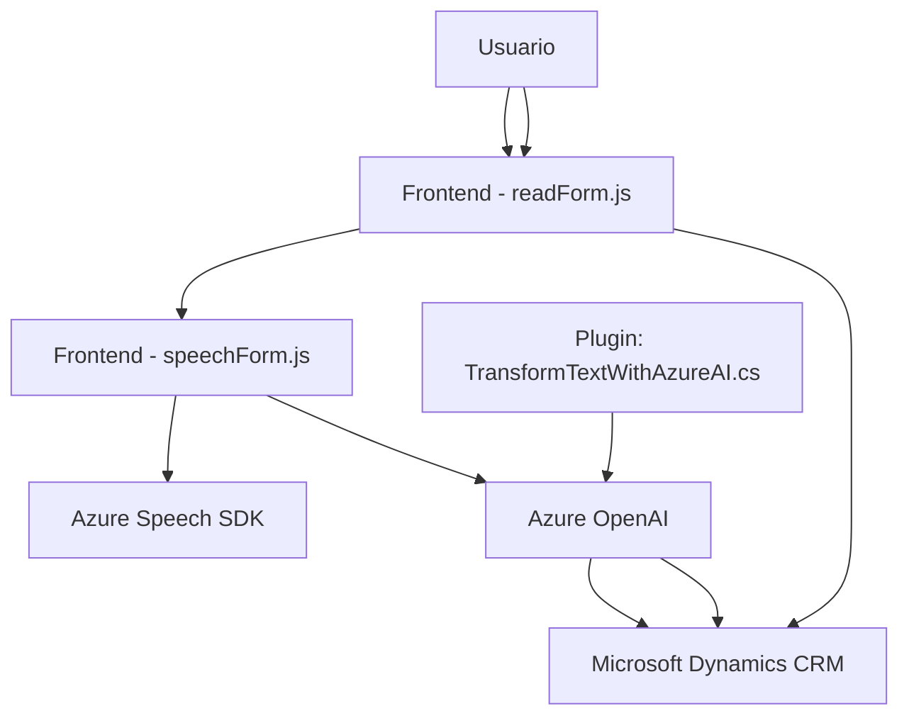

### Breve resumen técnico
Este repositorio forma parte de una solución híbrida que abarca **frontend**, **backend** y **plugins para CRM**. Su propósito central es integrar funcionalidades de voz y procesamiento de texto a sistemas basados en Microsoft Dynamics CRM. Utiliza servicios de Azure, como el **Speech SDK** para síntesis y reconocimiento de voz, y **Azure OpenAI** para transformación avanzada de textos.

---

### Descripción de arquitectura
La solución parece utilizar una arquitectura **n-capas**, aunque con elementos que sugieren una integración parcial de microservicios:
1. **Frontend**: Implementa funcionalidades dinámicas en JavaScript para lectura y captura de datos de formularios y manipulación del SDK de Azure Speech.
2. **Backend/Plugins**: Usa el modelo de Plugins de Dynamics CRM mediante la implementación de `IPlugin`, para activar funcionalidades como procesamiento de texto mediante Azure OpenAI.
3. **Servicios de Azure**: La interacción con APIs de Azure indica un enfoque de **arquitectura orientada a servicios**.

---

### Tecnologías usadas
1. **Frontend**:
   - **JavaScript**: Implementación modular con funciones específicas para manipular formularios y sintetizar voz.
   - **Azure Speech SDK**: Para reconocimiento de voz desde el navegador y síntesis de texto a voz.
2. **Backend/Plugins**:
   - **C#/.NET Framework**: Implementación de plugins siguiendo el estándar de extensibilidad de Dynamics CRM.
   - **Azure OpenAI**: Para procesamiento de textos con modelos GPT.
   - **Newtonsoft.Json**: Para manejo de estructuras JSON en C#.
3. **CRM APIs**:
   - **Microsoft Dynamics CRM SDK**: Para operar sobre estructuras y entidades del CRM.
4. **Servicios externos y patrones**:
   - Gestor dinámico de SDK de Azure (carga de dependencias según necesidad).
   - Procesamiento en el cliente y en el servidor, combinado con interacciones asincrónicas con Azure.

---

### Diagrama Mermaid

---

### Conclusión final
Este repositorio combina funcionalidades sofisticadas en un entorno CRM, con especial atención a la interacción usuario-herramienta mediante voz y procesamiento avanzado de datos dialogados. Utiliza múltiples servicios de Azure como Speech y OpenAI, asegurando una integración fluida entre el frontend (navegador) y el backend (plugins de Dynamics CRM). Aunque sigue patrones de **n-capas**, sus dependencias con servicios externos le inyectan cierta flexibilidad propia de arquitecturas más orientadas hacia servicios. Es una solución altamente extensible, diseñada para entornos corporativos con automatización basada en inteligencia artificial.