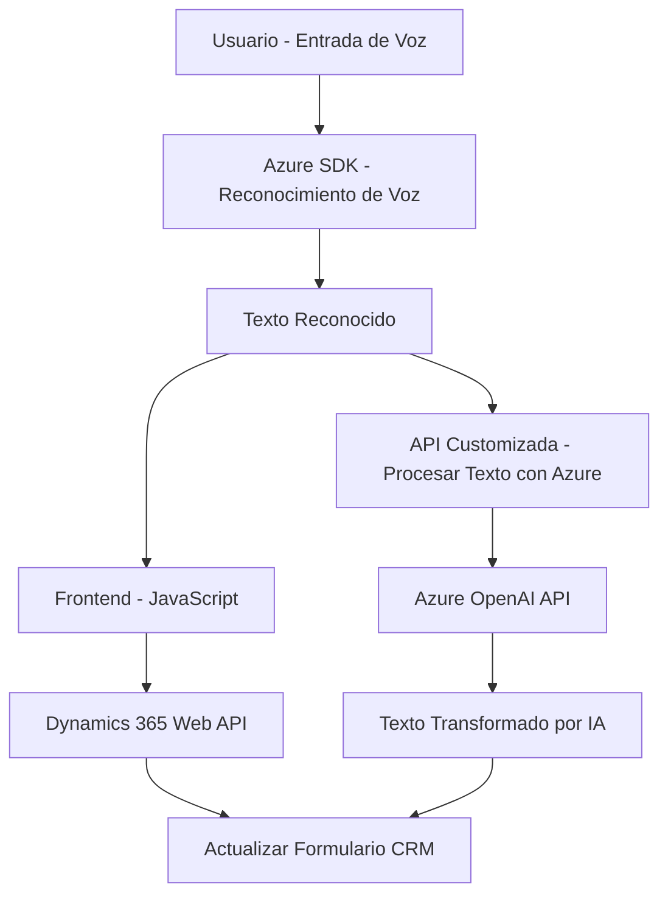

### Breve resumen técnico
El repositorio ofrece una solución que integra el reconocimiento y síntesis de voz con procesamiento y automatización avanzada de datos en formularios de Dynamics 365 CRM. Utiliza Azure Speech SDK para la interacción con voz y Azure OpenAI para el procesamiento de texto mediante inteligencia artificial. A nivel técnico, se encuentran implementaciones tanto en frontend como en backend.

---

### Descripción de arquitectura
La solución utiliza una **arquitectura de n-capas** que combina:
1. **Frontend**, que actúa como una capa de interacción con el usuario y SDKs de Azure Speech.
2. **Backend (Plugins)**, que implementa funcionalidades adicionales para el procesamiento inteligente de texto via OpenAI.
3. **Integración con APIs externas**: Centralizada en Microsoft Dynamics 365 Web API, Azure OpenAI API y el SDK de Azure Speech para establecer comunicación entre capas.

La integración de servicios externos y su interacción con el CRM sigue patrones como modularización y plugins para mantener la separación de responsabilidades.

---

### Tecnologías usadas
1. **Frontend**:
   - **JavaScript ES6** para lógica de reconocimiento/síntesis de voz y gestión de formularios en Dynamics 365.
   - **Azure Speech SDK**, especialmente para reconocimiento, síntesis de voz y trabajo dinámico con componentes del navegador.
   - **Dependency Injection** dinámico para cargar Azure Speech SDK.
2. **Backend**:
   - **C# (Microsoft Dynamics Plugin Framework)**: Se usa para implementar plugins específicos como `TransformTextWithAzureAI`.
   - **Azure OpenAI API**: Modelo GPT-4, utilizado para transformar y procesar texto según reglas predefinidas.
   - **HttpClient y JSON libraries**: Para solicitudes HTTP y manejo de datos estructurados.
3. **Microsoft Dynamics CRM**:
   - Uso intensivo de `IOrganizationService` y APIs de Dynamics 365 Web API.
   - Actualización directa de formularios y entidades de CRM mediante mapeo de claves.

---

### Diagrama Mermaid válido para GitHub

---

### Conclusión final
La solución presentada es una **arquitectura n-capas con integración de servicios en la nube**, que permite enriquecer la experiencia del usuario en Dynamics 365 mediante reconocimiento de voz, generación de síntesis, y procesamiento inteligente de datos. La modularidad y los patrones como plugins y callbacks garantizan flexibilidad y escalabilidad dentro del sistema. Aunque está fuertemente acoplado a los servicios de Microsoft Dynamics 365 y Azure, el diseño asegura un flujo eficiente entre frontend y backend.