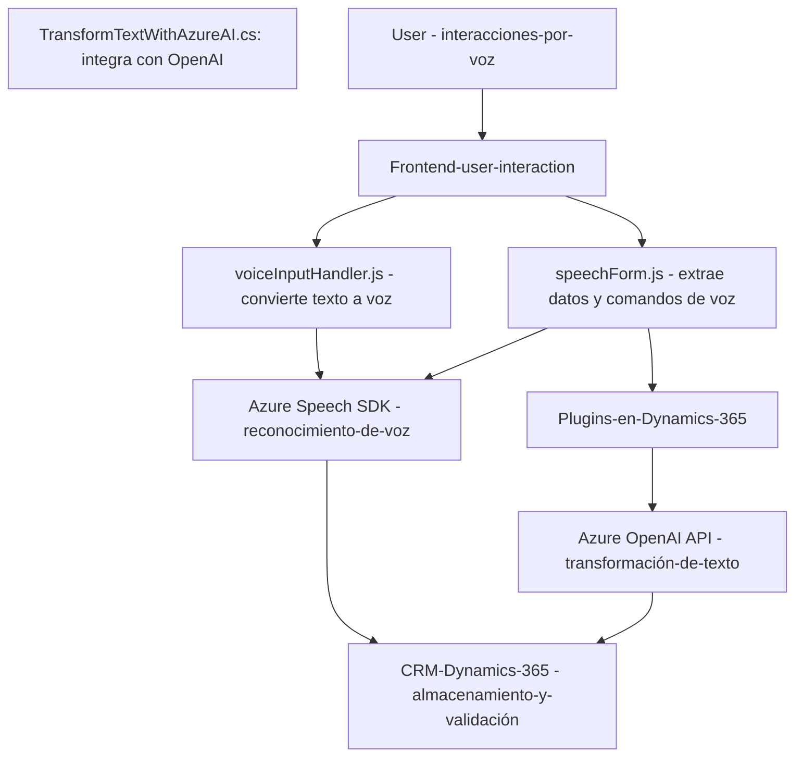

### **Breve Resumen Técnico**

El repositorio corresponde a una solución integrada con Dynamics 365 que utiliza capacidades de voz y procesamiento de lenguaje natural (PLN). Incluye varios componentes: archivos de frontend para interacción con usuarios, controladores de reconocimiento y síntesis de voz mediante Azure Speech SDK, y plugins backend en Dynamics CRM que integran transformaciones con Azure OpenAI API. La finalidad es crear una experiencia interactiva por voz (lectura y escritura) en formularios dentro de Dynamics 365, potenciando el uso de inteligencia artificial y servicios de Azure.

---

### **Descripción de Arquitectura**

Este sistema tiene una arquitectura **híbrida**:
1. **Frontend modular**: Archivos JavaScript actúan como una capa de presentación y lógica cliente, interactuando con SDK externo para realizar tareas asincrónicas como reconocimiento de voz y leer datos de formularios.
2. **Backend plugin-based**: Los archivos en C# extienden funcionalidades del sistema CRM (Dynamics 365). Los plugins actúan como middlewares que reciben datos procesados y los transforman utilizando Azure OpenAI para almacenar resultados en la estructura CRM.
3. **Integración con servicios externos**: La interacción con APIs de Azure (Speech SDK y OpenAI) se realiza en tiempo real, haciendo que el sistema dependa de componentes externos para la generación de voz y transformaciones del lenguaje.

El diseño sigue una arquitectura **n-capas** con integración dinámica:
- **Presentación (Frontend)**: Interacción directa con usuarios.
- **Negocio (Plugins en Dynamics 365)**: Transformación de contenidos según reglas del negocio.
- **Persistencia (API Dynamics CRM)**: Almacenamiento y manipulación de datos locales en el sistema CRM.
- **Servicios externos**: Integración con APIs de Azure para las funcionalidades de reconocimiento y transformación.

---

### **Tecnologías Utilizadas**

1. **Frontend**:
   - **JavaScript/ES6**: Uso de módulos y funciones reutilizables.
   - **Azure Speech SDK**: Para sintetizar y reconocer voz en tiempo real.
   - **Dynamics 365 Web APIs**: Funciones como `Xrm.WebApi` para manipular datos del sistema CRM.

2. **Backend**:
   - **C#**: Implementación de plugins utilizando la interfaz `IPlugin`.
   - **Microsoft Dynamics CRM SDK**: Manejo de eventos del sistema CRM (`context.InputParameters`, `context.OutputParameters`).
   - **Azure OpenAI** (API externa): Procesamiento avanzado basado en inteligencia artificial.
   - **System.Net.Http + Newtonsoft.Json**: Para solicitudes HTTP y manejo de respuestas JSON.

3. **Servicios Externos**:
   - **Azure Speech SDK**: Reconocimiento y síntesis de voz.
   - **Azure OpenAI**: Transformación de texto con reglas.
   - Paquete dinámico del SDK en Frontend (`https://aka.ms/csspeech/jsbrowserpackageraw`).

---

### **Diagrama Mermaid**

---

### **Conclusión Final**

El repositorio presenta un sistema de procesamiento por voz altamente integrado con Azure y Dynamics CRM. Adopta técnicas modernas como reconocimiento de voz, inteligencia artificial para análisis del lenguaje y automatización de procesos en formularios. Utiliza una estructura modular con **frontend n-capas** y **plugins backend**, destacándose por integrar servicios externos de Azure, manteniendo independencia y escalabilidad. Esta arquitectura es adecuada para soluciones intensivas en inteligencia artificial y funcionalidades de interacción por voz.