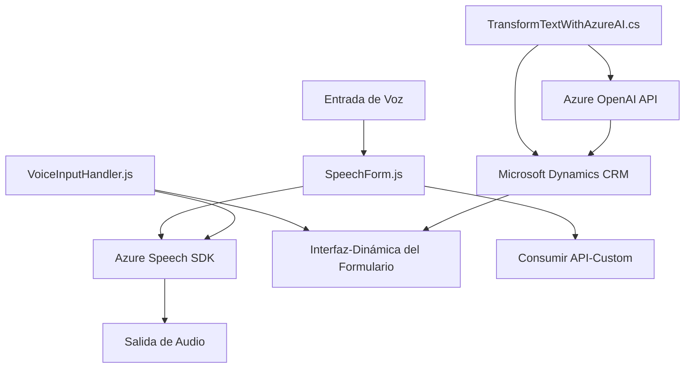

### Breve resumen técnico:
El repositorio está compuesto principalmente por integración de SDK de Azure para reconocimiento de voz, síntesis de texto en audio, y procesamiento de datos implementado tanto en frontend como en backend (plugin para Dynamics CRM). 

### Descripción de arquitectura:
La solución sigue una arquitectura **monolítica de n capas** con **integración de APIs externas**, donde las operaciones se dividen en:
1. **FrontEnd**: Funciones JavaScript para procesamiento dinámico de formularios, captura de datos mediante voz y transcripción.
2. **BackEnd**: Plugin en C# para consumir servicios avanzados como el **Azure OpenAI**.
3. **Integración de Servicios Externos**: Uso del **Azure Speech SDK** y **Azure OpenAI API** como componentes externos para procesar y sintetizar datos.

### Tecnologías usadas:
1. **FrontEnd**:
   - **JavaScript** en módulos independientes.
   - Integración con APIs como **Azure Speech SDK**.
   - Uso de modelos asincrónicos (`Promise`).
   - Funciones modulares.
2. **BackEnd**:
   - **C#** para implementación de plugins bajo el estándar de Microsoft Dynamics CRM.
   - Bibliotecas .NET (`System.Net.Http`, `System.Text.Json`).
   - APIs REST (Azure OpenAI).
3. **Microsoft Dynamics CRM**:
   - Manipulación de datos mediante `executionContext`.

### Diagrama Mermaid:

### Conclusión final:
Este repositorio implementa una solución integral para reconocimiento de voz, procesamiento de texto y automatización de formularios utilizando tecnologías líderes como **Azure Speech SDK** y **Azure OpenAI API**. La arquitectura es híbrida, con soporte principalmente monolítico (Dynamics CRM) pero siguiendo patrones modernos como API-driven y modularidad. Potente, extensible y apto para casos de uso que impliquen interacción dinámica con formularios y síntesis de datos automatizados.