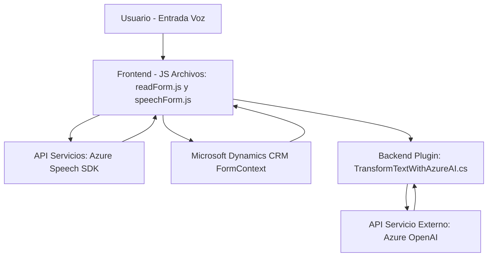

## Breve resumen técnico

Este repositorio muestra una integración avanzada de Microsoft Dynamics 365 con Azure Speech SDK y Azure OpenAI. Los archivos implementan funcionalidades como síntesis de voz, reconocimiento de comandos de voz y transformación de texto mediante inteligencia artificial. Las operaciones están dirigidas a enriquecer la interacción con formularios y datos en Dynamics 365.

## Descripción de arquitectura

- **Tipo de solución:** La solución es una aplicación para la automatización y mejora de procesos en formularios de Microsoft Dynamics 365 mediante reconocimiento de voz, síntesis de audio y transformación de texto con Azure OpenAI. Combina un sistema **Frontend** basado en JavaScript con plugins en **C#**.
- **Arquitectura:** Se trata de una arquitectura híbrida, donde hay integración entre módulos frontend orientados a eventos y procesamiento asincrónico, junto a una extensión de la plataforma Microsoft Dynamics CRM a través de plugins. Puede asemejarse a una arquitectura de **microservicios** en lo que respecta a la interacción con servicios de Azure (Speech SDK y OpenAI).
- **Capas:** 
  - **Capa de presentación:** Soluciones frontend en JavaScript para interacción con el usuario y los formularios.
  - **Capa de lógica:** Plugins escritos en C# que actúan como middleware entre Dynamics CRM y servicios externos, como Azure OpenAI.
  - **Capa de servicios externos:** Azure Speech SDK y OpenAI interactúan para manejar la lógica de síntesis y transformación.

## Tecnologías usadas

1. **Frontend**:
   - HTML/JavaScript.
   - Azure Speech SDK para sintetizar y reconocer voz.
   - Microsoft Dynamics FormContext API para manipular datos del formulario.

2. **Backend**:
   - C# Plugins para integrar lógicas de negocio en Microsoft Dynamics 365.
   - Azure OpenAI para procesamiento de texto avanzado.

3. **Patrones y conceptos**:
   - **Modular Design:** Cada archivo contiene funciones agrupadas para atender funcionalidades específicas.
   - **Event-driven Architecture:** Integración del SDK de Azure Speech como desencadenante para acciones sobre formularios.
   - **Plugin Pattern:** Utilizado en la implementación de extensiones para Dynamics.
   - **External Service Integration:** Consumo de servicios de terceros (Azure Speech, OpenAI).

## Dependencias/Componentes externos

1. **Azure Speech SDK**: Realiza síntesis y reconocimiento de voz.
2. **Microsoft Dynamics CRM SDK**: API para acceder a los datos y lógica de los formularios.
3. **Azure OpenAI API**: Transforma texto utilizando modelos avanzados de lenguaje.
4. **Librerías de soporte**: 
   - `Newtonsoft.Json`: Para manipulación de JSON.
   - `System.Net.Http`: Para comunicaciones HTTP con APIs externas.

## Diagrama Mermaid válido para GitHub

## Conclusión final

Este repositorio representa una solución robusta orientada a la interacción inteligente con formularios en Dynamics 365 mediante tecnologías modernas. Su arquitectura híbrida combina patrones de modularidad y eventos en el frontend con extensiones orientadas a servicios en el backend. La dependencia en Azure para reconocimiento de voz y procesamiento de texto aumenta su complejidad, pero también lo hace una muestra sólida de cómo integrar servicios en plataformas empresariales. La arquitectura es escalable y puede evolucionar hacia una configuración más basada en microservicios mediante contenedores para manejo independiente de componentes.