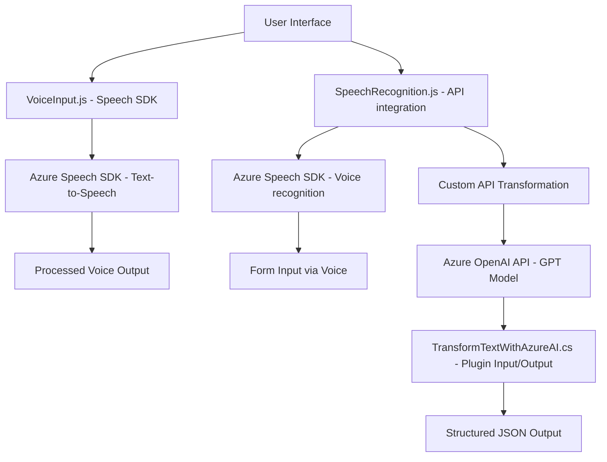

### Resumen técnico
El repositorio aborda tres grandes componentes:
1. **Frontend** en JavaScript que integra voz a texto y texto a voz, mediante el SDK de Azure Speech.
2. Procesamiento por **Plugins** para Dynamics CRM en C#, que utilizan Azure OpenAI para transformar texto en JSON estructurado.
3. Uso extensivo de APIs externas para reconocimiento de voz, síntesis y transformación semántica avanzada.

### Descripción de la arquitectura
Este sistema tiene una **arquitectura de n capas**:
- **Capa de presentación**: Los archivos `readForm.js` y `speechForm.js` actúan como una interfaz entre el usuario y el sistema (eventos de voz, entrada de texto).
- **Capa de lógica de negocio**: El procesamiento en el archivo .NET realiza transformaciones avanzadas en texto con reglas específicas.
- **Capa de servicios**: Las integraciones como Azure Speech SDK y OpenAI utilizan APIs externas configuradas.

Se observa un **patrón de integración** significativo, dado que las capas interactúan directamente con servicios externos y de terceros, como Azure SDK y APIs de OpenAI.

### Tecnologías usadas
1. **Frontend**:
   - **JavaScript**, con soporte para Azure Speech SDK.
   - Integración de SDK para reconocimiento y síntesis de voz.
   - Procesamiento dinámico de Formularios CRM (Microsoft Dynamics).
  
2. **Backend/Plugins**:
   - **C#** para los plugins de Dynamics CRM.
   - Servicios **Azure OpenAI** para transformación semántica avanzada.
   - Uso de `Newtonsoft.Json` para gestión JSON en las integraciones.

3. **Dependencias y servicios externos**:
   - Azure Speech SDK y Azure OpenAI como servicios centrales.
   - CRM Dynamics (`Xrm.WebApi`) para manipulación de datos empresariales.

### Diagrama Mermaid válido para GitHub Markdown

### Conclusión final
El sistema combina tecnologías frontales con una lógica robusta empresarial respaldada por servicios cloud (Azure Speech SDK y OpenAI). La arquitectura es **n capas**, orientada a servir al usuario en tiempo real mediante voz y procesamiento de texto con integraciones externas seguras. Este diseño es flexible para ampliar funcionalidades, como soporte multi-lenguaje o patrones cognitivos. La modularidad observada respeta principios fundamentales de separación de responsabilidades y escalabilidad.