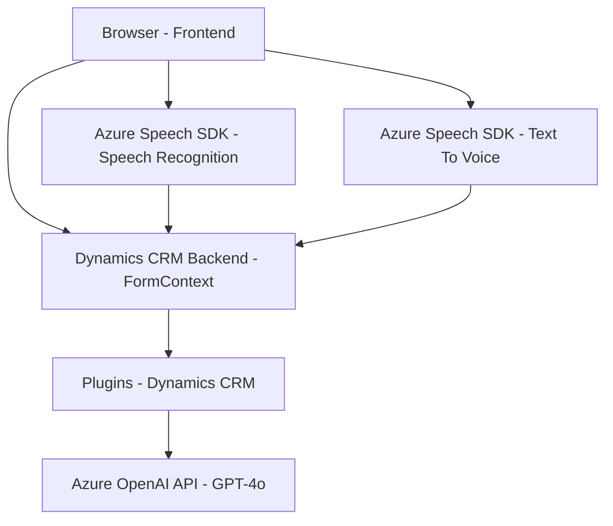

### Breve resumen técnico
Este repositorio implementa una solución híbrida con funcionalidades extendidas que se centran en el lenguaje natural y la interacción vocal con formularios de Dynamics CRM. Los componentes principales están divididos en tres capas: una interfaz basada en el navegador (Frontend), una lógica de reconocimiento de voz gestionada por Azure Speech SDK (Frontend), y una capa backend de procesamiento que utiliza Azure OpenAI dentro de un plugin de Dynamics CRM.

---

### Descripción de la arquitectura
La solución sigue una **arquitectura de múltiples capas** que integra procesamiento en cliente (frontend) y servidor (backend). El frontend interactúa directamente con Dynamics CRM para captar y presentar información, mientras que el backend maneja tareas avanzadas de AI y transformación de datos utilizando un plugin embebido. El uso de servicios de Azure (Speech SDK y OpenAI) resalta la estrategia de integración de **APIs externas** para extender las capacidades de Dynamics CRM.

---

### Tecnologías usadas
1. **Azure Speech SDK**
   - Usado para síntesis y reconocimiento de voz.
   - El frontend carga dinámicamente este SDK desde una CDN.
   
2. **Microsoft Dynamics CRM SDK**
   - Usado para el desarrollo de plugins y la interacción directa con los datos de CRM.
   - Permite acceder al contexto del formulario y manejar atributos y entidades relacionadas.
   
3. **Azure OpenAI**
   - Usado para transformar texto en JSON estructurado en el backend.
   - Configuración mediante HTTP requests al servicio de API específica.

4. **JavaScript** (en el frontend):
   - Gestión de la presentación y la interacción con los datos de formularios.
   - Implementación modular con funciones reutilizables (obtener datos del formulario, aplicar valores y sintetizar voz).

5. **C# (.NET Framework)**:
   - Es lenguaje principal del plugin del backend.
   - Emplea librerías como `Microsoft.Xrm.Sdk` y `Newtonsoft.Json` para la integración y el procesamiento de datos.

---

### Diagrama **Mermaid** (GitHub Markdown compatible)

---

### Conclusión final
La solución está diseñada para extender una plataforma de Dynamics CRM mediante integración de capacidades avanzadas de reconocimiento de voz (Speech SDK de Azure) y procesamiento natural (OpenAI). La arquitectura es modular y de **múltiples capas**, siendo particularmente adecuada para escenarios de interacción intensiva de usuario con formularios. El uso de **APIs externas** y técnicas de procesamiento asincrónico amplifica la extensibilidad y técnicas avanzadas que ofrece el sistema. La implementación es robusta, siguiendo principios de encapsulación y modularidad.