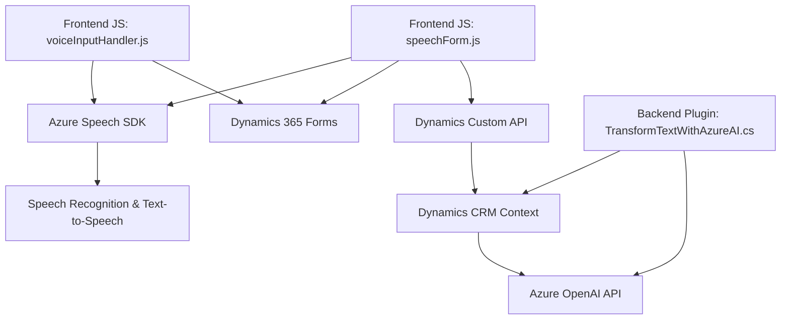

### Breve resumen técnico
El repositorio presenta una solución de integración entre formularios interactivos en Dynamics 365 y servicios avanzados de Azure, como el SDK de Speech y OpenAI. El desarrollo incluye funcionalidades para reconocimiento de voz, síntesis de texto a voz, procesamiento de datos de formularios y extensión mediante plugins.

---

### 1. Descripción de arquitectura
La arquitectura es una variante de **n capas** con componentes distribuidos:

- **Frontend**:
  Maneja la interacción con usuarios a través de formularios en Dynamics 365, usando funciones modularizadas en JavaScript y el SDK de Azure Speech.
- **Backend (Dynamics CRM Plugin)**:
  Implementa lógica empresarial en C# para conectar el ecosistema de Dynamics con Azure OpenAI y garantizar una integración robusta entre el sistema CRM y servicios externos.
- **Servicios externos**:
  Azure Speech SDK para reconocimiento y síntesis de voz; Azure OpenAI para procesamiento avanzado de texto.

---

### 2. Tecnologías usadas
#### **Frontend**
- **Lenguajes y frameworks**:
  - JavaScript ECMAScript (use de async/await y promesas).
  - SDK Azure Speech.
- **Patrones**:
  - Modularidad funcional (funciones divididas por propósito específico).
  - Asincronía para integración dinámica con APIs externas.
  - Dynamic Form Mapping (lógica adaptativa de campos y datos del formulario).

#### **Backend**
- **Lenguajes y runtimes**:
  - C#: .NET Framework (probablemente >= 4.6 para compatibilidad con Dynamics CRM).
- **Librerías**:
  - `Newtonsoft.Json` para serialización/deserialización JSON.
  - `Microsoft.Xrm.SDK` para lógica CRM.
- **Patrones**:
  - Plugin Pattern para integración con Dynamics CRM.
  - Builder Pattern para creación estructurada del payload enviado a Azure.
  - Microservicio externo (Azure OpenAI como servicio desacoplado).

---

### 3. Dependencias externas
- **Azure Speech SDK**:
  Herramienta principal para síntesis y reconocimiento de voz en módulos frontend.
- **Azure OpenAI API**:
  Servicio de procesamiento de texto con modelos GPT.
- **Dynamics CRM APIs**:
  Para manipulación de datos de formularios y entidades relacionadas.
- **HTTP Client**:
  Usado para interactuar con Azure OpenAI en el backend C#.

---

### 4. Diagrama Mermaid compatible con GitHub Markdown

---

### Conclusión final
La solución está diseñada para extender las capacidades de formularios interactivos en Dynamics 365 mediante tecnologías avanzadas como el SDK de Speech y los modelos GPT de Azure OpenAI. Combina un enfoque de capas tradicionales con integración de servicios externos, lo que aumenta la funcionalidad. Sin embargo, se recomienda mejorar la seguridad de las claves API y refinar los puntos de desacoplamiento entre los módulos.