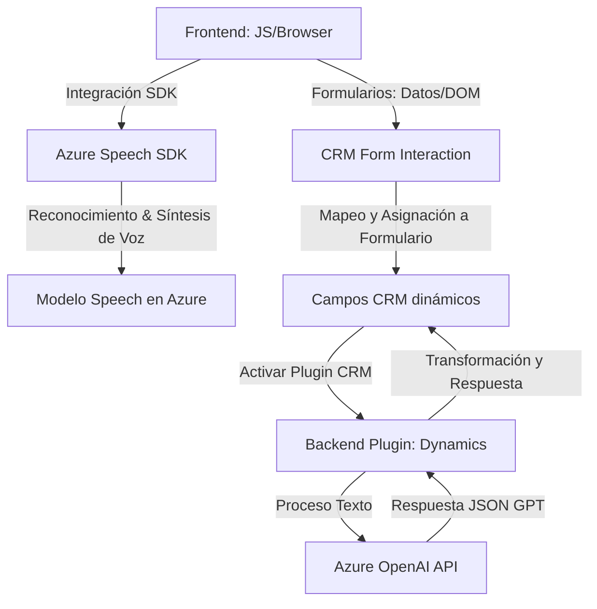

### Breve resumen técnico
Este repositorio contiene implementaciones orientadas a integrar la interacción de datos mediante voz y texto dentro de un ecosistema CRM, utilizando servicios de Azure Speech y Azure OpenAI. Las piezas clave incluyen archivos para procesamiento de formularios, síntesis y reconocimiento de voz en la interfaz de usuario (`readForm.js`, `speechForm.js`), así como un plugin para Dynamics CRM que realiza transformaciones de texto basado en reglas usando un modelo GPT de Azure OpenAI (`TransformTextWithAzureAI.cs`).

### Descripción de la arquitectura
La solución combina una arquitectura **mixta**, compuesta por los siguientes elementos:
1. **Cliente (Frontend):**
   - Código JavaScript modular en el navegador integra el Azure Speech SDK para reconocer y sintetizar voz, y utiliza patrones de observador/modularidad para garantizar la respuesta asíncrona del SDK.
   - Gestión de datos de formularios (DOM manipulation) y mapeo de campos dinámicos en CRM.
2. **Backend (Plugin):**
   - Implementación como un **plugin en Dynamics CRM** usando un patrón de arquitectura **basado en eventos** (interface `IPlugin`).
   - Comunicación directa con un servicio externo (Azure OpenAI) como una especie de API Gateway.

### Tecnologías usadas
- **Frontend/Javascript:**
  - Azure Speech SDK (para reconocimiento y síntesis de voz).
  - CRM SDK (JavaScript).
  - Uso de funciones asincrónicas (`Promise`, `async/await`) para manejar datos dinámicamente.
- **Backend (.NET/C#):**
  - Azure OpenAI (GPT) para procesamiento e interpretación semántica del texto.
  - Microsoft Dynamics CRM SDK para integración nativa.
  - .NET (C#): libretías como `HttpClient`, `System.Text.Json`, y métodos de serialización/deserialización JSON.
- **Integraciones con APIs (PATTERNS):**
  - Azure services (Speech, OpenAI).
  - REST API para comunicación en el backend.

### Diagrama Mermaid válido para GitHub

### Conclusión final
La solución combina componentes frontend y backend que se integran con servicios inteligentes de Azure. La arquitectura denota:
1. **Patrones Modulares:** Separación de responsabilidades en funciones específicas para lectura, síntesis, mapeo, y procesamiento.
2. **Arquitectura híbrida:** Aunque hay un enfoque en integración API (backend/plugin), el frontend permanece semiautónomo con ciertas responsabilidades de procesamiento.
3. **Dependencias externas:** Azure Speech SDK y Azure OpenAI son los pilares clave, orientados al manejo de voz y texto.

Aunque la arquitectura presenta una muy buena integración de tecnologías avanzadas, podría optimizarse en términos de seguridad y manejo de configuraciones sensibles (como claves de API).