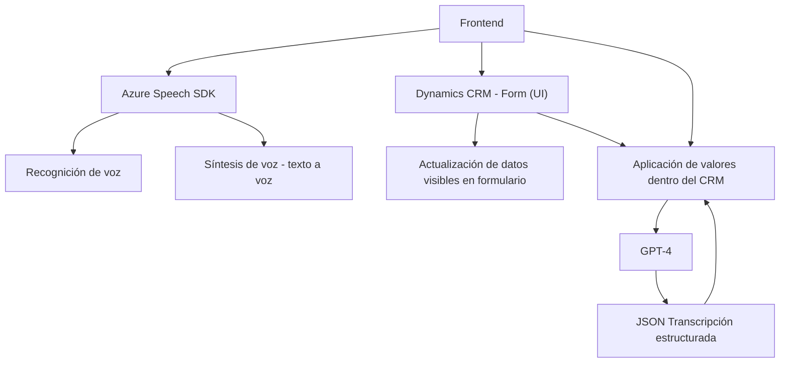

### Breve Resumen Técnico:
El repositorio contiene código para una solución de integración basada en Microsoft Dynamics CRM y Azure. Su objetivo principal es permitir una interacción humanizada entre usuarios y sistemas, facilitando el reconocimiento y síntesis de voz, así como el procesamiento y actualización de datos del formulario CRM usando inteligencia artificial.

### Descripción de la Arquitectura:
La solución implementa una arquitectura **híbrida** que utiliza las siguientes características:
1. **Cliente (Frontend)**: En la carpeta `FRONTEND`, se implementan funcionalidades de entrada/salida de voz, aprovechando el SDK de Azure Speech. El manejo del reconocimiento de voz y la síntesis está orientado a la actualización de formularios en CRM.
2. **Backend basado en plugins**: En la carpeta `Plugins`, se encuentra un plugin para Dynamics CRM que integra servicios externos de Azure OpenAI para el procesamiento avanzado de texto mediante redes neuronales como GPT-4.
3. **API externa**: Integra servicios REST externos (Azure Speech, OpenAI) para características de síntesis y análisis de datos. En el backend, el patrón arquitectónico empleado es Plugin-based (propio de Dynamics).

La solución tiene una estructura modular que destaca la división clara de responsabilidades. Aunque no sigue una arquitectura estrictamente n-capas ni hexagonal, sí utiliza principios de modularidad y desacoplamiento en su diseño.

### Tecnologías Usadas:
1. **Frontend (JS)**:
   - **Azure Speech SDK**: Para reconocimiento de voz y síntesis TTS.
   - **DOM API**: Usada para la manipulación de HTML.
   - **Promises y async/await**: Para manejar tareas asíncronas.
2. **Backend (C#)**:
   - **Dynamics CRM Plugin Architecture**: Integración a eventos del ciclo de vida en el CRM.
   - **Azure OpenAI GPT-4**: Para inteligencia artificial en el procesamiento de texto.
   - **System.Net.Http, Newtonsoft.Json**: Frameworks para llamadas HTTP y manejo avanzado de estructuras JSON.
3. **Cloud Services**:
   - Azure Speech para procesamiento de voz y altura de síntesis.
   - Azure OpenAI para análisis de texto con IA avanzada.

### Dependencias y Componentes Externos Posibles:
1. **SDK de Azure Speech**: Para entrada y salida de voz.
2. **Dynamics CRM SDK**: Para integración y gestión de entornos CRM.
3. **Azure OpenAI GPT-4 API**: Para el análisis y transformación de texto.
4. **Servicios REST HTTP**: Implementados para integrar con sistemas fuera del CRM en tiempo real.

---

### Diagrama **Mermaid**:

---

### Conclusión Final:
Este repositorio implementa una solución integradora que conecta funcionalidades avanzadas de síntesis y reconocimiento de voz, mediante el frontend JS en combinación con el Azure Speech SDK. En el backend, utiliza un plugin exclusivo de Dynamics CRM para orquestar el uso de GPT-4 en Azure OpenAI. En términos de arquitectura, combina elementos de **SOA** (orientación al servicio) y **híbridos modulares**, logrando un sistema extendible y orientado a automatizar tareas cognitivas en la gestión de datos del CRM.