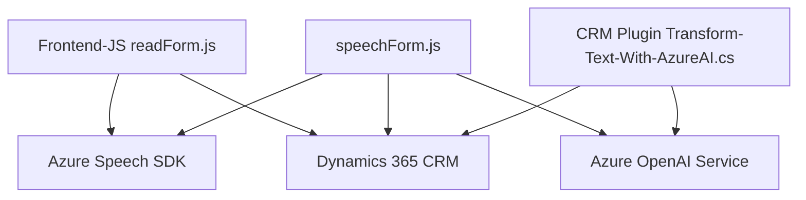

### Breve Resumen Técnico

El repositorio contiene código para la integración de servicios avanzados en aplicaciones que parecen ser partes de un CRM personalizado, probablemente Dynamics 365. Destaca la implementación de reconocimiento de voz, síntesis de texto a voz y procesamiento de datos con APIs externas (Azure Speech SDK y Azure OpenAI). La solución combina frontend funcional con lógica de plugins y servicios específicos del CRM.

---

### Descripción de Arquitectura

1. **Tipo de Solución:**
   - Es una solución híbrida que integra un **frontend** basado en JavaScript para interfaces de usuario dinámicas y funcionales con mecanismos avanzados de voz y API en un **plugin backend** construido en C#. Este enfoque claramente sirve a plataformas tipo CRM (Dynamics 365).

2. **Arquitectura:**
   - La solución utiliza una arquitectura basada en **n capas**:
     - **Presentación (Frontend):** Contiene JavaScript que interactúa con Dynamics 365 para facilitar la entrada y salida de datos en tiempo real usando voz.
     - **Lógica de negocio (Backend):** Los plugins para Dynamics CRM implementan lógica personalizada para procesamiento de datos y consultas a servicios externos como Azure OpenAI.
     - **Integración (Externa):** Dependencia de SDK de Azure Speech y la API OpenAI alojada en Azure.
   - Permite usar características individuales como microservicios para integración con servicios externos, aunque el CRM base sigue siendo un monolito.

3. **Patrones:**
   - **Carga Dinámica de SDK:** Solo carga el SDK necesario al momento de la ejecución.
   - **Modularización:** Funciones individuales en frontend mantienen facilidad de reutilización.
   - **Uso de API REST:** Consume APIs externas (Azure Speech y OpenAI) con comunicación HTTP y formato JSON.
   - **Plugin Architecture:** Extensión del CRM con lógica backend mediante plugins definidos por interfaces específicas (Dynamics CRM SDK).
   - **Context-Aware Design:** Aprovecha el contexto de formularios para ejecutar lógica adaptada al entorno.

---

### Tecnologías Usadas

1. **Frontend:**
   - **JavaScript:** Base para el script relacionado con la interfaz en Dynamics 365.
   - **Azure Speech SDK:** Reconocimiento y síntesis de voz (JS).
   - **Dynamics 365 Context API (executionContext):** Manipulación de atributos y formularios.
   - **Ajax/Fetch:** Comunicación dinámica desde el frontend.

2. **Backend:**
   - **C# (.NET Framework):** Desarrollo de plugins para Dynamics 365.
   - **Azure OpenAI API:** Realización de transformaciones avanzadas de texto mediante un servicio IA alojado en Azure.
   - **Microsoft XRM SDK:** Acceso a la API de Dynamics CRM.

3. **Servicios Externos:**
   - Azure Speech (Reconocimiento y síntesis de voz).
   - Azure OpenAI (Transformación de texto en JSON estructurado).

---

### Diagrama Mermaid Compatible con GitHub

---

### Conclusión Final

La solución está diseñada con un enfoque modular y escalable, lo que hace posible integrar tecnologías avanzadas de reconocimiento de voz y procesamiento de lenguaje natural en sistemas CRM como Dynamics 365. La arquitectura combina un frontend interactivo y funcional, que utiliza servicios externos en la nube, y un backend gestionado por plugins extendidos.

El uso de tecnologías avanzadas como Azure Speech SDK y Azure OpenAI, junto con una arquitectura modular basada principalmente en n capas, la hacen adecuada para entornos que requieren alta personalización y automatización. Una posible mejora sería la implementación de pruebas unitarias para garantizar la calidad y fiabilidad del código, así como su capacidad de mantener un rendimiento aceptable frente a cargas de trabajo más exigentes.