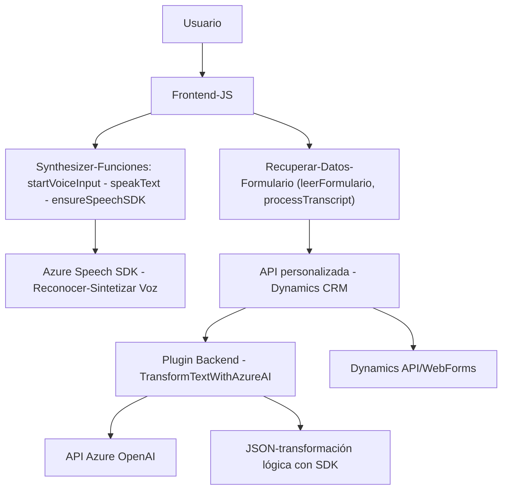

# Resumen Técnico

El repositorio parece estar enfocado en integrar servicios de Azure para agregar capacidades de **procesamiento de voz** y **procesamiento de texto natural** en sistemas Microsoft Dynamics 365. Está dividido principalmente en **JavaScript archivos de frontend**, donde se maneja la interacción del usuario, los formularios CRM y la integración con servicios como **Azure Speech SDK**; y en archivos de backend representados por plugins C# que implementan funcionalidades específicas mediante Dynamics SDK y la API de Azure OpenAI.

---

# Descripción de Arquitectura

La solución utiliza una **arquitectura híbrida**:

1. **Frontend (JS)**:
   - Actúa como capa de presentación/interacción del usuario dentro de Dynamics 365, aprovechando APIs externas como el SDK de **Azure Speech** para síntesis y reconocimiento de voz.
   - Modularidad: Funciones autónomas que separan responsabilidades (procesamiento de formulario, integración con SDK, comunicación con API personalizada).
   - Patrón Cliente-SDK: Aprovecha los recursos del navegador para cargar y usar SDKs externos.

2. **Backend (C#)**:
   - Trabaja bajo el patrón **Plugin para Dynamics CRM**, el cual se basa en un modelo de eventos. Los plugins son usados para ejecutar lógica específica en respuesta a eventos del sistema.
   - Los plugins usan **integración directa con servicios externos**, como el uso de la API Azure OpenAI para transformar o procesar datos (texto en JSON, análisis, etc.).

En general, esto sugiere una arquitectura **multicapa orientada a servicios**:
- **Frontend**: Realiza procesamiento de voz y comunicación directa con Dynamics.
- **Backend**: Amplía las capacidades de Dynamics CRM mediante plugins personalizados y servicios IA externos.

---

# Tecnologías Usadas

### Frontend
- **Lenguaje**: JavaScript.
- **Azure Speech SDK**: Para sintetizar y reconocer voz de los usuarios en el navegador.
- **Entorno Dynamics 365**: Interacción con formularios CRM mediante contextos y APIs internas (`formContext`, `Xrm.WebApi`).

### Backend
- **Lenguaje**: C#.
- **Dynamics 365 SDK**: Extiende la plataforma Dynamics CRM con plugins que escuchan eventos del sistema.
- **Azure OpenAI API**: Procesa el texto mediante inteligencia artificial.

### Patrones
1. **Cargador Dinámico**: Uso de carga dinámica de scripts SDK en el navegador (`ensureSpeechSDKLoaded`).
2. **Event-Driven Programming (Plugin)**: Los plugins C# implementan lógica orientada a eventos que encapsula las acciones en Dynamics CRM.
3. **Modularidad**: Clases y funciones bien separadas por responsabilidades específicas.
4. **Cliente SDK**: Interacción directa con servicios externos desde el cliente.

---

# Dependencias y Componentes Externos

1. **Azure Speech SDK**:
   - Sirve para la síntesis y reconocimiento de voz desde el navegador.
   - Carga dinámica desde la URL oficial proporcionada por Microsoft.

2. **API OpenAI en Azure**:
   - Utiliza la capacidad de OpenAI para procesar y transformar texto, haciendo solicitudes HTTP al servicio.

3. **Microsoft Dynamics SDK**:
   - Proporciona los datos del entorno CRM y permite extender funcionalidades internas para los formularios.

4. **Otras bibliotecas .NET**:
   - `Newtonsoft.Json.Linq` y `System.Text.Json` para el manejo de JSON.
   - `HttpClient` para ejecutar solicitudes hacia APIs externas.

---

# Diagrama Mermaid

---

# Conclusión Final

Este repositorio representa un **modelo extensible de integración entre Microsoft Dynamics 365 y los recursos de inteligencia artificial en Azure**, como el **Speech SDK** y **OpenAI API**, para habilitar funciones avanzadas. La arquitectura es una mezcla entre los patrones de **multicapa** y **cliente-SDK**, con un diseño modular y una separación clara de responsabilidades.

Las funciones del frontend JS se acoplan bien con los formularios de Dynamics 365 y servicios como el SDK de Azure Speech, mientras que los plugins en backend (C#) ofrecen mayor extensibilidad y capacidades de procesamiento enriquecidas con el uso de la API Azure OpenAI. Esto es ideal para soluciones corporativas donde se combina **IA**, **automatización de procesos** y **Dynamics CRM**.