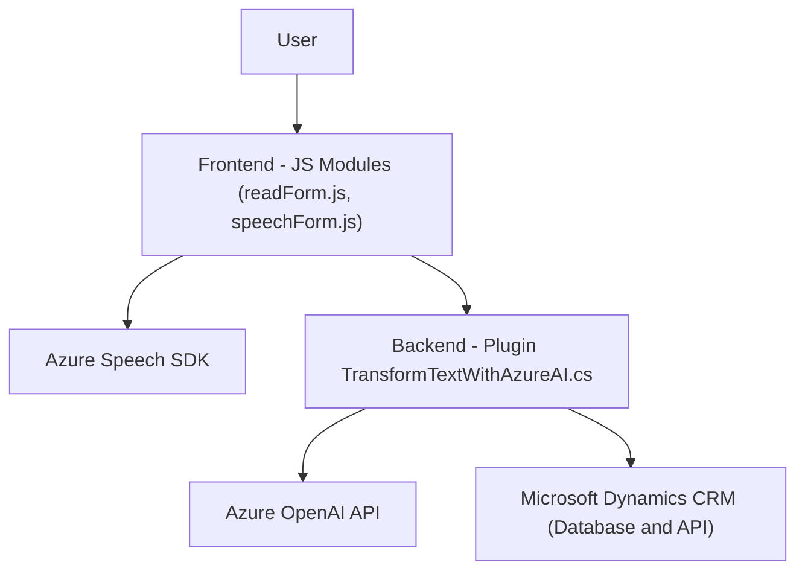

### Resumen técnico
El repositorio muestra una solución orientada al uso de inteligencia artificial en aplicaciones empresariales, específicamente con la integración de **Microsoft Dynamics CRM** y servicios como **Azure Speech SDK** y **Azure OpenAI API**. Los archivos analizados implementan funcionalidad de síntesis y reconocimiento de voz, procesamiento de datos de formularios, y transformación de texto mediante API, siendo modular y orientada a eventos.

---

### Descripción de la arquitectura
La arquitectura de este sistema es una mezcla entre **arquitectura de n capas y Service-Oriented Architecture (SOA)**. La interacción se realiza mediante módulos separados (frontend y backend), donde el backend actúa como intermediario entre un servicio externo (Azure OpenAI API) y el CRM de Dynamics. 

Los módulos del frontend están diseñados como aplicaciones independientes que generan y procesan voz, mientras que los plugins del backend gestionan el procesamiento y transformación de texto en la capa de datos del CRM.

---

### Tecnologías utilizadas
1. **Frontend:**
   - Lenguaje: JavaScript.
   - Framework/SDK: Azure Cognitive Services Speech SDK para síntesis y reconocimiento de voz.
   - Plataforma: Microsoft Dynamics CRM Web Resources.
   - Dependencias: Asynchronous JavaScript (AJAX/Promise), uso del objeto `executionContext`.

2. **Backend:**
   - Lenguaje: C# (.NET Framework).
   - Framework: CRM Plugin SDK (Microsoft.Xrm.Sdk).
   - Integraciones: Azure OpenAI API, HttpClient para requests HTTP JSON.
   - Dependencias: Newtonsoft.Json para manipulación de JSON y System.Text.Json.

3. **Servicios externos:**
   - Azure Speech SDK (Frontend).
   - Azure OpenAI API para procesamiento de texto del plugin en backend.

---

### Diagrama Mermaid
El diagrama proporcionado aquí representa los módulos del sistema, interacciones entre frontend y backend, y los servicios externos como Azure Speech SDK y OpenAI API.

---

### Conclusión final
La solución implementada en este repositorio es una **enterprise API-integrated system** diseñada para procesar datos de formularios en el contexto de Microsoft Dynamics CRM. Utiliza una combinación de patrones, como el **evento-dirigido** y la **arquitectura SOA**, con una clara separación tanto de funciones como de integraciones externas. 

La estructura modular del código facilita la mantenibilidad y la extensibilidad del sistema al separar la lógica de reconocimiento de voz y síntesis (frontend) de la lógica de procesamiento más complejo y transformación (backend). Sin embargo, el uso de claves API incrustadas en el código puede representar riesgos de seguridad y confinar la flexibilidad para el despliegue en ambientes variados. Se recomienda utilizar técnicas seguras para manejar credenciales, como almacenes de secretos o configuraciones específicas por ambiente.