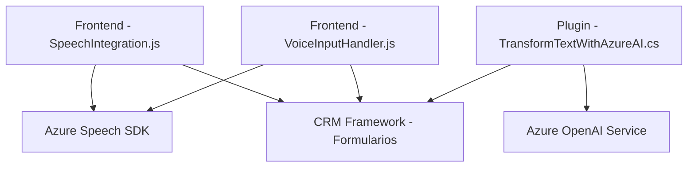

### Breve Resumen Técnico
El repositorio contiene archivos enfocados en construir una solución que integra servicios de voz y texto con una aplicación CRM basada en Dynamics. Los componentes incluyen un sistema frontal para el trabajo con entradas de voz (en JavaScript) y un plugin backend (en C#) que transforma texto utilizando Azure AI. Esta solución está claramente orientada a mejorar la accesibilidad y la interactividad mediante tecnologías de síntesis y reconocimiento de voz, y el procesamiento automático de texto con AI.

---

### Descripción de la Arquitectura
La solución es una **aplicación de múltiples capas** que combina elementos de un frontend (scripts JS para interacción y control en el navegador y el CRM) y un componente backend (plugin Dynamics CRM en C#). Sigue una **arquitectura cliente-servidor**, donde el frontend interactúa directamente con el usuario y un sistema CRM, y el backend maneja transformaciones de datos y delegación a servicios externos.

- **Frontend**: Scripts en JavaScript manejan la interactuación del usuario con la interfaz del CRM. Estos scripts utilizan un SDK de Microsoft Azure (Speech SDK) para la síntesis y reconocimiento de voz, añadiendo accesibilidad por voz y automatización a la interfaz.
- **Backend**: Un plugin `TransformTextWithAzureAI` implementa lógica de negocio específica en el contexto de Dynamics CRM mediante la API de plugins. Este plugin interactúa con Azure OpenAI para obtener transformaciones inteligentes de texto en JSON estructurado.

Ambos componentes utilizan servicios externos (Azure Speech SDK y Azure OpenAI Service), haciendo uso del **patrón de integración de servicios** y modularidad en su desarrollo.

---

### Tecnologías y Frameworks usados
1. **Frontend (JavaScript):**
   - **Azure Speech SDK**: Manejo de síntesis y reconocimiento de voz.
   - **JavaScript ES6**: Funciones modulares.
   - **Microsoft Dynamics CRM SDK**: Interacciones con el contexto del formulario CRM.
   - **DOM**: Manipulación dinámica de elementos HTML.

2. **Backend (C#):**
   - **Microsoft Dynamics SDK (`IPlugin`)**: Desarrollo de plugins.
   - **Azure OpenAI Service**: Consumo HTTP para modelos GPT (como GPT-4).
   - **Newtonsoft.Json** y **System.Text.Json**: Para operaciones con JSON.
   - **HTTP Client**: Para realizar solicitudes HTTP a servicios externos.

---

### Dependencias y Componentes Externos
1. **Azure Speech SDK**: Sintetiza texto en voz y realiza reconocimiento de voz.
2. **Azure OpenAI Service**: Procesa y transforma texto utilizando modelos de lenguaje avanzados como GPT-4.
3. **Microsoft Dynamics CRM SDK**: Base del desarrollo de plugins y manejo de contexto del formulario.
4. **HTTP Client**: Comunicación entre el plugin y Azure OpenAI Service.
5. **JSON Handling Libraries**: Serialización y deserialización de mensajes JSON.

---

### Diagrama Mermaid
El diagrama muestra la interacción entre componentes, servicios y su flujo de datos.

---

### Conclusión Final
Este proyecto implementa una solución avanzada para integrar accesibilidad vocal y automatización con un CRM basado en Microsoft Dynamics. Completa dos objetivos principales: usar voz como canal interactivo en el frontend y transformar información textual en el backend mediante AI de Azure.

- La arquitectura es híbrida: un frontend orientado a las interacciones del usuario, que emplea servicios de voz en tiempo real, y un backend basado en un plugin para procesar datos transformados y aplicar reglas.

- La elección de tecnologías estratégicas como Azure Speech SDK y OpenAI GPT asegura capacidades de reconocimiento y síntesis de voz, procesamiento textual mejorado por IA y soporte en la nube. La modularidad del código facilita la ampliación y mantenimiento.

A pesar de su robustez, se podrían optimizar factores como el manejo de errores más detallado y pruebas locales simulando los servicios externos.