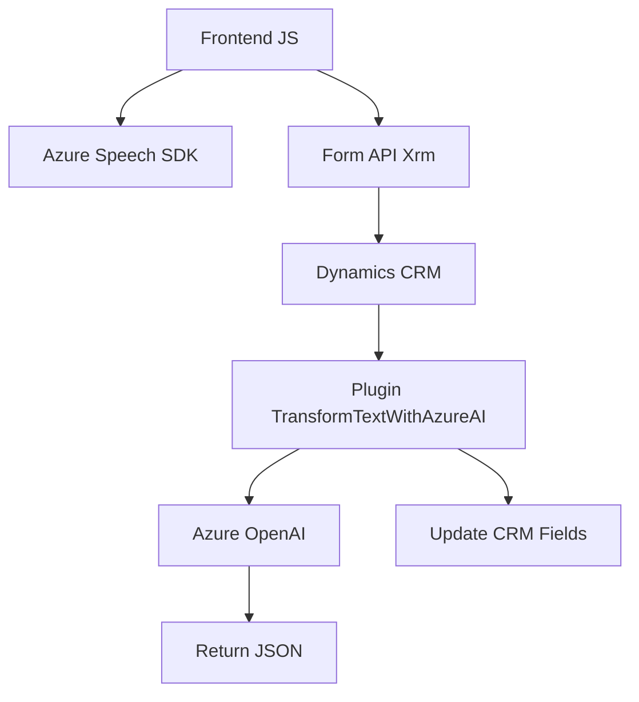

### Breve Resumen Técnico
El repositorio incluye componentes que interactúan con formularios CRM y servicios de voz e inteligencia artificial de Azure. Combina funcionalidad frontend en JavaScript para reconocimiento y síntesis de voz, con backend basado en C# que actúa como un plugin en Dynamics CRM y consume servicios de Azure OpenAI. Su propósito principal es la integración de tecnologías de procesamiento de voz, inteligencia artificial y manipulación de datos en formularios CRM.

---

### Descripción de Arquitectura
La arquitectura del proyecto tiene características intermodulares, con:
1. **Frontend Modular:** Scripts de JavaScript orientados a funciones, integrados en formularios CRM, que gestionan reconocimiento y síntesis de voz mediante Azure Speech SDK.
2. **Backend Plugin:** Plugin en C# para Dynamics 365 que transforma texto mediante Azure OpenAI y manipula datos CRM.
3. **Integración Externa:** Arquitectura orientada a servicios con dependencia en APIs de Azure (Speech y OpenAI) y Xrm API de Dynamics CRM.

El proyecto sigue una arquitectura **n-capas** basada en separación de responsabilidades:
- **Frontend:** Interacción con usuarios y SDK de voz.
- **Backend:** Procesamiento de texto e integración CRM.
- **Servicios Externos:** Consumo de APIs de Azure y Xrm.

Patrones utilizados:
- **Carga dinámica de recursos (ensureSpeechSDKLoaded).**
- **Integración API para ejecución de servicios externos (Azure Speech y OpenAI).**
- **Separación de responsabilidades mediante módulos.**

---

### Tecnologías, Frameworks y Patrones Usados
#### Tecnologías:
1. **JavaScript:** Gestión del frontend, integración de SDKs.
2. **Azure Speech SDK:** Para reconocimiento y síntesis de voz.
3. **Xrm API (Dynamics 365):** Interacción con formularios y datos de CRM.
4. **C#:** Desarrollo de plugins con `IPlugin`.
5. **Azure OpenAI API:** Transformación avanzada de texto.
6. **HTTP Client y JSON:** Para solicitudes y manipulación de datos.

#### Frameworks/Librerías:
- **Microsoft.Xrm.Sdk**: SDK de Dynamics CRM.
- **Newtonsoft.Json**: Manipulación JSON avanzada.
- **System.Net.Http**: Comunicación con servicios externos.

#### Patrones:
- **Plugin-Based Architecture (Dynamics 365).**
- **Modularidad basada en funciones (JavaScript).**
- **Integración de servicios externos vía APIs.**
- **Uso de inyección de dependencias (`IServiceProvider`).**

---

### Dependencias o Componentes Externos
1. **Azure Speech SDK:** Necesario para reconocimiento y síntesis de voz.
2. **Azure OpenAI API:** Proveedor de transformación de texto.
3. **Xrm API:** Manipulación y actualización de formularios en CRM.
4. **HTTP para comunicación REST.**
5. **Serialización JSON (Newtonsoft.Json y System.Text.Json).**

---

### Diagrama Mermaid
El siguiente diagrama representa la estructura técnica de integración de componentes:

---

### Conclusión Final
El repositorio implementa una solución de **procesamiento de voz e inteligencia artificial** aplicada a formularios CRM, con integración directa en Dynamics 365 y servicios de Azure. El diseño modular de su frontend y el uso de un plugin backend basado en servicios externos garantiza eficiencia y separa responsabilidades efectivamente. Esta arquitectura sería ideal para entornos corporativos que requieren interacción avanzada basada en voz e inteligencia artificial.