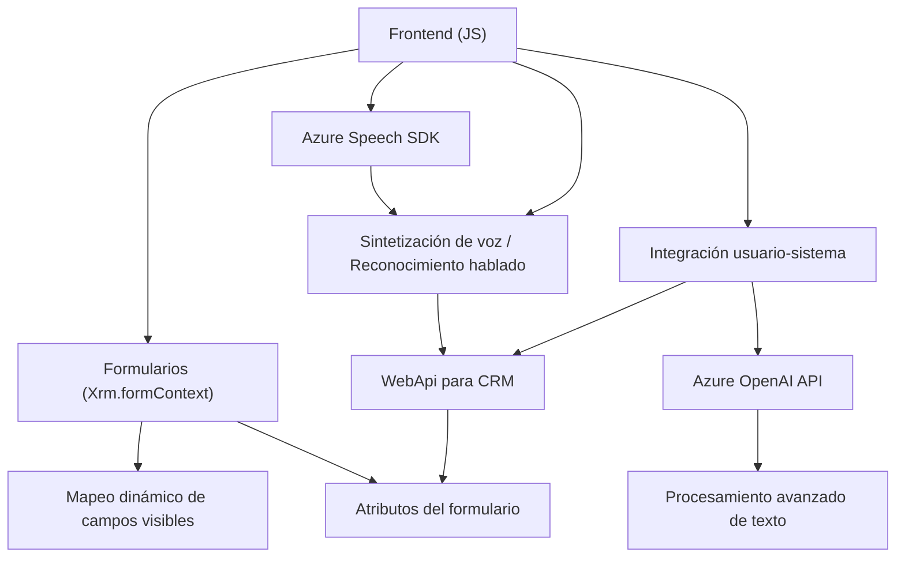

### Breve resumen técnico

Este repositorio contiene el desarrollo de una solución que integra Microsoft Dynamics 365 con servicios de Azure (Speech SDK y OpenAI). Los componentes principales permiten:
1. **Automatizar la entrada de datos** mediante reconocimiento de voz y mapeo dinámico de campos en formularios de Dynamics 365.
2. **Transformar texto mediante inteligencia artificial** (Azure OpenAI) desde plugins personalizados para evaluar y modificar datos en la plataforma.

---

### Descripción de arquitectura

La solución sigue un enfoque **multicapas** con especial integración de tecnologías externas. Los archivos de frontend (`readForm.js`, `speechForm.js`) representan la capa de presentación y lógica de negocio específica, mientras que el plugin (`TransformTextWithAzureAI.cs`) funciona como un componente backend que realiza procesamientos más avanzados de datos usando APIs externas. La estructura y patrones observados permiten una arquitectura modular:

- **Capa de presentación:** Archivos JS (`readForm.js`, `speechForm.js`) que interactúan directamente con el usuario.
- **Capa de negocio:** Plugins personalizados para CRM que incluyen transformación de texto y procedimientos específicos.
- **Capa de integración externa:** Servicios de Azure Speech y Azure OpenAI.

---

### Tecnologías usadas

1. **Frontend (JS)**:
   - **Azure Speech SDK**:
     - Sintetización y reconocimiento de voz en tiempo real.
   - **Dynamics 365 WebApi**:
     - Manipulación dinámica de formularios y atributos.
   - **JavaScript** (vanilla):
     - Modularidad y manejo de eventos asíncronos para la comunicación con APIs externas.
   - Utilización de promesas y callbacks para carga dinámica de recursos.
   
2. **Backend (C# Plugin)**:
   - **Microsoft Dynamics CRM SDK** (`Microsoft.Xrm.Sdk`):
     - Implementación de plugins personalizados para lógica de negocio avanzada.
   - **Azure OpenAI Service**:
     - Procesamiento de texto mediante modelos de lenguaje (e.g., GPT-4).
   - **HTTP Client** (C#):
     - Envío de solicitudes JSON a servicios externos.
   - **Regex y LINQ**:
     - Simplificación y transformación de texto y estructuras de datos.

---

### Diagrama Mermaid válido para GitHub

---

### Conclusión final

La solución presentada es un sistema modular que optimiza la entrada y salida de datos en Dynamics 365 utilizando servicios avanzados de Azure. La integración del reconocimiento de voz con la infraestructura de Dynamics, combinada con procesamiento avanzado mediante Azure OpenAI, refleja una arquitectura de **multicapas** orientada a eventos y repositorios. Esta estrategia garantiza que cada componente cumpla una responsabilidad específica y coopere dentro del flujo general, logrando una experiencia de usuario efectiva y basada en inteligencia artificial, mientras potencia las capacidades del CRM existente.